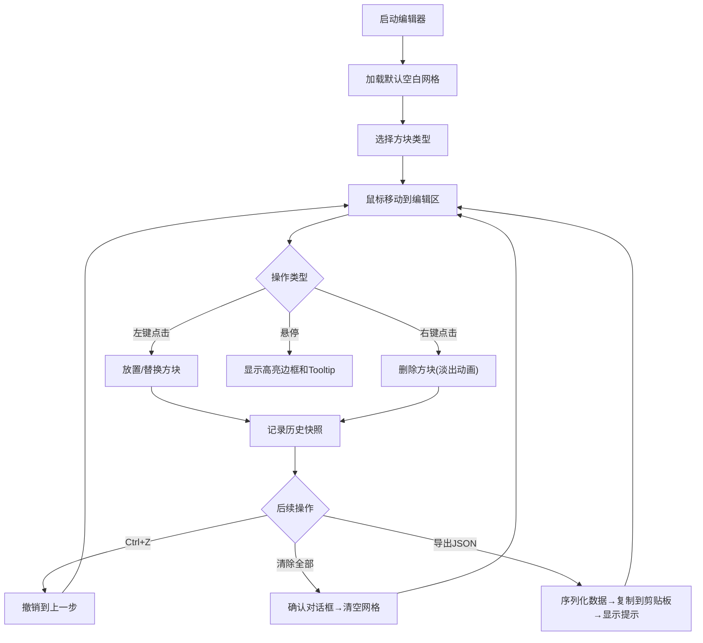

## 1. 产品概述

像素风2D平台跳跃游戏关卡编辑器，为独立游戏制作人提供可视化的关卡设计工具。用户可以像搭积木一样在网格上放置、选择和删除不同种类的方块，并实时预览关卡布局，最终导出为JSON文件供游戏引擎解析。

- 目标用户：独立游戏开发者、关卡设计师
- 核心价值：提供快速、直观的像素风关卡原型设计体验

## 2. 核心功能

### 2.1 功能模块

1. **编辑区**：12×8网格Canvas画布，支持方块放置、删除、替换
2. **工具栏**：方块类型选择、清除全部、导出JSON、撤销操作
3. **状态栏**：显示当前选中方块类型和鼠标网格坐标
4. **数据管理**：撤销历史、JSON导出、剪贴板复制

### 2.2 功能详情

| 模块名称 | 功能点 | 详细描述 |
|---------|--------|---------|
| 编辑区 | 网格系统 | 12×8网格，每格40×40像素，显示网格线 |
| 编辑区 | 方块放置 | 点击网格放置当前选中方块，同位置覆盖 |
| 编辑区 | 右键删除 | 右键点击方块删除，带0.3秒淡出动画 |
| 编辑区 | 悬停高亮 | 鼠标悬停显示白色虚线边框和Tooltip |
| 编辑区 | 方块替换 | 点击已有方块，若类型不同则替换 |
| 工具栏 | 方块选择 | 地面砖块、尖刺、金币、敌人出生点4种类型 |
| 工具栏 | 清除全部 | 弹出确认对话框后清空所有方块 |
| 工具栏 | 导出JSON | 按固定格式导出并复制到剪贴板，显示成功提示 |
| 工具栏 | 撤销操作 | 支持Ctrl+Z，记录最近20步状态 |
| 状态栏 | 信息显示 | 当前选中方块类型、鼠标网格坐标 |

## 3. 核心流程

用户主要操作流程：选择方块类型 → 在编辑区点击放置 → 右键删除或替换方块 → 使用撤销功能 → 导出JSON。

## 4. 用户界面设计

### 4.1 设计风格

- **主题配色**：暗色主题，背景#2a2a2a，网格线#4a4a4a
- **方块颜色**：
  - 地面砖块：#8B4513（棕色）
  - 尖刺：#FF4500（橙红色）
  - 金币：#FFD700（金色）
  - 敌人出生点：#800080（紫色）
- **按钮样式**：40×40像素，圆角4px，选中态白色边框+发光效果
- **动画效果**：hover亮度提升20%，点击缩放0.95（100ms），删除淡出0.3s

### 4.2 布局设计

| 区域 | 位置 | 尺寸 | 背景色 |
|-----|------|------|--------|
| 工具栏 | 左侧固定 | 宽度200px | #2a2a2a |
| 编辑区 | 中间主区域 | 自适应 | #2a2a2a |
| 状态栏 | 编辑区底部 | 高度40px | #3a3a3a |

### 4.3 响应式设计

- **桌面端（≥1024px）**：工具栏左侧垂直布局，编辑区居中
- **移动端（<1024px）**：工具栏折叠为顶部水平栏
- **网格自适应**：网格大小不超过窗口高度的70%
