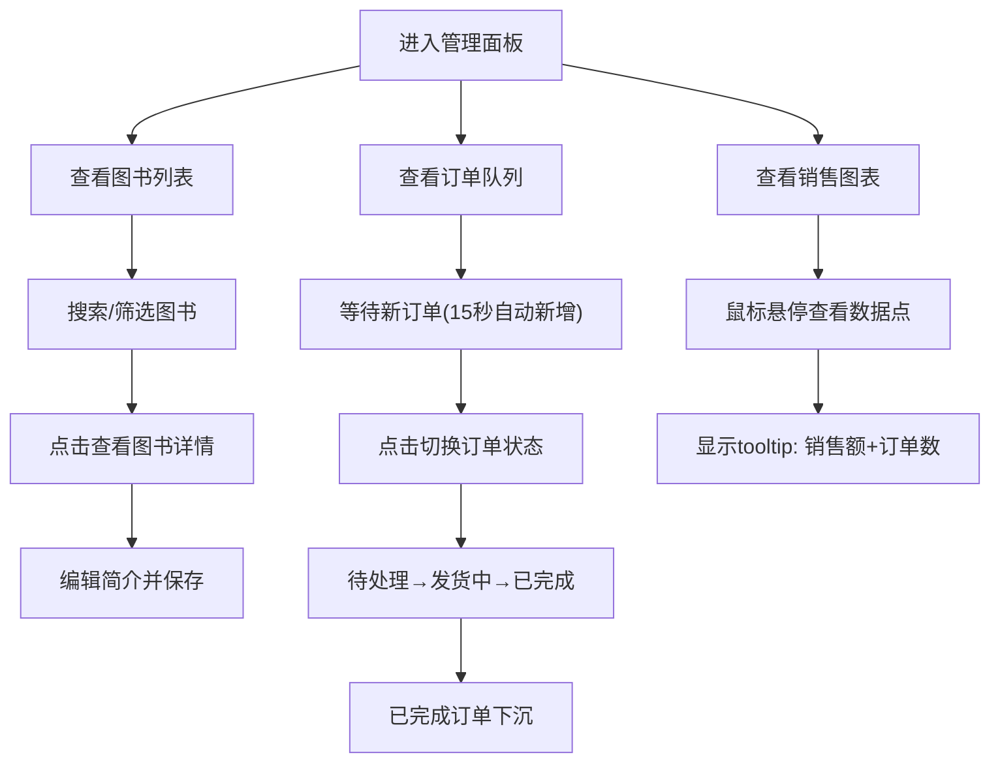

## 1. 产品概述

二手书店后台管理面板是一个面向书店管理员的单页Web应用，用于可视化管理图书库存、处理实时订单以及分析销售趋势数据。
- 解决问题：帮助管理员高效处理日常运营事务，通过数据可视化辅助经营决策
- 目标用户：二手书店运营管理人员

## 2. 核心功能

### 2.1 功能模块

1. **图书管理面板**：图书列表展示、模糊搜索、分类筛选、图书详情查看与编辑
2. **订单处理队列**：实时订单列表、状态流转（待处理→发货中→已完成）、颜色动画过渡
3. **销售趋势图表**：30天销售额折线图、悬停tooltip、统计数字滚动动画

### 2.2 页面详情

| 页面名称 | 模块名称 | 功能描述 |
|---------|---------|---------|
| 主面板 | 图书管理面板 | 左侧展示图书列表（书名、作者、ISBN、售价、库存），支持模糊搜索和分类（文学/科技/艺术）筛选，点击图书展示详情卡片（封面、简介、累计销量、评分），支持编辑简介并保存 |
| 主面板 | 订单处理队列 | 右侧展示实时订单列表，每15秒自动新增一条模拟订单，订单支持点击切换状态（待处理→发货中→已完成），已完成订单自动下沉到底部 |
| 主面板 | 销售趋势图表 | 顶部区域展示近30天销售额Canvas折线图，X轴显示日期，Y轴显示金额，鼠标悬停显示tooltip，下方展示总销售额和总订单量滚动数字 |

## 3. 核心流程

管理员进入面板后，可同时查看三个区域的内容：
- 在图书管理区搜索/筛选图书，点击查看详情并编辑简介
- 在订单队列区点击订单逐步推进状态流转
- 顶部销售图表自动更新，管理员可悬停查看每日详情

## 4. 用户界面设计

### 4.1 设计风格

- **主色调**：浅灰蓝 #E8F0FE（背景）、深蓝灰 #1A2B3C（文字/深色元素）
- **面板背景**：半透明毛玻璃效果 backdrop-filter: blur(10px)
- **卡片交互**：悬停上浮 4px，0.3s ease-out 阴影过渡
- **订单状态动画**：0.4s 颜色过渡（待处理红→发货中黄→已完成绿灰）
- **响应式**：1024px 以内左侧列表与右侧订单队列上下堆叠

### 4.2 页面设计概述

| 页面名称 | 模块名称 | UI元素 |
|---------|---------|-------|
| 主面板 | 销售趋势图表 | Canvas折线图、tooltip气泡、数字滚动动画、毛玻璃容器 |
| 主面板 | 图书管理面板 | 搜索框、分类筛选标签、图书卡片列表、右侧详情抽屉、编辑文本域 |
| 主面板 | 订单处理队列 | 订单卡片列表、状态颜色标识、已完成灰态下沉 |

### 4.3 响应式

桌面端优先设计，1024px 断点切换为上下堆叠布局，确保触摸操作流畅，无卡顿。
