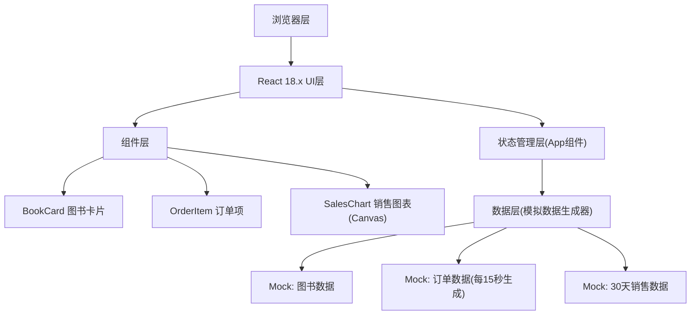

## 1. 架构设计



## 2. 技术描述

- **前端框架**：React@18 + TypeScript
- **构建工具**：Vite（devServer 端口 3000）
- **UI 样式**：原生 CSS（backdrop-filter、CSS transitions、响应式 media queries）
- **图表实现**：HTML5 Canvas API 原生绘制
- **辅助库**：uuid（ID生成）、lodash（工具函数）
- **数据来源**：前端模拟数据生成器，无后端依赖

## 3. 文件结构

```
e:\solo\VersionFast\tasks\auto52\
├── package.json
├── vite.config.js
├── tsconfig.json
├── index.html
└── src/
    ├── main.tsx            # 应用入口
    ├── App.tsx             # 主布局 & 状态管理
    ├── types/              # 类型定义(可选)
    ├── utils/              # 模拟数据生成器(可选)
    └── components/
        ├── BookCard.tsx    # 图书卡片组件
        ├── OrderItem.tsx   # 订单项组件
        └── SalesChart.tsx  # 销售图表组件
```

## 4. 类型定义

### Book 类型
```typescript
interface Book {
  id: string;
  title: string;
  author: string;
  isbn: string;
  price: number;
  stock: number;
  category: '文学' | '科技' | '艺术';
  description: string;
  sales: number;
  rating: number;
}
```

### Order 类型
```typescript
type OrderStatus = 'pending' | 'shipping' | 'completed';

interface Order {
  id: string;
  title: string;
  bookTitle: string;
  quantity: number;
  amount: number;
  status: OrderStatus;
  createdAt: Date;
}
```

### SalesData 类型
```typescript
interface SalesDataPoint {
  date: string;
  revenue: number;
  orders: number;
}
```

## 5. 数据模型

模拟数据生成器将在应用启动时初始化：
- **图书数据**：生成 15-20 本不同分类的图书，包含完整字段
- **订单数据**：初始 3-5 条，每 15 秒通过 setInterval 新增一条
- **销售数据**：生成近 30 天的日销售记录，含销售额和订单数
