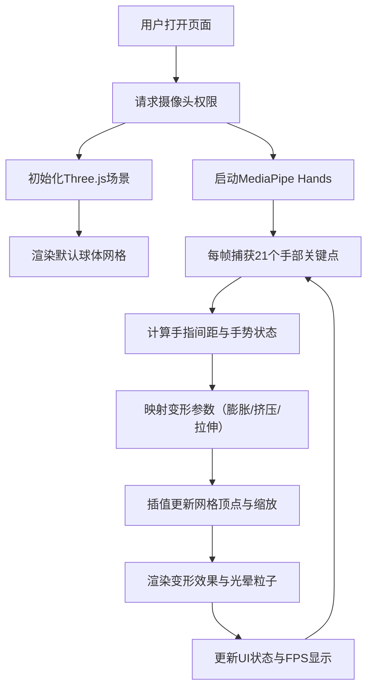

## 1. 产品概述

一款基于Web的手势驱动3D雕塑变形预览应用，帮助数字雕塑师通过手部动作实时控制三维几何体的形态变化，实现创意灵感的快速可视化。

- 解决问题：当前缺乏轻量级浏览器端工具，用于实时捕捉手部关键点并驱动3D网格顶点变形
- 目标用户：数字雕塑师、3D艺术家、交互设计师
- 产品价值：降低实时手势交互的技术门槛，提供零安装、即开即用的创意预览环境

## 2. 核心功能

### 2.1 功能模块

1. **主视图页面**：全屏3D画布、摄像头手势捕捉、实时变形效果预览
2. **手势追踪模块**：MediaPipe Hands手部关键点检测，21个3D坐标点输出
3. **网格变形模块**：二十面体球体网格、多模式变形逻辑（膨胀/挤压/拉伸）
4. **UI信息面板**：手指尖坐标投射显示、变形模式状态、FPS计数器

### 2.2 页面详情

| 页面名称 | 模块名称 | 功能描述 |
|---------|---------|--------|
| 主视图 | 3D渲染画布 | 全屏Three.js场景，展示可变形球体与粒子光晕 |
| 主视图 | 手势追踪层 | 实时摄像头输入，MediaPipe Hands关键点检测 |
| 主视图 | 坐标投射面板 | 左上角显示五根手指尖的2D像素坐标，彩色圆点标记 |
| 主视图 | 状态信息栏 | 底部毛玻璃面板，显示变形模式和FPS |

## 3. 核心流程

用户打开页面→授权摄像头权限→系统初始化3D场景与手势追踪→用户做出手势动作→系统检测手部关键点并计算手指间距→根据预设规则映射为变形参数→驱动3D网格顶点变化并渲染→实时显示状态信息

## 4. 用户界面设计

### 4.1 设计风格

- **主色调**：深空蓝黑渐变背景（#0b0e1a → #1a2332），营造沉浸感
- **材质色调**：半透明白色到浅蓝色渐变球体，带环境光敏感效果
- **强调色**：五根手指追踪点使用红、绿、蓝、黄、紫五色区分
- **UI风格**：毛玻璃效果（backdrop-filter: blur(8px)，圆角12px，半透明白色字体）

### 4.2 页面设计概览

| 页面名称 | 模块名称 | UI元素 |
|---------|---------|--------|
| 主视图 | 3D场景 | 居中二十面体球体、自动旋转相机（15度俯角，每秒3度）、OrbitControls鼠标拖拽、光晕粒子 |
| 主视图 | 坐标面板 | 左上角浮动面板，彩色圆点+坐标数值，半透明背景 |
| 主视图 | 状态栏 | 底部毛玻璃条，左侧变形模式（捏合/挤压/拉伸/空闲），右侧FPS计数器 |

### 4.3 响应性

- 桌面端优先，全屏自适应
- Canvas尺寸随窗口Resize自动调整
- 触摸设备支持触屏拖拽控制视角

### 4.4 3D场景指引

- **环境与氛围**：深空蓝黑渐变背景，无外部HDRI，纯程序化环境光
- **光照设置**：环境光（AmbientLight 0.5强度）+ 方向光（DirectionalLight 1.0强度，带阴影）
- **相机设置**：PerspectiveCamera，初始距离球体3单位，俯角15度，自动水平旋转3°/s
- **构图与焦点**：球体位于场景中心，光晕粒子环绕半径0.5单位
- **交互与动画**：顶点Lerp平滑插值（因子0.1），粒子缓慢旋转并渐隐
- **后处理效果**：球体半透明材质，光晕粒子Additive混合模式
- **资源来源**：纯程序化几何体（IcosahedronGeometry细分2次），无外部模型资源

## 5. 性能指标

| 指标 | 要求 |
|-----|------|
| 手势检测帧率 | ≥ 15fps |
| 3D渲染帧率 | ≥ 20fps |
| 变形响应延迟 | ≤ 100ms |
| 首次摄像头加载 | ≤ 5秒 |
