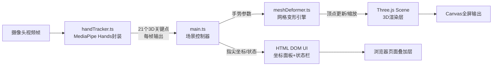

## 1. 架构设计

纯前端单页应用，无后端服务。采用模块化分层设计：数据采集层（手部追踪）→ 业务逻辑层（变形计算）→ 渲染层（Three.js）→ UI层（DOM覆盖层）。



## 2. 技术栈说明

| 层级 | 技术 | 版本 | 用途 |
|-----|------|------|------|
| 构建工具 | Vite | ^5.0 | 开发服务器与TypeScript打包 |
| 语言 | TypeScript | ^5.3 | 类型安全的应用开发 |
| 3D引擎 | Three.js | ^0.160.0 | WebGL 3D场景渲染 |
| 手势识别 | @mediapipe/hands | ^0.4.1675469240 | 手部关键点检测模型 |
| 摄像头工具 | @mediapipe/camera_utils | ^0.3.1675466124 | 视频帧采集与回调 |
| 类型定义 | @types/three | ^0.160.0 | Three.js TypeScript类型 |

**初始化方式**：手动创建项目结构与配置文件，无需使用Vite脚手架模板（用户指定纯TypeScript而非React/Vue）。

## 3. 文件结构与调用关系

```
e:\solo\VersionFast\tasks\auto56\
├── index.html                  # 入口HTML，挂载Canvas与UI面板
├── package.json                # 依赖与启动脚本
├── vite.config.js              # Vite构建配置（端口3000）
├── tsconfig.json               # TypeScript严格模式配置
└── src/
    ├── main.ts                 # [入口] 初始化场景/相机/灯光/追踪，串联数据流
    │   ├── 调用 handTracker.ts 的 HandTracker 类
    │   ├── 调用 meshDeformer.ts 的 MeshDeformer 类
    │   └── 直接操作 DOM 更新 UI
    ├── handTracker.ts          # [数据层] MediaPipe Hands封装
    │   └── 输出: onResults 回调 → HandLandmark[] (21个3D点)
    └── meshDeformer.ts         # [逻辑层] 网格变形计算与渲染
        ├── 输入: setGestureState(distance, pinchMode, squeezeMode, stretchMode)
        └── 输出: update(deltaTime) → 更新Three.js网格顶点
```

## 4. 核心数据结构

### 4.1 手部关键点类型

```typescript
interface HandLandmark {
  x: number; // 归一化X坐标 [0, 1]
  y: number; // 归一化Y坐标 [0, 1]
  z: number; // 相对深度
}

interface FingerTips {
  thumb: HandLandmark;     // 拇指指尖 (索引4)
  index: HandLandmark;     // 食指指尖 (索引8)
  middle: HandLandmark;    // 中指指尖 (索引12)
  ring: HandLandmark;      // 无名指指尖 (索引16)
  pinky: HandLandmark;     // 小指指尖 (索引20)
}
```

### 4.2 变形状态类型

```typescript
type DeformMode = 'idle' | 'pinch' | 'squeeze' | 'stretch';

interface GestureState {
  pinchDistance: number;       // 食指-拇指像素距离
  indexMiddleDistance: number; // 食指-中指像素距离
  middleRingDistance: number;  // 中指-无名指像素距离
  middlePinkyDistance: number; // 中指-小指像素距离
  isPinching: boolean;         // pinchDistance < 50px
  isSqueezing: boolean;        // 三指并拢，各间距 < 30px
  isStretching: boolean;       // middlePinkyDistance > 150px
  mode: DeformMode;
}
```

## 5. 关键算法说明

### 5.1 像素距离计算
MediaPipe输出归一化坐标(0-1)，乘以视频帧宽高转换为像素坐标后计算欧几里得距离。

### 5.2 膨胀变形算法
```
targetScale = 1.0 + (1.0 - clamp(pinchDistance / 50, 0, 1)) * 0.5
currentVertexRadius = lerp(current, originalRadius * targetScale, 0.1)
顶点沿法线方向位移
```

### 5.3 平滑插值（Lerp）
```typescript
function lerp(a: number, b: number, t: number): number {
  return a + (b - a) * t;
}
// t = 0.1，确保变形响应≤100ms延迟
```

### 5.4 变形模式优先级
squeeze > stretch > pinch > idle，互斥触发。

## 6. 性能保障策略

1. **顶点缓存**：保存原始顶点位置数组，避免每帧重建
2. **帧率解耦**：手势检测(≥15fps)与渲染(≥20fps)独立运行
3. **惰性更新**：仅当手势状态变化超过阈值时触发重计算
4. **几何体优化**：IcosahedronGeometry细分2次（约162顶点），避免过重网格
5. **粒子池**：固定20个光晕粒子，复用对象不频繁GC
