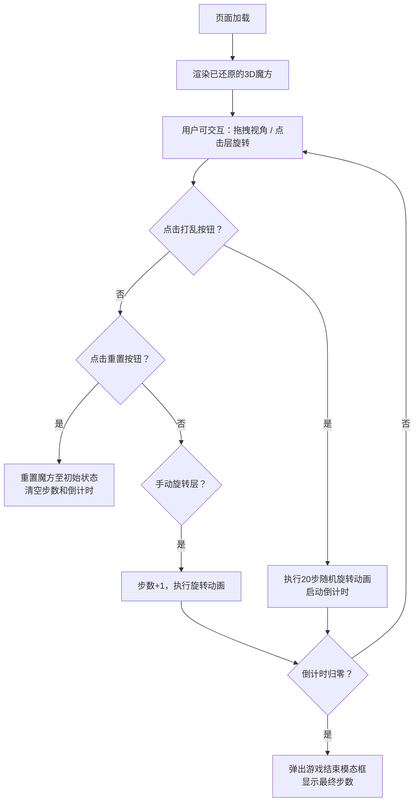

## 1. 产品概述

基于Web的3D魔方模拟器，让魔方爱好者在浏览器中通过交互操作还原魔方。
- 核心价值：提供沉浸式、流畅的3D魔方体验，支持视角旋转、层旋转、自动打乱、步数统计和倒计时挑战
- 目标用户：魔方爱好者、益智游戏玩家

## 2. 核心功能

### 2.1 功能模块
1. **3D魔方展示模块**：标准3x3魔方、六面鲜艳颜色区分、3D渲染
2. **交互控制模块**：鼠标拖拽旋转视角、点击棱/面旋转对应层、高亮反馈
3. **游戏功能模块**：自动打乱（20步随机旋转）、重置还原、步数计数器、10分钟倒计时
4. **UI界面模块**：磨砂玻璃控制面板、按钮交互反馈、游戏结束模态框

### 2.2 页面详情

| 页面名称 | 模块名称 | 功能描述 |
|---------|---------|---------|
| 主界面 | 3D魔方展示区 | 页面中央渲染3D魔方，支持视角拖拽旋转 |
| 主界面 | 控制面板 | 魔方下方半透明磨砂玻璃面板，包含打乱/重置按钮和步数显示 |
| 主界面 | 倒计时显示 | 顶部显示10分钟倒计时 |
| 主界面 | 游戏结束模态框 | 倒计时结束弹出，显示最终步数 |

## 3. 核心流程

## 4. 用户界面设计

### 4.1 设计风格
- **主色调**：深灰到黑色的径向渐变背景
- **辅助色**：魔方六面颜色 - 白(#FFFFFF)、黄(#FFD500)、红(#FF0000)、橙(#FF8C00)、蓝(#0046AD)、绿(#009B48)
- **按钮风格**：圆角矩形，悬停缩放1.05倍，点击颜色微变，带平滑过渡
- **字体**：现代无衬线字体，清晰易读
- **面板效果**：半透明磨砂玻璃（backdrop-filter: blur）

### 4.2 页面设计概览

| 页面名称 | 模块名称 | UI元素 |
|---------|---------|--------|
| 主界面 | 3D魔方展示区 | 居中布局，Three.js Canvas全屏 |
| 主界面 | 倒计时显示 | 顶部居中，大号数字，警示色渐变 |
| 主界面 | 控制面板 | 底部居中，磨砂玻璃效果，按钮横向排列 |
| 主界面 | 步数显示 | 控制面板内，图标+数字 |
| 主界面 | 游戏结束模态框 | 居中弹出，半透明遮罩，标题+步数+确认按钮 |

### 4.3 响应式
- 桌面端优先设计，Canvas自适应窗口大小
- 控制面板在移动端自适应宽度

### 4.4 3D场景指南
- **环境**：深色渐变背景，环境光+方向光组合
- **光照**：AmbientLight(0xffffff, 0.6) + DirectionalLight(0xffffff, 0.8)
- **相机**：PerspectiveCamera，初始距离10，fov=45
- **交互**：轨道控制器支持阻尼缓动，鼠标点击射线检测选择层
- **动画**：层旋转使用弹性缓动（elastic easing），0.3秒完成
- **性能**：帧率目标60fps，最低30fps
