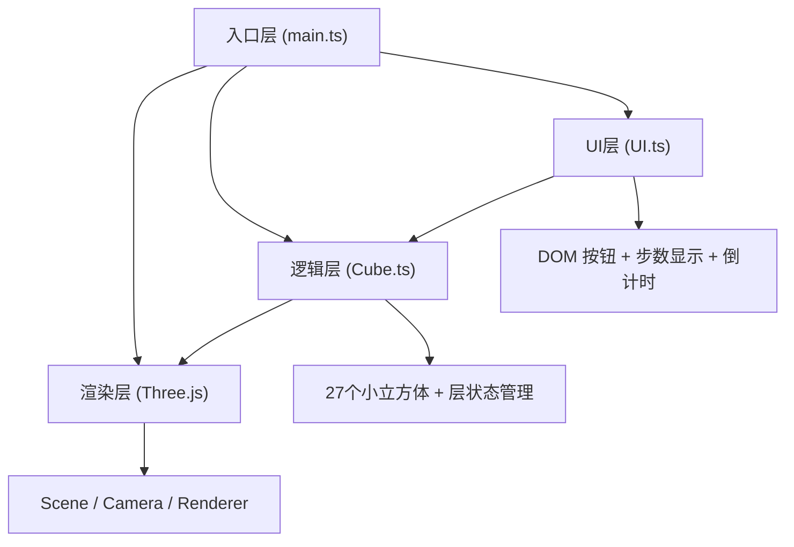

## 1. 架构设计



## 2. 技术描述
- **前端**：TypeScript + Three.js + Vite
- **构建工具**：Vite 5.x
- **渲染引擎**：Three.js 0.160+（原生调用，不使用React Three Fiber）
- **无后端**：纯前端项目

## 3. 文件结构

| 文件 | 职责 |
|-----|------|
| `package.json` | 依赖声明：three、@types/three、typescript、vite |
| `vite.config.js` | Vite配置，TypeScript支持，dev端口3000 |
| `tsconfig.json` | TypeScript严格模式，target ES2020，DOM类型 |
| `index.html` | 入口页面，全屏Canvas容器，UI层 |
| `src/main.ts` | 初始化Three.js场景、相机、渲染器、轨道控制器，事件绑定 |
| `src/Cube.ts` | 魔方核心：27个小立方体创建、层旋转动画、打乱、重置 |
| `src/UI.ts` | UI控制：按钮创建、步数显示、倒计时、模态框、事件绑定 |

## 4. 核心类型定义

```typescript
// 层标识：x=0(左), x=1(中), x=2(右)
//         y=0(下), y=1(中), y=2(上)
//         z=0(后), z=1(中), z=2(前)
type Axis = 'x' | 'y' | 'z';
type LayerIndex = 0 | 1 | 2;

interface LayerRotation {
  axis: Axis;
  index: LayerIndex;
  clockwise: boolean;
}

interface CubieData {
  mesh: THREE.Mesh;
  position: THREE.Vector3; // 初始网格坐标 (-1, 0, 1)
}
```

## 5. Cube类数据流向

```
控制指令(rotateLayer/scramble/reset)
    ↓
更新目标层的小立方体父级为临时 pivot
    ↓
对 pivot 执行 Tween 动画旋转 90°
    ↓
动画结束：将小立方体世界坐标/四元数写回本地，从 pivot 移出
    ↓
通知 UI 层步数更新 → 触发 renderer 重绘
```

## 6. 性能优化点
1. 使用 `THREE.Group` 作为层旋转 pivot，避免逐矩阵操作
2. 材质共享（6种颜色材质各创建1次）
3. 几何体复用（所有小立方体共用一个 BoxGeometry）
4. Raycaster 点击检测时限制对象范围为小立方体
5. requestAnimationFrame 渲染循环，避免重复渲染
