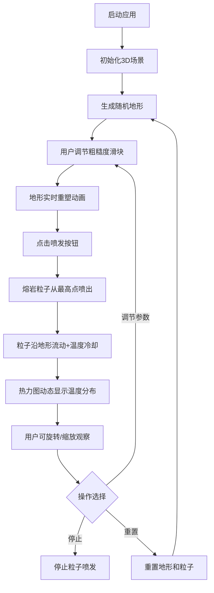

## 1. 产品概述

三维火山熔岩流动路径与温度分布可视化应用，为地质教学和游戏场景设计提供实时观察熔岩在不同地形上流动形态与冷却规律的交互式工具。

- 目标用户：地质学教师、学生、游戏场景设计师
- 核心价值：将抽象的地质物理过程转化为直观可交互的3D可视化体验

## 2. 核心功能

### 2.1 功能模块

1. **3D主场景**：地形渲染、熔岩粒子流动、温度热力图叠加
2. **地形生成系统**：随机起伏地形生成、粗糙度参数控制、等高线着色
3. **熔岩粒子系统**：粒子源喷发、基于坡度的流动模拟、温度渐变冷却、流动路径显示
4. **温度热力图**：半透明热力图层、动态透明度、红蓝色温渐变
5. **交互控制面板**：喷发/停止控制、粒子数量调节、地形粗糙度调节、重置功能

### 2.2 功能详情

| 模块名称 | 子功能 | 功能描述 |
|-----------|--------|----------|
| 地形生成 | 网格生成 | 10x10随机起伏地形网格 |
| 地形生成 | 等高线着色 | 深绿到棕褐色海拔渐变着色 |
| 地形生成 | 粗糙度控制 | 0-100滑块调节，实时重塑动画平滑 |
| 熔岩粒子 | 喷发源 | 地形最高点橙色发光粒子源 |
| 熔岩粒子 | 流动模拟 | 沿地形向下随机分支流动，坡度影响速度 |
| 熔岩粒子 | 温度变化 | #FF4500 亮橙 → #8B0000 暗红 → 消失 |
| 熔岩粒子 | 路径显示 | 粒子轨迹形成清晰流动路径 |
| 热力图 | 颜色渐变 | 红色高温区 → 蓝色低温区 |
| 热力图 | 动态透明度 | 喷发初期透明，逐渐显亮 |
| 视角控制 | 旋转 | 鼠标拖拽旋转视角 |
| 视角控制 | 缩放 | 滚轮缩放 |
| 控制面板 | 喷发/停止 | 按钮控制粒子喷发状态 |
| 控制面板 | 粒子数量 | 100-500滑块调节，默认200 |
| 控制面板 | 粗糙度 | 0-100滑块调节地形 |
| 控制面板 | 重置 | 重置地形和粒子至初始状态 |

## 3. 核心流程

## 4. 用户界面设计

### 4.1 设计风格

- **主背景色**：深色太空风格 #1a1a2e
- **文字颜色**：亮灰色 #e0e0e0
- **强调色**：熔岩橙 #FF4500、冷却暗红 #8B0000
- **渐变轨迹条**：深蓝 → 橙红
- **控制面板**：黑色半透明背景，圆角边框
- **按钮悬停**：transform: scale(1.05)，0.2s 过渡动画

### 4.2 页面布局

| 区域 | 占比 | 内容 |
|------|------|------|
| 3D场景 | 70% 屏幕面积 | Canvas容器，地形+粒子+热力图 |
| 控制面板（桌面端） | 右侧悬浮 | 半透明面板，所有控制控件 |
| 控制面板（移动端） | 底部固定 | 折叠为底部栏 |

### 4.3 响应式设计

- 桌面端：3D场景占70%，控制面板右侧悬浮
- 移动端：控制面板折叠为底部固定栏，3D场景全屏显示
- 触控优化：支持双指缩放、单指旋转

### 4.4 3D场景指导

- **环境**：深色太空背景，微弱环境光
- **光照**：方向光模拟阳光，点光源模拟熔岩发光
- **相机**：PerspectiveCamera，初始45度俯视角
- **控制器**：OrbitControls，支持拖拽旋转和滚轮缩放
- **后期处理**：轻微Bloom效果增强熔岩发光感
- **性能**：200粒子时帧率≥30fps，粒子生成/消失无闪烁
