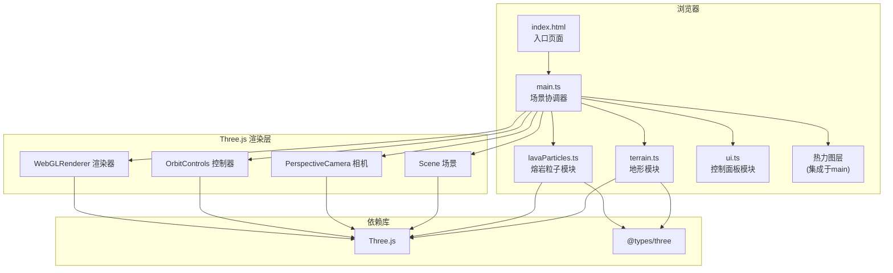

## 1. 架构设计



## 2. 技术选型说明

- **前端框架**：TypeScript + Vite（纯前端，无需框架）
- **3D引擎**：Three.js（WebGL封装）
- **类型定义**：@types/three
- **构建工具**：Vite（热更新，devServer端口3000）
- **开发语言**：TypeScript（严格模式，target ES2020）

## 3. 模块与文件结构

```
auto59/
├── package.json           # 依赖与脚本配置
├── vite.config.js         # Vite构建配置
├── tsconfig.json          # TypeScript配置
├── index.html             # 入口HTML
└── src/
    ├── main.ts            # 场景初始化、渲染循环、模块协调
    ├── terrain.ts         # 地形网格生成与更新
    ├── lavaParticles.ts   # 熔岩粒子系统
    └── ui.ts              # 控制面板DOM构建与事件绑定
```

## 4. 核心类定义

### 4.1 Terrain 地形类

```typescript
class Terrain {
  mesh: THREE.Mesh;
  heights: number[][];
  roughness: number;
  size: number;
  
  constructor(size: number, roughness: number);
  generateHeights(): void;        // 基于Perlin噪声生成高度
  updateRoughness(roughness: number): void;  // 平滑更新粗糙度
  getHeightAt(x: number, z: number): number;  // 获取指定位置高度
  getSlopeAt(x: number, z: number): number;   // 获取指定位置坡度
  getHighestPoint(): THREE.Vector3;           // 获取最高点坐标
  private colorForElevation(height: number): THREE.Color;  // 等高线着色
}
```

### 4.2 LavaParticleSystem 熔岩粒子系统

```typescript
interface LavaParticle {
  position: THREE.Vector3;
  velocity: THREE.Vector3;
  temperature: number;  // 0.0 - 1.0
  life: number;         // 剩余寿命
  active: boolean;
  trail: THREE.Vector3[];
}

class LavaParticleSystem {
  particles: LavaParticle[];
  maxParticles: number;
  pointCloud: THREE.Points;
  trailLines: THREE.LineSegments;
  isErupting: boolean;
  terrain: Terrain;
  sourcePosition: THREE.Vector3;
  
  constructor(maxParticles: number, terrain: Terrain);
  startEruption(): void;
  stopEruption(): void;
  setParticleCount(count: number): void;
  update(deltaTime: number): void;
  reset(): void;
  private spawnParticle(): void;
  private updateParticle(p: LavaParticle, dt: number): void;
  private temperatureToColor(temp: number): THREE.Color;
}
```

### 4.3 Heatmap 热力图类

```typescript
class Heatmap {
  mesh: THREE.Mesh;
  texture: THREE.CanvasTexture;
  canvas: HTMLCanvasElement;
  opacity: number;
  
  constructor(size: number);
  update(temperatures: Map<string, number>): void;
  setOpacity(opacity: number): void;
  reset(): void;
}
```

## 5. UI 组件结构

### 控制面板 DOM 结构

```
#control-panel (fixed right, 30% width)
├── h2 标题 "熔岩流动模拟控制台"
├── .control-group
│   ├── button#eruptBtn "喷发/停止"
│   └── button#resetBtn "重置"
├── .control-group
│   ├── label "粒子数量: <span>200</span>"
│   └── input[type=range]#particleCount (min=100, max=500, value=200)
├── .control-group
│   ├── label "地形粗糙度: <span>50</span>"
│   └── input[type=range]#roughness (min=0, max=100, value=50)
└── .info
    └── "提示: 鼠标拖拽旋转, 滚轮缩放"
```

## 6. 性能优化策略

| 优化项 | 策略 |
|--------|------|
| 粒子渲染 | 使用 THREE.Points 批量渲染，而非单个 Mesh |
| 轨迹优化 | 使用 LineSegments + BufferGeometry，限制轨迹点数量 |
| 地形更新 | 使用顶点动画过渡，而非重建 Geometry |
| 热力图 | Canvas 2D 绘制温度，更新 Texture，避免每帧重建 Mesh |
| 帧率控制 | requestAnimationFrame 循环，deltaTime 时间步长 |
| 内存管理 | 对象池复用粒子，避免频繁 GC |

## 7. 动画与过渡

- **地形重塑**：顶点位置 lerp 插值，300ms 平滑过渡
- **按钮悬停**：CSS transform: scale(1.05)，transition: 0.2s
- **粒子生成**：透明度从0渐变到1，避免闪烁
- **粒子消失**：温度低于阈值时透明度渐变为0
- **热力图显亮**：opacity 随喷发时间从0线性增长到0.7

## 8. 响应式断点

| 断点 | 布局策略 |
|------|----------|
| ≥ 1024px (桌面) | 3D场景70%，控制面板右侧30%悬浮 |
| < 1024px (平板/手机) | 3D场景全屏，控制面板底部固定，可展开/收起 |
