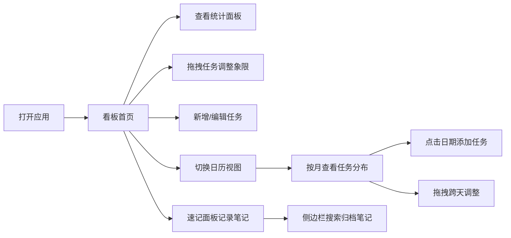

## 1. 产品概述

集成式生产力看板应用，为独立开发者和小团队提供统一的待办事项、项目进度与笔记管理平台，解决多工具切换导致的信息碎片化问题。
- 目标用户：独立开发者、小团队成员、需要高效管理日常任务的知识工作者
- 核心价值：将四象限看板、Markdown笔记、日历视图、数据统计整合于单一界面，消除重复录入

## 2. 核心功能

### 2.1 用户角色
| 角色 | 注册方式 | 核心权限 |
|------|----------|----------|
| 普通用户 | 无需注册（本地使用） | 完整使用所有功能，数据存储于本地 localStorage |

### 2.2 功能模块
1. **首页看板视图**：统计概览面板 + 四象限待办看板 + 笔记速记侧边栏
2. **日历视图**：月视图展示任务截止日期，支持快速添加和拖拽调整
3. **笔记管理**：Markdown速记、时间归档、全文搜索

### 2.3 页面详情
| 页面名称 | 模块名称 | 功能描述 |
|----------|----------|----------|
| 看板首页 | 统计面板 | 今日完成数、待处理总数、超期数、7天趋势折线图 |
| 看板首页 | 四象限看板 | 紧急重要/重要不紧急/紧急不重要/不重要不紧急四象限展示，支持拖拽移动 |
| 看板首页 | 笔记速记面板 | 浮动Markdown编辑器，支持加粗、列表、待办勾选，实时保存 |
| 日历视图 | 月历视图 | 月视图展示任务截止日期，月份切换滑动动画 |
| 日历视图 | 日期交互 | 点击日期添加任务，拖拽事件卡片跨天调整 |
| 全局 | 笔记侧边栏 | 按创建时间归档笔记列表，标题/正文搜索（<300ms响应） |

## 3. 核心流程

用户打开应用 → 进入看板首页，查看今日统计和待办事项 → 拖拽调整任务象限优先级 → 点击编辑或新增任务 → 切换至日历视图查看全局安排 → 使用右侧速记面板记录灵感 → 通过搜索快速定位笔记

## 4. 用户界面设计

### 4.1 设计风格
- 主色调：浅灰蓝到蓝紫色渐变背景（#f0f5ff → #e8ecf5）
- 象限色块：红、橙、黄、绿各15%透明度区分
- 卡片样式：圆角12px、半透明白色背景 rgba(255,255,255,0.9)、柔和阴影
- 按钮风格：涟漪点击效果、悬停上浮3px加深阴影
- 字体：现代无衬线字体，标题与正文形成清晰层级

### 4.2 页面设计概述
| 页面名称 | 模块名称 | UI元素 |
|----------|----------|--------|
| 看板首页 | 顶部导航 | 极简导航栏、视图切换（看板/日历）、动画过渡 |
| 看板首页 | 统计面板 | 4个数据卡片 + Canvas折线图、柔和渐变色块 |
| 看板首页 | 四象限区域 | 2×2网格布局、色块背景区分、可拖拽任务卡片 |
| 看板首页 | 任务卡片 | 标题、截止日期标签、优先级徽章、完成勾选动画 |
| 看板首页 | 速记面板 | 浮动右侧、Markdown工具栏、实时预览 |
| 日历视图 | 月历网格 | 7列网格、月份滑动切换、日期格子任务标记 |
| 全局 | 笔记侧边栏 | 时间分组列表、搜索框、底部抽屉式（移动端） |

### 4.3 响应式
- 桌面端（>768px）：四象限2×2网格、笔记面板固定右侧
- 移动端（≤768px）：四象限单列垂直堆叠、笔记面板变底部抽屉、日历紧凑列表
- 触控优化：拖拽区域增大、按钮点击区域≥44px

### 4.4 动效设计
- 任务卡片拖拽：scale 0.98→1.02、0.3s过渡、半透明跟随光标
- 悬停效果：卡片上浮3px、阴影加深、0.2s过渡
- 日历月份切换：0.4s ease-out 滑动动画
- 完成勾选：轻微旋转打勾动画
- 按钮点击：伪元素模拟涟漪扩散效果
