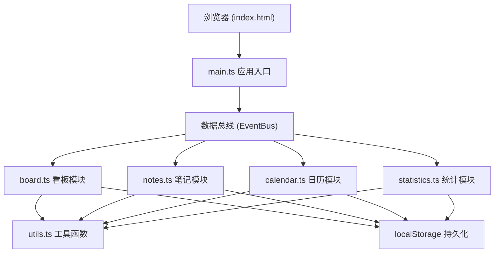
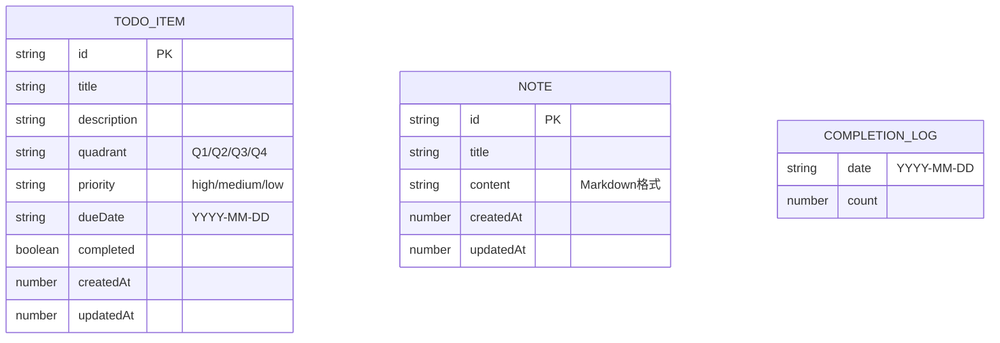

## 1. 架构设计

## 2. 技术描述
- 前端：TypeScript + Vite + 纯 HTML/CSS（无 UI 框架，所有组件手写）
- 构建工具：Vite 5.x（端口 3000）
- 语言标准：TypeScript 严格模式，target ES2020
- 数据存储：浏览器 localStorage（JSON 序列化）
- 图形绘制：原生 Canvas API（折线图）
- 拖拽实现：原生 HTML5 Drag and Drop API + requestAnimationFrame 优化

## 3. 视图路由
| 视图标识 | 对应模块 | 说明 |
|----------|----------|------|
| board | Board 模块 | 四象限看板视图（默认） |
| calendar | Calendar 模块 | 日历月视图 |

通过 main.ts 中的视图切换逻辑控制 DOM 显隐，不使用第三方路由库。

## 4. 数据模型

### 4.1 数据模型定义

### 4.2 localStorage 存储键
- `productivity_board_items`: TodoItem[] - 待办事项列表
- `productivity_notes`: Note[] - 笔记列表
- `productivity_completion_log`: Record<string, number> - 每日完成数记录

## 5. 模块职责

| 模块 | 文件 | 核心职责 | 对外 API |
|------|------|----------|----------|
| 工具 | utils.ts | 日期格式化、localStorage 封装、防抖、ID 生成 | formatDate(), storage(), debounce(), uid() |
| 看板 | board.ts | 四象限渲染、拖拽排序、事项增删改查 | addItem(), moveItem(), updateItem(), deleteItem(), getItems(), render() |
| 笔记 | notes.ts | Markdown 编辑器、笔记归档、全文搜索 | addNote(), updateNote(), deleteNote(), searchNotes(), render() |
| 日历 | calendar.ts | 月视图渲染、日期点击、跨天拖拽 | render(), setMonth(), addItemForDate(), moveItemToDate() |
| 统计 | statistics.ts | 数据聚合、Canvas 折线图绘制 | renderStats(), renderChart(), getStats() |
| 主入口 | main.ts | 模块初始化、视图路由、事件总线协调 | init(), switchView() |

## 6. 性能优化策略

1. **搜索响应 < 300ms**：使用 debounce(200ms) + 字符串 includes 线性搜索
2. **拖拽 FPS > 50**：使用 requestAnimationFrame 节流 DOM 更新，仅修改 transform/opacity
3. **日历渲染 < 200ms**：虚拟日期网格 + DocumentFragment 批量插入
4. **动画性能**：所有过渡使用 transform/opacity，避免触发 layout/paint
5. **localStorage**：读写使用内存缓存，批量写入时合并防抖
