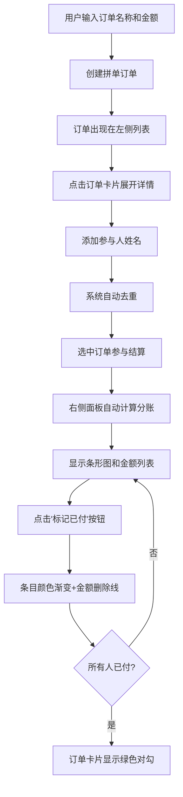

## 1. 产品概述

拼单分账可视化管理应用是一款面向共享办公空间社群成员的Web应用，解决传统群聊接龙方式管理拼单活动时的混乱、统计困难、支付状态不清晰等痛点。用户可快速创建拼单订单、添加参与人、自动计算每人应摊金额，并通过可视化条形图和状态颜色直观展示支付情况。

- **目标用户**：共享办公空间社群成员、需要组织团购/拼单活动的任何人
- **核心价值**：简化拼单流程、透明分账计算、清晰支付状态追踪

---

## 2. 核心功能

### 2.1 功能模块

1. **订单管理模块**：创建、编辑、删除拼单订单，支持订单选中/取消选中
2. **参与人管理模块**：为每个订单添加/移除参与人，姓名去重，支付状态关联
3. **分账计算模块**：按订单人头均摊，支持一人多单累计汇总，自动保留两位小数
4. **支付状态可视化模块**：颜色状态标记、平滑过渡动画、完成标识、条形图可视化

### 2.2 页面详情

| 页面名称 | 模块名称 | 功能描述 |
|-----------|-------------|---------------------|
| 主应用页面 | 订单创建区 | 输入订单名称和总金额，点击按钮创建新订单 |
| 主应用页面 | 订单列表区 | 左侧30%宽度展示所有订单卡片，支持选中高亮、展开详情、编辑、删除 |
| 主应用页面 | 订单卡片 | 显示订单名称、总金额、创建时间，展开后管理参与人，完成时显示绿色对勾 |
| 主应用页面 | 结算面板区 | 右侧70%宽度展示分组条形图和每人应付金额列表，支持标记已付 |
| 主应用页面 | 编辑弹窗 | Modal形式修改订单名称和总金额 |

---

## 3. 核心流程

用户创建拼单订单 → 添加参与人 → 系统自动按人头均摊计算每人应付 → 用户查看结算面板条形图 → 参与人付款后点击"标记已付" → 条目颜色从红色渐变到绿色，金额显示删除线 → 所有参与人付清后订单卡片显示完成对勾

---

## 4. 用户界面设计

### 4.1 设计风格
- **整体基调**：浅色主题，清爽现代，专业可信
- **主背景色**：#F5F7FA
- **主色调**：蓝色 #3B82F6（选中/高亮）
- **状态色**：浅红 #FEE2E2（未支付）、浅绿 #DCFCE7（已支付）、中绿 #22C55E（完成标识）
- **卡片背景**：白色 #FFFFFF，圆角 12px，浅灰色阴影
- **字体**：现代无衬线字体，清晰易读
- **按钮样式**：圆角按钮，悬停时 translateY(-2px) + 阴影放大过渡

### 4.2 页面设计概述

| 页面名称 | 模块名称 | UI 元素 |
|-----------|-------------|-------------|
| 主应用页面 | 订单创建区 | 输入框 + 按钮组合，顶部区域，简洁布局 |
| 主应用页面 | 订单卡片 | 白色圆角卡片，悬停显示编辑/删除图标（淡入0.2s），选中时蓝色边框+加深阴影 |
| 主应用页面 | 参与人条目 | Flex布局，姓名和金额左对齐，标记按钮右对齐 |
| 主应用页面 | 结算面板 | 顶部横向条形图（按姓名字母顺序分配彩色），下方参与人列表，状态颜色过渡0.5s |
| 主应用页面 | 响应式布局 | 桌面：左30%右70%，<768px：上下排列各占100% |

### 4.3 动画与交互
- 按钮悬停：translateY(-2px) + 阴影放大，平滑过渡
- 支付状态变化：背景色从浅红到浅绿，0.5s 渐变动画
- 卡片操作图标：默认隐藏，悬停淡入（0.2s）
- 条形图颜色：从色环按姓名字母顺序分配
- 金额样式：已支付时灰色 + 删除线

### 4.4 响应式
- 桌面优先（Desktop-first）设计
- 断点 768px：左右分栏 → 上下堆叠
- 触摸设备：按钮尺寸适配手指点击区域
