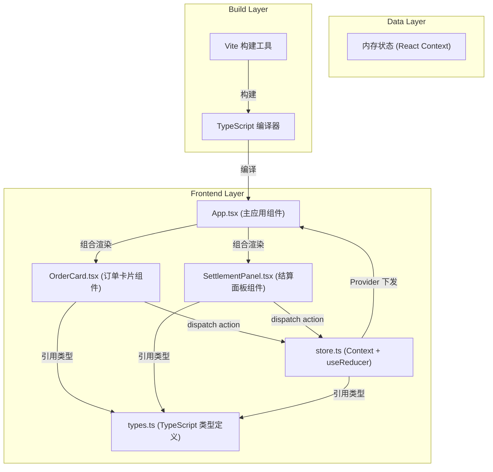
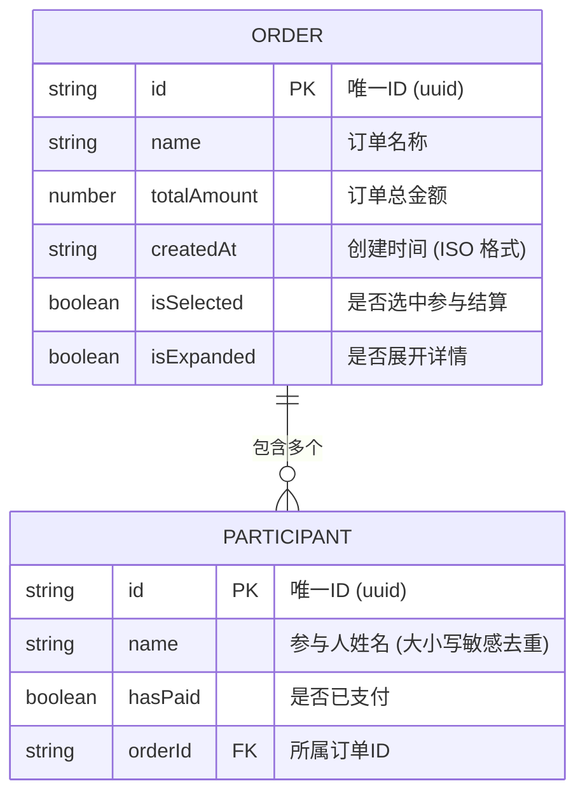

## 1. 架构设计



**数据流向说明：**
- 用户操作 → 视图组件（OrderCard / SettlementPanel）→ dispatch Action → useReducer 更新 State → Context Provider 下发 → 所有消费组件重新渲染
- 所有状态集中在 store.ts，通过 React Context 实现全局状态管理
- 结算计算逻辑使用 useMemo 缓存，避免不必要的重复计算

---

## 2. 技术描述

- **前端框架**：React 18 + React DOM
- **构建工具**：Vite（devServer 端口 3000）
- **类型系统**：TypeScript（严格模式，target ES2020）
- **状态管理**：React Context + useReducer
- **工具库**：uuid（生成唯一ID）、lodash（工具函数）
- **样式方案**：CSS Modules / 内联样式（无额外 CSS 框架，保持轻量）
- **初始化方式**：手动搭建项目结构（非 create-vite 脚手架）

---

## 3. 文件结构与职责

| 文件路径 | 职责描述 | 依赖关系 |
|-----------|-------------|-------------|
| `/package.json` | 项目依赖与脚本配置 | 无 |
| `/vite.config.js` | Vite 构建配置，React + TS 支持，端口 3000 | 无 |
| `/tsconfig.json` | TypeScript 编译配置（严格模式、ES2020、DOM） | 无 |
| `/index.html` | 应用入口 HTML，提供 React 挂载点 | 无 |
| `/src/types.ts` | 定义 Order、Participant、SettlementEntry 等接口 | 无（最底层） |
| `/src/store.ts` | 全局状态：Context、Reducer、初始状态、Action 类型 | 引用 types.ts |
| `/src/components/OrderCard.tsx` | 订单卡片组件：展示订单、管理参与人、编辑删除 | 引用 store.ts、types.ts |
| `/src/components/SettlementPanel.tsx` | 结算面板：分账计算、条形图、支付标记 | 引用 store.ts、types.ts |
| `/src/App.tsx` | 主应用：布局、Provider 包裹、组合子组件 | 引用 store.ts、OrderCard、SettlementPanel |
| `/src/main.tsx` | 应用入口：渲染 App 组件到 DOM | 引用 App.tsx |
| `/src/index.css` | 全局样式：主题变量、布局、动画、响应式 | 无 |

---

## 4. 数据模型

### 4.1 数据模型定义



### 4.2 TypeScript 类型定义

```typescript
// 参与人
interface Participant {
  id: string;
  name: string;
  hasPaid: boolean;
  orderId: string;
}

// 拼单订单
interface Order {
  id: string;
  name: string;
  totalAmount: number;
  createdAt: string;
  isSelected: boolean;
  isExpanded: boolean;
  participants: Participant[];
}

// 分账条目（结算面板用）
interface SettlementEntry {
  participantName: string;
  totalOwed: number;
  orders: Array<{
    orderId: string;
    orderName: string;
    amount: number;
    hasPaid: boolean;
  }>;
}

// 全局 State
interface AppState {
  orders: Order[];
}

// Action 类型
type AppAction =
  | { type: 'ADD_ORDER'; payload: { name: string; totalAmount: number } }
  | { type: 'DELETE_ORDER'; payload: { orderId: string } }
  | { type: 'UPDATE_ORDER'; payload: { orderId: string; name: string; totalAmount: number } }
  | { type: 'TOGGLE_ORDER_SELECTED'; payload: { orderId: string } }
  | { type: 'TOGGLE_ORDER_EXPANDED'; payload: { orderId: string } }
  | { type: 'ADD_PARTICIPANT'; payload: { orderId: string; name: string } }
  | { type: 'REMOVE_PARTICIPANT'; payload: { orderId: string; participantId: string } }
  | { type: 'TOGGLE_PAYMENT'; payload: { orderId: string; participantId: string } };
```

---

## 5. 性能优化策略

| 优化点 | 实施方案 |
|-----------|-------------|
| UI 响应 <16ms | 所有状态更新均为纯对象操作，避免 heavy computation 在 render 路径 |
| 结算计算不卡顿 | 使用 `useMemo` 缓存分账计算结果，仅当选中订单或参与人变化时重算 |
| 动画帧率 ≥30fps | 状态变化动画使用 CSS transition（GPU 加速），避免 JS 动画 |
| 首次渲染 <1s | 项目轻量无重型依赖，Vite HMR + React 18 并发特性 |
| 组件重渲染优化 | 通过 React.memo 包裹 OrderCard，避免无关订单变化导致的重渲染 |
| 列表渲染 | 使用稳定的 key（uuid）保证 React 协调效率 |

---

## 6. 核心业务逻辑

### 6.1 分账计算公式
```
单订单人均金额 = 订单总金额 / 参与人数
某参与人累计应付 = Σ(该参与人参与的每个选中订单的人均金额)
```

### 6.2 参与人去重规则
- 按姓名精确匹配（大小写敏感）
- 同一订单内不允许重名参与人
- 去重检查在 ADD_PARTICIPANT action 中执行

### 6.3 参与人删除限制
- 已标记支付（hasPaid = true）的参与人不可删除
- 删除按钮禁用并显示提示信息

### 6.4 订单完成判定
- 订单内所有参与人 hasPaid = true → 显示绿色对勾
- 任一参与人未支付 → 不显示完成标识
