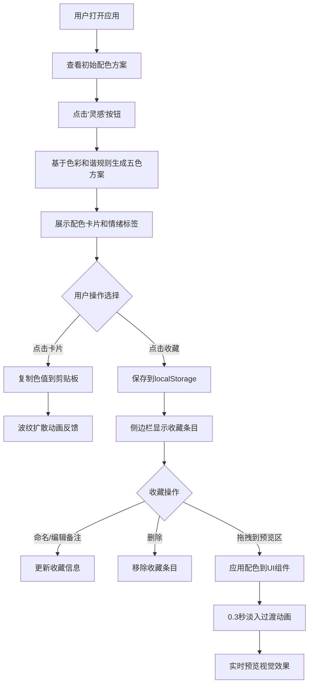

## 1. 产品概述

配色灵感工坊是一款面向独立插画师和设计师的在线配色方案灵感生成与收藏工具，解决创作者在设计过程中缺乏新颖配色灵感、难以系统管理发现的配色组合的痛点。

- 核心目标：提供高效的配色灵感生成、收藏管理和实时预览能力
- 目标用户：独立插画师、UI/UX设计师、平面设计师、创意工作者
- 产品价值：降低配色探索成本，系统化管理个人调色盘，提升设计效率

## 2. 核心功能

### 2.1 用户角色
| 角色 | 注册方式 | 核心权限 |
|------|----------|----------|
| 普通用户 | 无需注册，直接使用 | 生成配色、收藏管理、预览对比 |

### 2.2 功能模块
1. **配色生成器**：随机生成五种颜色的配色方案，支持色彩和谐规则
2. **收藏侧边栏**："我的调色盘"收藏夹管理，支持命名、折叠、编辑备注
3. **对比预览区**：将配色方案应用到UI组件样板，实时预览视觉效果

### 2.3 页面详情
| 页面名称 | 模块名称 | 功能描述 |
|----------|----------|----------|
| 主页面 | 配色生成器 | 点击"灵感"按钮基于色彩和谐规则（互补色、类似色、三角色等）生成五色配色方案；每个卡片显示色块和十六进制码；配情绪标签；点击卡片复制色值；复制波纹动画反馈 |
| 主页面 | 收藏侧边栏 | 右侧可折叠侧边栏；支持收藏夹命名；折叠式卡片条目；展开显示五色和可编辑备注；拖拽入口；localStorage持久化存储 |
| 主页面 | 对比预览区 | 接收拖拽配色方案；自动应用到预设UI组件（按钮、卡片、文字背景）；0.3秒淡入过渡动画 |

## 3. 核心流程

用户打开应用 → 点击"灵感"按钮生成随机配色方案 → 浏览五色卡片和情绪标签 → 点击卡片复制色值（波纹反馈）→ 满意的方案点击收藏 → 在右侧侧边栏查看和管理收藏 → 拖拽收藏方案到预览区 → 实时查看配色在UI组件上的效果

## 4. 用户界面设计

### 4.1 设计风格
- **主背景色**：#1a1a2e（深紫蓝）
- **辅背景色**：#16213e（深蓝）
- **卡片效果**：半透明磨砂玻璃质感（backdrop-filter: blur(8px)）
- **字体**：无衬线体（system-ui, -apple-system, sans-serif）
- **交互效果**：鼠标悬停时轻微上浮阴影效果
- **整体调性**：深色、优雅、专业、富有艺术感

### 4.2 页面设计概述
| 页面名称 | 模块名称 | UI元素 |
|----------|----------|--------|
| 主页面 | 配色生成器 | 灵感按钮（悬浮、高亮）、五个色块卡片（网格布局、悬停上浮、点击波纹）、情绪标签（渐变文字） |
| 主页面 | 收藏侧边栏 | 折叠/展开开关、收藏夹名称输入框、折叠式卡片列表、删除按钮、备注编辑框、拖拽手柄 |
| 主页面 | 对比预览区 | 拖拽接收区域提示、按钮组件、卡片组件、文字背景区域、淡入动画 |

### 4.3 响应式
- 桌面端：三栏布局（主区域+侧边栏+预览区）
- 移动端：纵向堆叠布局，侧边栏改为底部抽屉形式
- 触控优化：增大点击区域，支持触摸拖拽

### 4.4 动效规范
- 配色卡片悬停：translateY(-4px) + box-shadow增强，150ms ease-out
- 复制波纹：从点击位置向外扩散的圆形波纹，300ms ease-out
- 预览切换：opacity 0→1 + translateY(10px→0)，300ms ease-out
- 侧边栏折叠：width变化过渡，200ms ease
