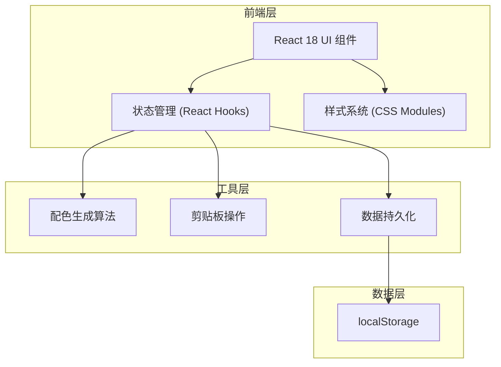

## 1. 架构设计



## 2. 技术描述
- **前端框架**：React@18 + TypeScript
- **构建工具**：Vite
- **辅助库**：uuid（唯一ID生成）、lodash（工具函数）
- **初始化方式**：Vite脚手架初始化
- **数据存储**：浏览器localStorage（无需后端）
- **样式方案**：原生CSS + CSS变量，半透明磨砂玻璃效果

## 3. 目录结构定义
| 文件路径 | 用途 |
|----------|------|
| `/package.json` | 项目依赖和脚本配置 |
| `/vite.config.js` | Vite构建配置（端口3000，React支持） |
| `/tsconfig.json` | TypeScript配置（严格模式，ES2020，JSX/DOM类型） |
| `/index.html` | 入口HTML，标题"配色灵感工坊" |
| `/src/App.tsx` | 主应用组件，整合三大模块，管理全局状态 |
| `/src/ColorGenerator.tsx` | 配色生成器组件，包含生成逻辑和UI |
| `/src/PaletteSidebar.tsx` | 收藏侧边栏组件，管理收藏夹 |
| `/src/PreviewArea.tsx` | 对比预览区组件，UI样板展示 |
| `/src/utils.ts` | 工具函数集合 |
| `/src/index.css` | 全局样式 |
| `/src/main.tsx` | 应用入口 |

## 4. 数据模型

### 4.1 核心类型定义
```typescript
interface ColorPalette {
  id: string;
  colors: string[];    // 5个十六进制色值
  mood: string;        // 情绪标签
  name: string;        // 用户自定义名称
  note: string;        // 备注
  createdAt: number;   // 创建时间戳
}

type HarmonyType = 'complementary' | 'analogous' | 'triadic' | 'split-complementary' | 'tetradic';
```

### 4.2 存储结构
```typescript
interface StorageData {
  palettes: ColorPalette[];
  collectionName: string;  // 收藏夹名称
}
// localStorage key: 'color-inspiration-workshop'
```

## 5. 性能要求
- 动画帧率：≥ 40fps（使用CSS transform和opacity实现硬件加速）
- 色值复制响应：≤ 50ms
- 预览切换响应：≤ 50ms
- 首次加载：≤ 2s（纯前端，轻量化）

## 6. 工具函数模块（src/utils.ts）
1. `generateRandomPalette(): { colors: string[], mood: string, harmonyType: HarmonyType }`
   - 基于色彩和谐规则随机生成五色方案
   - 随机选择和谐类型：互补色、类似色、三角色、分裂互补、四角色
2. `copyToClipboard(color: string): Promise<boolean>`
   - 将色值复制到剪贴板
3. `savePalettes(palettes: ColorPalette[], collectionName: string): void`
   - 写入localStorage持久化
4. `loadPalettes(): { palettes: ColorPalette[], collectionName: string } | null`
   - 从localStorage读取数据
5. `hslToHex(h: number, s: number, l: number): string`
   - HSL转十六进制辅助函数
6. `getMoodLabel(harmonyType: HarmonyType, baseHue: number): string`
   - 根据配色特征匹配情绪标签
