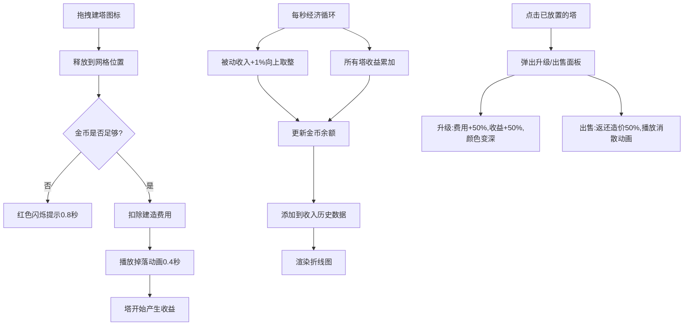

## 1. 产品概述
塔防经济系统模拟器 - 用于独立游戏开发者测试和展示不同防御塔建造费用与运行收益平衡性的可视化工具。
- 主要目的：提供实时经济数据模拟、防御塔建造/升级/出售操作、收益历史曲线可视化
- 目标用户：独立游戏开发者、塔防游戏策划
- 产品价值：快速迭代平衡防御塔的经济参数，直观展示收益趋势

## 2. 核心特性

### 2.1 功能模块
1. **主场景仪表盘**：Canvas绘制网格背景、防御塔图标、金币数值、每秒收入统计折线图
2. **控制面板**：4种防御塔选择、建造/出售/升级操作、实时经济摘要
3. **经济模拟引擎**：被动收入、防御塔收益、成本核算、状态管理

### 2.2 页面详情
| 页面名称 | 模块名称 | 功能描述 |
|-----------|-------------|---------------------|
| 主页面 | 主场景仪表盘 | 展示游戏地图网格、放置的防御塔、左下角金币数、右上角收入历史折线图 |
| 主页面 | 右侧控制面板 | 4种防御塔选择区（拖拽建造）、塔升级/出售面板、实时经济摘要 |
| 主页面 | 移动端底部工具栏 | 窄屏下控制面板折叠为可展开的底部工具栏 |

## 3. 核心流程

用户拖拽防御塔图标到主场景网格 → 系统吸附到30x30网格点并检查金币 → 金币足够则扣除费用并播放掉落动画，不足则红色闪烁提示 → 每秒自动计算所有塔收益和被动收入 → 数据推送到渲染器绘制UI和折线图 → 用户点击已放置的塔可升级（最多3次，费用+50%，收益+50%）或出售（返还当前造价一半，播放消散动画）

## 4. 用户界面设计

### 4.1 设计风格
- 主色调：深灰色背景(#2a2a2a) + 浅米色控制面板(#f5e6d3)
- 按钮风格：柔和圆角(border-radius:8px)，阴影(box-shadow)，按下时translateY(2px)并加深颜色
- 字体：像素风格或等宽字体，数字使用等宽字体便于对比
- 布局：左侧Canvas主场景(自适应) + 右侧240px控制面板(窄屏折叠到底部)
- 像素风防御塔图标：16x16像素级图形，箭塔(三角形)、炮塔(方形)、魔法塔(星形)、激光塔(矩形)

### 4.2 页面设计概览
| 页面名称 | 模块名称 | UI元素 |
|-----------|-------------|-------------|
| 主页面 | 主场景 | 深灰背景#2a2a2a，浅灰虚线网格#444，像素塔图标，左下角金币数值(绿/红渐变动画0.3s)，右上角60秒收入折线图 |
| 主页面 | 控制面板 | 浅米色背景#f5e6d3，4个塔选择按钮(显示名称、造价、收益/秒)，升级面板，出售按钮，经济摘要(当前金币、每秒收入、塔数量) |
| 主页面 | 动画效果 | 建塔掉落弹性缓动(easeOut弹跳两次0.4s)，出售白色圆圈扩散消散(0.3s)，金币数值颜色渐变(0.3s) |

### 4.3 响应式设计
- 桌面优先(Desktop-first)
- 浏览器宽度<768px时，控制面板折叠至底部变为可展开工具栏
- 触控设备优化拖拽和点击区域

## 5. 性能约束
- 经济更新循环帧率≥30fps
- 同时存在20座塔时交互流畅无明显卡顿
