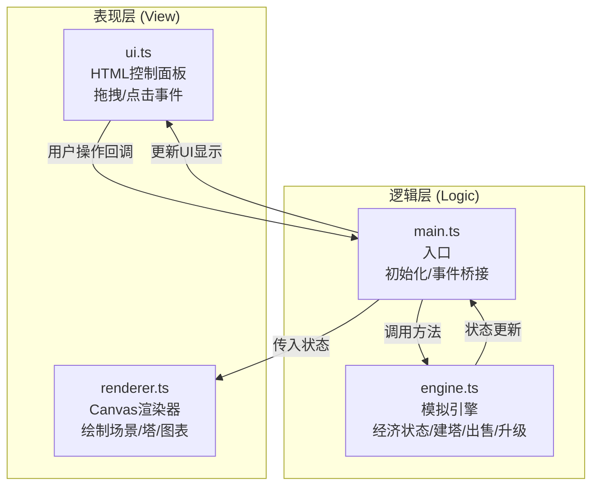

## 1. 架构设计



## 2. 技术选型
- 前端：TypeScript + Vite(纯原生，无React/Vue框架)
- 渲染：HTML5 Canvas 2D
- 样式：原生CSS（无Tailwind等框架，按需求手动编写）
- 初始化工具：Vite vanilla-ts模板
- 后端：无（纯前端模拟）

## 3. 文件结构
```
/
├── index.html              # 入口页面，canvas+控制面板DOM结构
├── package.json            # 依赖：typescript、vite
├── vite.config.js          # Vite配置，端口3000
├── tsconfig.json           # TS配置，严格模式，ES2020，DOM类型
└── src/
    ├── main.ts             # 入口逻辑，初始化、事件绑定、状态桥接
    ├── engine.ts           # 核心模拟引擎，经济状态管理
    ├── renderer.ts         # Canvas渲染器
    ├── ui.ts               # HTML控制面板逻辑
    └── styles.css          # 全局样式
```

## 4. 数据模型

### 4.1 核心类型定义

```typescript
// 防御塔类型
type TowerType = 'arrow' | 'cannon' | 'magic' | 'laser';

// 防御塔配置
interface TowerConfig {
  name: string;
  cost: number;           // 基础造价
  baseIncome: number;     // 基础每秒收益
  color: string;          // 基础颜色
  maxLevel: number;       // 最大等级(3)
}

// 已放置的防御塔实例
interface Tower {
  id: string;
  type: TowerType;
  gridX: number;          // 网格坐标
  gridY: number;
  level: number;          // 当前等级(1-3)
  currentCost: number;    // 当前总造价(含升级)
  currentIncome: number;  // 当前每秒收益
  // 动画状态
  buildProgress: number;  // 建造动画进度0-1
  selling: boolean;       // 是否正在出售
  sellProgress: number;   // 出售动画进度0-1
}

// 引擎状态
interface EngineState {
  gold: number;
  goldDelta: number;      // 最近变化量(用于颜色动画)
  goldDeltaTimer: number; // 颜色动画剩余时间
  towers: Tower[];
  incomeHistory: number[]; // 最近60秒每秒收入
  lastSecondIncome: number;
  passiveRate: number;    // 被动收入比例0.01
}

// 渲染状态(引擎状态+动画帧信息)
interface RenderState extends EngineState {
  time: number;           // 当前时间(ms)
  dragTowerType: TowerType | null; // 正在拖拽的塔类型
  dragX: number;
  dragY: number;
  selectedTowerId: string | null;
}
```

## 5. 模块间数据流向

```
用户UI操作(ui.ts)
    ↓ 事件回调(onBuyTower / onSellTower / onUpgradeTower)
main.ts(入口)
    ↓ 调用引擎方法
engine.ts: towerBuy() / towerSell() / towerUpgrade() / update()
    ↓ 更新内部状态，返回成功/失败
main.ts
    ↓ 每帧调用
renderer.ts: render(state)  ← 传入引擎状态+动画信息
ui.ts: updateUI(state)      ← 更新HTML面板显示
```

## 6. 性能优化策略

- 使用requestAnimationFrame渲染循环，与Vite dev server配合热更新
- 经济计算每秒触发一次(setInterval 1000ms)，与渲染循环分离
- Canvas批量绘制，避免频繁状态切换
- 收入历史数组使用固定长度60的环形缓冲
- 拖拽时只更新渲染状态，不触发引擎逻辑
- 防御塔升级/出售动画通过状态机驱动，渲染器读取进度值绘制
