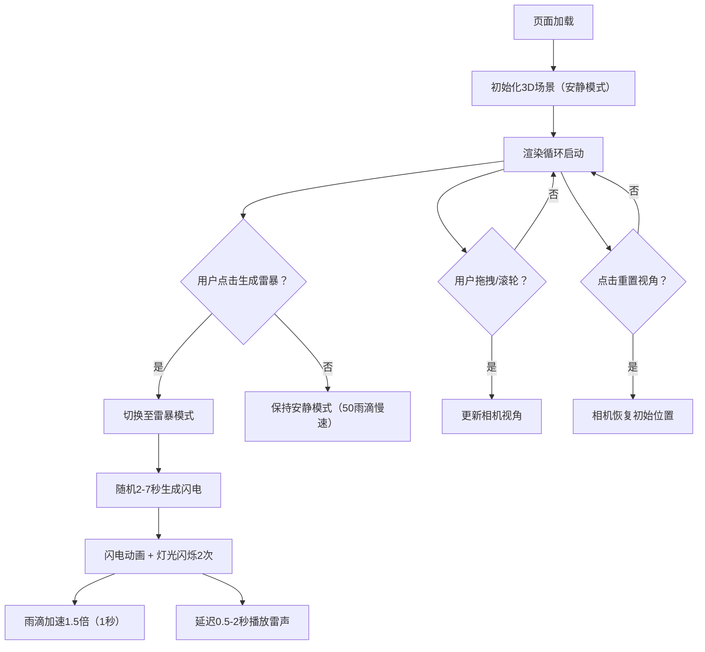

## 1. 产品概述

基于Three.js的浏览器端三维暴风雨场景模拟应用，用于游戏场景与影视预可视化中的雷电环境与室内灯光联动效果快速生成。

- 主要解决问题：为游戏开发者、影视预演人员提供快速生成逼真雷电环境与室内灯光联动效果的可视化工具
- 目标用户：游戏场景设计师、影视预可视化艺术家、3D交互开发者
- 产品价值：无需复杂DCC软件即可在浏览器中快速预览和调试雷暴环境灯光效果，提高创作效率

## 2. 核心功能

### 2.1 功能模块

1. **3D室内场景模块**：封闭房间构建、台灯光源、窗外建筑剪影、相机交互控制
2. **闪电与灯光联动模块**：随机闪电生成（折线+分支）、亮度动画、室内灯光同步闪烁
3. **雨滴粒子系统模块**：持续雨滴下落、风力偏移、闪电加速响应
4. **听觉反馈模块**：Web Audio API合成雷声音效、距离衰减
5. **UI交互模块**：雷暴/安静模式切换、视角重置、响应式布局

### 2.2 页面详情

| 页面名称 | 模块名称 | 功能描述 |
|-----------|-------------|---------------------|
| 主场景页 | 3D渲染区域 | 全屏Three.js Canvas渲染室内暴风雨场景，支持鼠标拖拽旋转视角、滚轮缩放 |
| 主场景页 | 闪电系统 | 随机2-7秒生成闪电（白色折线+2-3条分支），0.1s增亮+0.3s渐灭动画 |
| 主场景页 | 灯光联动 | 闪电触发时台灯与环境光同步闪烁2次（0.15s降至20%再恢复，指数衰减） |
| 主场景页 | 雨滴粒子 | 300个半透明浅蓝色雨滴，带风力水平偏移，4秒生命周期，闪电时1.5倍加速1秒 |
| 主场景页 | 雷声音效 | 闪电后0.5-2秒随机延迟触发白噪声低通滤波雷声，音量距离指数衰减 |
| 主场景页 | 控制按钮 | 生成雷暴开关、重置视角按钮、模式切换（雷暴/安静） |
| 主场景页 | 视觉特效 | 闪电时窗外半透明白色蒙版（0.1s出现+0.3s消失）、屏幕边缘抖动（2px 0.2s正弦衰减） |

## 3. 核心流程

用户打开页面 → 3D场景自动加载初始化（安静模式，50个慢速雨滴）→ 用户点击"生成雷暴"按钮 → 切换到雷暴模式（300雨滴、闪电随机生成、灯光闪烁、雷声延迟播放）→ 用户可拖拽鼠标旋转视角、滚轮缩放 → 点击"重置视角"恢复初始相机 → 切换按钮可在雷暴/安静模式间切换

## 4. 用户界面设计

### 4.1 设计风格

- **主色调**：深暗背景色 `#1a1a2e`，窗外深蓝色 `#0a0a23`，暖黄色台灯光晕 `#ffcc66`，闪电亮白 `#ffffff`
- **按钮风格**：圆角矩形（圆角12px），悬停时背景变亮并向上浮起2px（0.2s），按下缩放至95%再弹回（0.1s）
- **字体**：现代无衬线字体，标题加粗，正文常规字重
- **布局风格**：全屏3D Canvas为主体，底部悬浮控制栏，按钮水平排列（移动端垂直排列）
- **视觉特效**：台灯径向渐变光晕、闪电时白色蒙版覆盖、屏幕边缘抖动

### 4.2 页面设计概览

| 页面名称 | 模块名称 | UI元素 |
|-----------|-------------|-------------|
| 主场景页 | 3D渲染区 | 全屏Canvas，暗色调背景，房间内暖光，窗外深蓝建筑剪影 |
| 主场景页 | 控制栏 | 底部固定半透明深色条，3个圆角按钮：生成雷暴、重置视角、模式切换 |
| 主场景页 | 闪电特效层 | Canvas覆盖层，闪电时显示半透明白色蒙版（0.1s进+0.3s出） |
| 主场景页 | 屏幕抖动 | 闪电时CSS transform轻微抖动（2px偏移，0.2s正弦衰减） |

### 4.3 响应式设计

- 桌面端优先设计，适配移动端
- 渲染分辨率自适应，像素比限制在2以内以保证性能
- 桌面端：控制栏按钮水平排列，居中显示
- 移动端：控制栏按钮垂直排列，宽度适配屏幕，触控区域加大
- 鼠标/触摸双支持：拖拽旋转、捏合缩放（移动端）

### 4.4 3D场景指导

- **环境与氛围**：暗色调室内，暖黄色台灯营造温馨感，窗外深蓝夜色形成对比，闪电时冷暖强烈对比
- **灯光设置**：
  - 台灯：PointLight，色温2700K暖黄色（#ffcc66），带距离衰减，墙角放置
  - 环境光：AmbientLight，低强度，雷暴模式下随闪电闪烁
  - 闪电光：DirectionalLight/PointLight动态控制，闪电出现时短暂高强度白光
- **相机设置**：PerspectiveCamera，初始位置房间内略高于视平线，朝向窗户方向；OrbitControls带阻尼惯性平滑，缩放范围1-5倍
- **构图与焦点**：窗户为视觉中心，台灯为次要焦点，引导视线关注窗外闪电效果
- **交互与动画**：鼠标拖拽旋转（阻尼），滚轮缩放；闪电动画（折线生成+亮度渐变），灯光闪烁（指数衰减），雨滴粒子（持续下落+风力），屏幕抖动
- **后处理效果**：台灯区域Bloom光晕效果，闪电时整体亮白叠加
- **性能预算**：30fps以上，闪电响应延迟<50ms；粒子数300以内，单场景单Pass渲染
