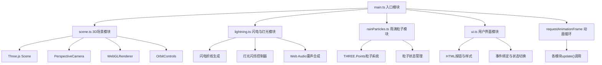

## 1. 架构设计



## 2. 技术描述

- **前端框架**：TypeScript 5 + Three.js 0.157（原生Three.js，非React封装）
- **构建工具**：Vite 5，使用@vitejs/plugin-react提供TypeScript编译支持（不使用React）
- **后端**：无（纯前端浏览器应用）
- **数据库**：无
- **音频**：Web Audio API原生合成（白噪声+低通滤波+包络控制）
- **包管理**：npm

## 3. 路由定义

| 路由 | 用途 |
|-------|---------|
| / | 主场景页面，全屏3D Canvas + 底部控制栏 |

## 4. 模块API定义

### 4.1 scene.ts

```typescript
export interface SceneModule {
  scene: THREE.Scene;
  camera: THREE.PerspectiveCamera;
  renderer: THREE.WebGLRenderer;
  controls: THREE.OrbitControls;
  lampLight: THREE.PointLight;
  ambientLight: THREE.AmbientLight;
  lightningLight: THREE.DirectionalLight;
  windowGroup: THREE.Group;
  initialCameraPosition: THREE.Vector3;
  initialCameraTarget: THREE.Vector3;
  init(container: HTMLElement): void;
  onResize(): void;
  resetCamera(): void;
}
```

### 4.2 lightning.ts

```typescript
export interface LightningModule {
  init(scene: THREE.Scene, lampLight: THREE.PointLight, ambientLight: THREE.AmbientLight, lightningLight: THREE.DirectionalLight): void;
  generateLightning(): void;
  toggleStorm(enable: boolean): void;
  update(deltaTime: number): void;
  setCallbacks(callbacks: {
    onLightningFlash?: () => void;
    onRainSpeedBoost?: (duration: number) => void;
  }): void;
}
```

### 4.3 rainParticles.ts

```typescript
export interface RainParticlesModule {
  init(scene: THREE.Scene, isStormMode: boolean): void;
  update(deltaTime: number): void;
  setStormMode(enable: boolean): void;
  boostSpeed(duration: number, multiplier: number): void;
}
```

### 4.4 ui.ts

```typescript
export interface UIModule {
  setupUI(callbacks: {
    onGenerateStorm: () => void;
    onResetCamera: () => void;
    onToggleMode: (isStorm: boolean) => void;
  }): void;
  triggerScreenShake(duration: number, intensity: number): void;
  setFlashOverlayOpacity(opacity: number): void;
}
```

### 4.5 main.ts - 模块交互流程

```
main.ts 初始化顺序:
1. DOMContentLoaded → 获取canvas容器
2. scene.init(container) → 创建3D场景、相机、渲染器、灯光
3. lightning.init(...) → 绑定灯光引用
4. rainParticles.init(scene, false) → 安静模式初始化粒子
5. ui.setupUI({...callbacks}) → 绑定UI按钮事件
6. lightning.setCallbacks({onLightningFlash, onRainSpeedBoost})
7. 启动 requestAnimationFrame 循环:
   - controls.update()
   - lightning.update(delta)
   - rainParticles.update(delta)
   - renderer.render(scene, camera)
```

## 5. 核心数据模型

### 5.1 闪电动画状态

```typescript
interface LightningState {
  active: boolean;
  startTime: number;
  riseDuration: number;    // 0.1秒 增亮
  decayDuration: number;   // 0.3秒 渐灭
  maxIntensity: number;
  currentIntensity: number;
  lineMesh: THREE.Line | null;
  branchMeshes: THREE.Line[];
}
```

### 5.2 灯光闪烁状态

```typescript
interface FlickerState {
  active: boolean;
  flickerCount: number;     // 2次闪烁
  currentFlicker: number;
  flickerDuration: number;  // 0.15秒每次
  startTime: number;
  baseLampIntensity: number;
  baseAmbientIntensity: number;
}
```

### 5.3 雨滴粒子数据

```typescript
interface RainParticle {
  position: THREE.Vector3;
  velocity: THREE.Vector3;
  size: number;              // 3-8像素
  opacity: number;           // 0.3-0.6
  lifetime: number;          // 剩余生命周期秒
  maxLifetime: number;       // 4秒
}
```

## 6. 性能优化策略

1. **粒子系统优化**：使用单个THREE.BufferGeometry + PointsMaterial管理所有雨滴，避免多个Mesh
2. **闪电对象池**：预创建闪电Line对象，激活/停用而非频繁创建销毁
3. **像素比限制**：renderer.setPixelRatio(Math.min(window.devicePixelRatio, 2))
4. **渲染帧率控制**：requestAnimationFrame + deltaTime计算，保证逻辑帧率稳定
5. **事件节流**：鼠标拖拽与滚轮使用OrbitControls内置的阻尼平滑，避免高频重计算
