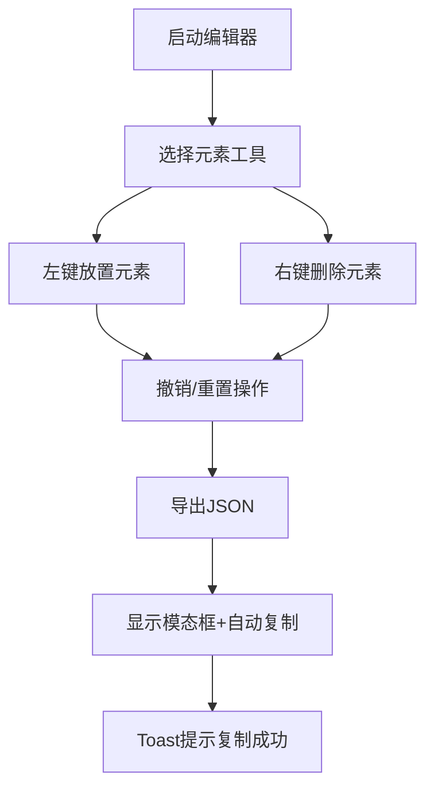

## 1. 产品概述

Roguelike地牢房间编辑器是一款面向游戏设计师的Web工具，用于快速可视化编辑和预览随机生成的地牢房间布局，支持墙壁、地面、怪物、宝箱等元素的放置与删除，并能一键导出房间模板的JSON数据供游戏引擎使用。

- 目标用户：游戏设计师、关卡策划
- 核心价值：提升地牢关卡设计效率，实现可视化编辑与快速导出

## 2. 核心功能

### 2.1 用户角色

| 角色 | 注册方式 | 核心权限 |
|------|---------|---------|
| 游戏设计师 | 无需注册，直接使用 | 完整编辑、导出功能 |

### 2.2 功能模块

1. **网格编辑区：20x15网格，支持元素放置与删除、缩放、悬停高亮
2. **工具面板：墙壁、地面、怪物、宝箱四种元素切换，撤销、重置功能
3. **导出功能：JSON模态框展示、自动复制到剪贴板、Toast提示

### 2.3 页面详情

| 页面名称 | 模块名称 | 功能描述 |
|---------|---------|---------|
| 编辑器主页面 | 网格编辑区 | 20x15网格显示，鼠标左键放置元素，右键删除元素，滚轮缩放，空格+拖拽平移
| 编辑器主页面 | 工具面板 | 左侧垂直工具条，元素切换按钮（带高亮动画），撤销/重置按钮，导出按钮
| 编辑器主页面 | 导出模态框 | 展示JSON结构，自动复制，关闭按钮
| 编辑器主页面 | Toast提示 | 右上角复制成功提示，2秒自动消失

## 3. 核心流程

用户打开编辑器 → 选择工具类型 → 在网格上点击放置/删除元素 → 可撤销/重置操作 → 导出JSON数据

## 4. 用户界面设计

### 4.1 设计风格
- 主色调：暗色主题，背景#1a1a2e，面板#16213e
- 强调色：橙色#e94560，金色#f5a623
- 网格线：半透明灰色#cccccc20
- 交互过渡：0.2秒缓动动画
- 按钮悬停：放大1.1倍并轻微上移

### 4.2 页面设计概览

| 页面名称 | 模块名称 | UI元素 |
|---------|---------|--------|
| 编辑器主页面 | 网格编辑区 | Canvas全屏、20x15网格、悬停蓝色高亮、缩放/平移交互 |
| 编辑器主页面 | 工具面板 | 垂直60px宽度、四个元素按钮（橙色脉冲高亮）、撤销/重置/导出按钮 |
| 编辑器主页面 | 导出模态框 | 半透明模糊遮罩、橙色渐变边框、JSON代码展示区 |
| 编辑器主页面 | Toast提示 | 右上角、2秒自动消失、橙色主题 |

### 4.3 响应式

- 桌面端优先，Canvas自适应窗口大小
- 工具面板固定左侧

## 5. 性能要求

- Canvas渲染帧率稳定30fps以上
- 批量编辑20+元素无可见卡顿
- JSON导出耗时不超过10ms
