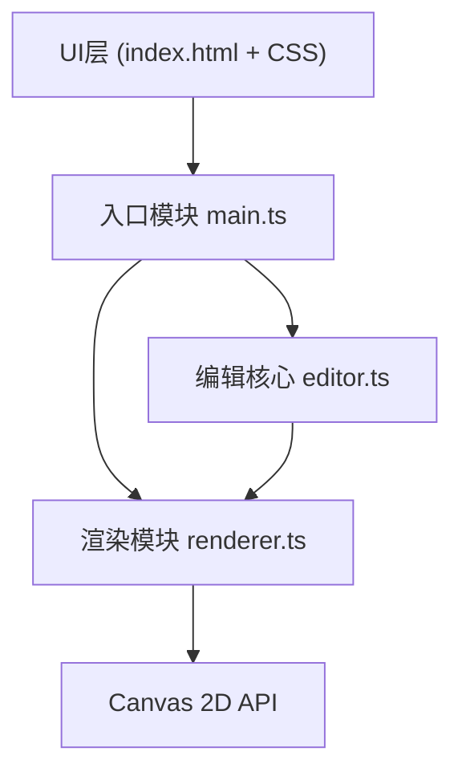

## 1. 架构设计



数据流向：
- 用户操作 → main.ts 监听UI事件 → 调用 editor.ts 更新网格数据 → renderer.ts 读取状态并渲染到Canvas

## 2. 技术描述

- 前端：TypeScript + Vite
- 渲染：HTML5 Canvas 2D API
- 构建工具：Vite
- 开发服务器端口：3000
- 无后端、无数据库，纯前端应用

## 3. 项目文件结构

```
auto66/
├── package.json          # 项目依赖与脚本
├── vite.config.js        # Vite构建配置
├── tsconfig.json         # TypeScript配置
├── index.html            # 入口HTML
└── src/
    ├── main.ts           # 应用入口、UI事件监听
    ├── editor.ts         # 编辑核心：网格数据、增删、撤销、导出
    ├── renderer.ts       # Canvas渲染：网格、元素、高亮、光标
    └── style.css         # 全局样式
```

### 模块职责与调用关系

| 文件 | 职责 | 输入 | 输出 |
|-----|-----|-----|-----|
| main.ts | 初始化应用、事件监听、协调各模块 | UI事件（点击、键盘、鼠标） | 调用editor.ts的操作方法，传递状态给renderer.ts |
| editor.ts | 网格数据管理、元素增删、撤销栈、JSON导出 | main.ts的操作指令 | 当前网格状态、导出的JSON数据 |
| renderer.ts | Canvas绘制网格、元素、高亮、光标 | editor.ts的网格状态、main.ts的鼠标位置 | 渲染到Canvas |

## 4. 核心数据模型

### 4.1 元素类型枚举

```typescript
enum TileType {
  EMPTY = 'empty',
  WALL = 'wall',
  FLOOR = 'floor',
  MONSTER = 'monster',
  CHEST = 'chest'
}
```

### 4.2 网格数据

```typescript
interface Tile {
  x: number;
  y: number;
  type: TileType;
}

interface EditorState {
  width: number;      // 20
  height: number;     // 15
  tileSize: number;   // 32
  tiles: Tile[];
  selectedTool: TileType;
}
```

### 4.3 导出格式

```typescript
interface ExportData {
  width: number;
  height: number;
  tiles: { x: number; y: number; type: string }[];
}
```

## 5. 性能优化策略

- 使用 requestAnimationFrame 渲染，帧率控制
- Canvas 脏矩形重绘（本次简化为全量重绘，网格规模较小）
- 撤销栈限制为10步，避免内存占用
- 网格数据使用扁平数组，O(1) 随机访问
