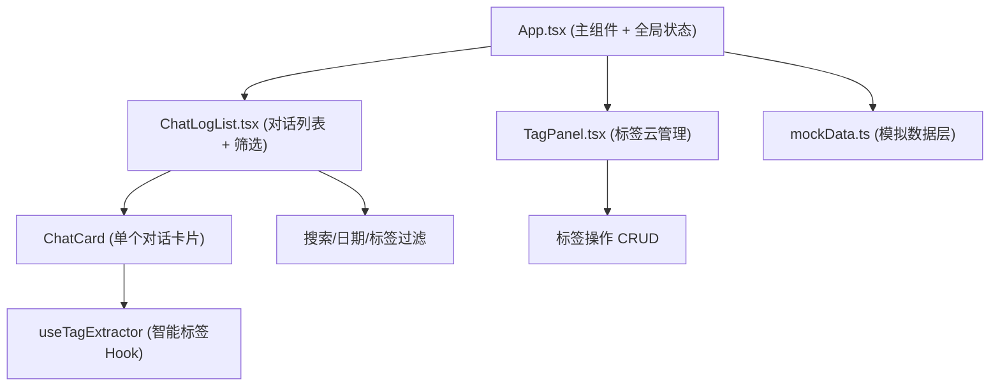
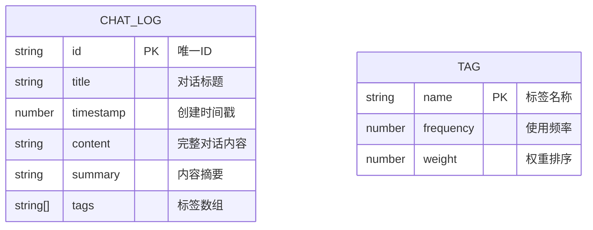

## 1. 架构设计



## 2. 技术描述

- **前端框架**：React@18 + TypeScript
- **构建工具**：Vite (devServer端口3000)
- **状态管理**：React Hooks (useState, useMemo, useCallback, React.memo)
- **依赖库**：uuid (唯一ID生成)、lodash (工具函数、防抖)
- **数据层**：本地Mock数据，10条预设对话记录
- **样式方案**：内联CSS + CSS动画，纯CSS实现60fps交互动效

## 3. 文件结构

```
e:\solo\VersionFast\tasks\auto68\
├── package.json
├── vite.config.js
├── tsconfig.json
├── index.html
└── src/
    ├── App.tsx              # 主组件，路由+全局状态管理
    ├── components/
    │   ├── ChatLogList.tsx  # 对话记录列表，搜索/日期/标签筛选
    │   └── TagPanel.tsx     # 标签云面板，增删标签+自动摘要
    ├── data/
    │   └── mockData.ts      # 10条预设对话数据
    └── hooks/
        └── useTagExtractor.ts  # 关键词频率分析生成3个标签
```

## 4. 数据模型

### 4.1 数据模型定义



### 4.2 TypeScript类型定义

```typescript
interface ChatLog {
  id: string;
  title: string;
  timestamp: number;
  content: string;
  summary: string;
  tags: string[];
}

interface TagInfo {
  name: string;
  frequency: number;
  fontSize: number;
}
```

## 5. 性能优化策略

| 优化点 | 方案 | 目标 |
|-------|------|------|
| 列表渲染 | React.memo包裹卡片组件 | 100条记录初始渲染 < 200ms |
| 搜索过滤 | useMemo缓存过滤结果 + lodash防抖300ms | 过滤响应 < 100ms |
| 标签云 | useMemo计算标签频率和字体大小 | 标签变更时仅重算受影响项 |
| 动画效果 | CSS transform/opacity硬件加速 | 所有交互60fps流畅 |
| 状态更新 | useCallback稳定函数引用 | 避免子组件无谓重渲染 |
