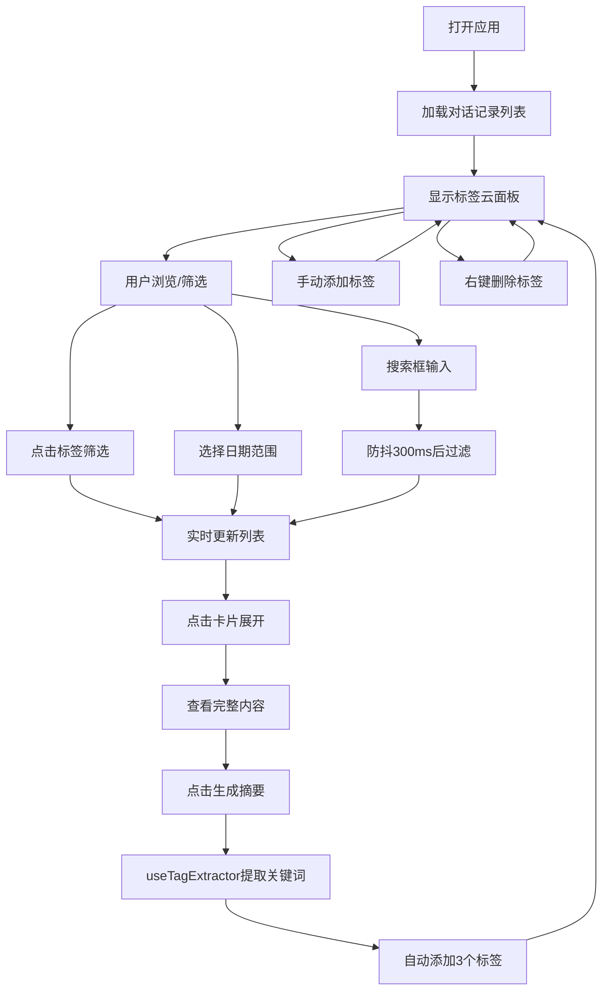

## 1. 产品概述

AI对话记录与标签管理面板是一款基于Web的笔记式对话历史管理工具，帮助用户高效整理和回顾AI交互记录，通过智能标签系统实现快速检索和主题聚合。

- 目标用户：频繁使用AI工具的知识工作者、开发者和内容创作者
- 核心价值：将零散的AI对话转化为可管理、可搜索的知识资产

## 2. 核心功能

### 2.1 功能模块

1. **对话记录列表**：卡片式展示对话历史，支持展开查看完整内容、搜索、日期筛选、标签过滤
2. **标签管理面板**：标签云可视化、手动添加/删除标签、基于内容自动生成摘要标签
3. **智能标签提取**：基于关键词频率自动生成3个高相关度标签
4. **多维筛选**：搜索框（防抖300ms）+ 日期范围 + 标签点击筛选联动

### 2.2 页面详情

| 页面名称 | 模块名称 | 功能描述 |
|---------|---------|---------|
| 主面板 | 顶部筛选栏 | 搜索输入框（带图标）、日期范围选择器、实时过滤 |
| 主面板 | 对话卡片列表 | 可滚动卡片列表，展开/收起动画，时间渐变背景色 |
| 主面板 | 右侧标签云面板 | Sticky定位毛玻璃面板，字体大小随频率变化，右键菜单删除 |
| 对话卡片 | 操作区 | "生成摘要"按钮，自动生成标签并添加动画 |
| 对话卡片 | 标签区域 | 标签药丸展示，新增时闪烁高亮动画 |

## 3. 核心流程

用户打开面板 → 浏览对话记录列表 → 通过搜索/日期/标签筛选定位 → 点击卡片展开完整对话 → 点击"生成摘要"自动打标签 → 在标签面板手动管理标签 → 点击标签云快速筛选相关对话

## 4. 用户界面设计

### 4.1 设计风格
- **主色调**：米白背景 (#faf8f5)、纯白卡片、紫色渐变标签 (#6366f1 → #8b5cf6)
- **卡片风格**：圆角12px，微弱阴影，悬停抬升2px过渡0.2s
- **标签药丸**：圆角渐变背景，白色文字，新增时缩放弹出动画
- **字体**：系统无衬线字体，保持极简主义
- **特殊效果**：卡片背景色按时间从冷色(浅蓝)到暖色(浅橙)渐变

### 4.2 页面设计概述

| 页面名称 | 模块名称 | UI元素 |
|---------|---------|---------|
| 主面板 | 筛选栏 | 搜索框(search图标)、日期选择器(From/To)、水平排列 |
| 主面板 | 对话列表 | 垂直滚动容器，最大宽度800px居中，卡片间距16px |
| 主面板 | 标签云面板 | 宽度250px，深色半透明毛玻璃，sticky定位顶部，标签换行排列 |
| 对话卡片 | 内容区 | 标题(16px加粗)、时间戳(相对时间如"3分钟前")、摘要(80字符截断)、标签列表 |
| 对话卡片 | 展开区 | 淡入动画0.3s，完整对话内容，行高1.6 |
| 空状态 | 占位图 | 半透明便签纸插画，浮动动画，居中显示"暂无记录" |

### 4.3 响应式
- 桌面端优先：标签云固定右侧250px，内容区自适应居中
- 标签云面板：sticky定位，跟随页面滚动保持可见
- 列表滚动：惯性滚动体验，最大高度视口自适应
