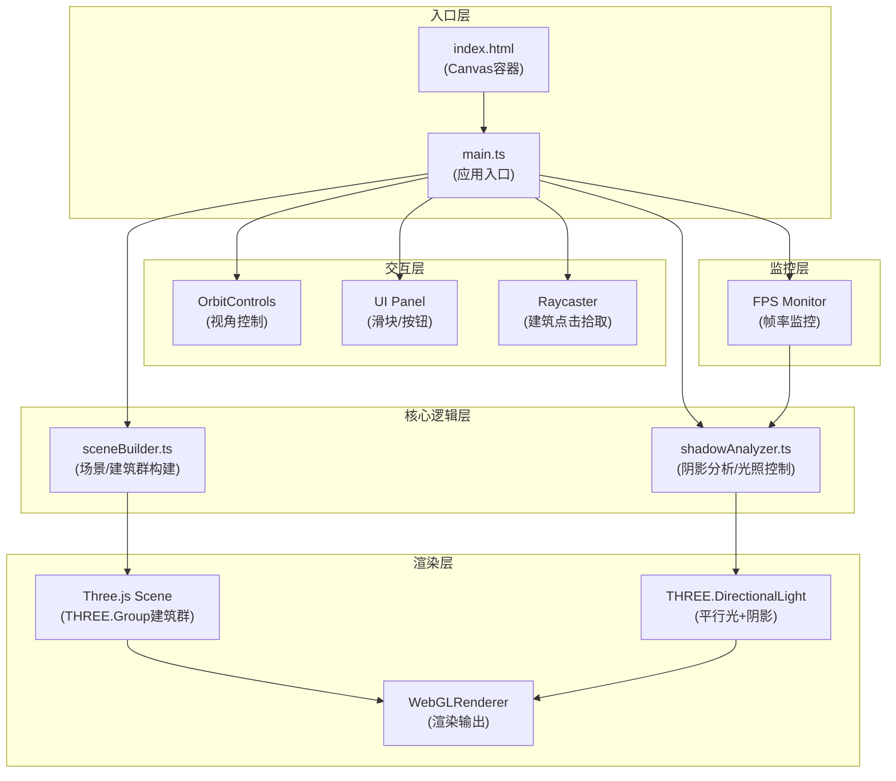

## 1. 架构设计



**数据流向说明**：
- `main.ts` 作为枢纽，从 `sceneBuilder.ts` 获取建筑群 Group，从 `shadowAnalyzer.ts` 获取光照控制接口
- UI面板(滑块/按钮)的用户输入 → `main.ts` → `shadowAnalyzer.ts.updateLight()` 更新光照参数
- 时钟循环 `requestAnimationFrame` → `main.ts` → `shadowAnalyzer.tick()` 处理动画 → `renderer.render()`
- `FPS Monitor` 持续采样帧率，低于阈值时通知 `shadowAnalyzer.ts` 降级阴影分辨率

## 2. 技术说明

- **前端框架**：原生 TypeScript (无React/Vue)，直接操作Three.js API以获得最佳性能
- **构建工具**：Vite 5.x，支持TypeScript编译与HMR热更新
- **3D引擎**：Three.js 0.160.0 + @types/three 类型定义
- **样式方案**：原生CSS3 + CSS Variables，backdrop-filter实现毛玻璃效果
- **无后端、无数据库**：建筑数据hardcode在代码中，纯前端运行

## 3. 模块职责与文件调用关系

| 文件 | 职责 | 对外接口 | 被谁调用 |
|-----|------|---------|---------|
| `src/main.ts` | 应用入口，场景/相机/渲染器初始化，时钟循环，事件绑定，FPS监控 | 无(入口) | — |
| `src/sceneBuilder.ts` | 接收建筑坐标数组，生成带窗户纹理的Mesh建筑群，返回THREE.Group | `buildCity(buildingData: BuildingData[]): THREE.Group`，`createBuildingTexture(color: string): THREE.Texture` | main.ts |
| `src/shadowAnalyzer.ts` | 管理平行光、阴影相机、阴影贴图，接收方位角/高度角参数，处理日照动画，提供阴影降级接口 | `ShadowAnalyzer`类：`constructor(scene, renderer)`，`updateLight(azimuth, altitude)`，`startAnimation()`，`stopAnimation()`，`tick(delta)`，`setShadowQuality(quality)` | main.ts |

## 4. 数据模型

### 4.1 建筑数据定义

```typescript
interface BuildingData {
  id: number;
  x: number;
  z: number;
  width: number;
  depth: number;
  height: number;
  color: string;
}
```

- `id`：建筑编号，用于点击识别
- `x`, `z`：建筑在XZ平面的中心坐标
- `width`, `depth`：建筑底面宽深(X/Z方向尺寸)
- `height`：建筑高度(Y方向尺寸)
- `color`：建筑基色(十六进制)，用于生成窗户纹理

### 4.2 光照参数定义

```typescript
interface LightParams {
  azimuth: number;    // 方位角 0-360°，0°=正北，顺时针
  altitude: number;   // 高度角 0-90°，0°=地平线，90°=天顶
}
```

## 5. 性能优化策略

1. **阴影质量动态降级**：
   - 高精度：`shadow.mapSize.width/height = 4096`，PCFSoftShadowMap
   - 低精度：`shadow.mapSize.width/height = 1024`，BasicShadowMap
   - FPS < 25持续2秒自动降级，FPS > 35持续5秒可回升

2. **纹理复用**：
   - 相同颜色建筑共享同一张CanvasTexture，避免重复创建

3. **渲染优化**：
   - `renderer.shadowMap.autoUpdate = false`，仅在光照变化或动画时手动 `needsUpdate = true`
   - 建筑Mesh静态化 `mesh.matrixAutoUpdate = false`

4. **拾取优化**：
   - Raycaster仅在鼠标点击时触发，非每帧检测
