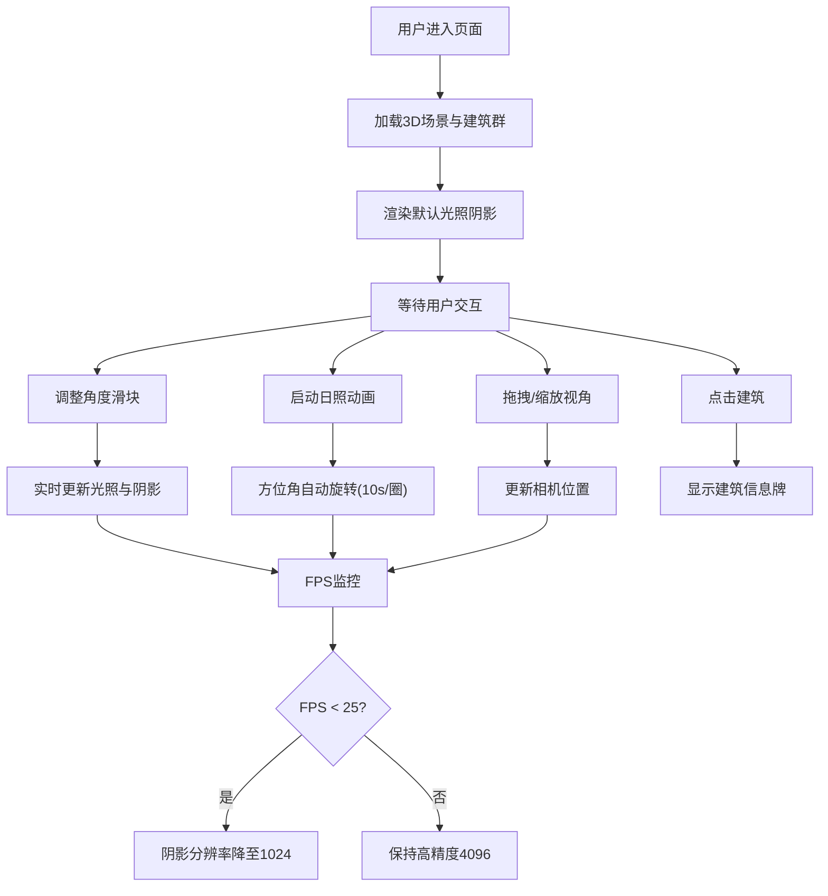

## 1. 产品概述

本产品是一个基于Web的3D城市建筑日照阴影可视化分析工具，帮助城市规划师在浏览器中交互式查看城市区域的3D建筑模型，并通过动态调整太阳光照角度来分析不同时间段的日照阴影分布，从而辅助判断新建高层建筑对周边建筑采光的影响。

## 2. 核心功能

### 2.1 用户角色
| 角色 | 使用场景 | 核心需求 |
|------|---------|---------|
| 城市规划师 | 建筑方案评审、采光影响评估 | 直观的3D可视化、精确的日照阴影分析、交互便捷 |

### 2.2 功能模块
1. **3D建筑群展示模块**：自动生成10-15栋不同高度、颜色的方块建筑街区，外立面带窗户格子纹理
2. **日照阴影模拟模块**：通过方位角(0-360°)和高度角(0-90°)滑块实时调整平行光方向，动态渲染阴影
3. **时间动画模块**：一键启动日照动画，方位角自动旋转模拟日出日落，高度角固定45°
4. **视角交互模块**：OrbitControls鼠标拖拽旋转、滚轮缩放、点击建筑显示信息牌
5. **性能监控模块**：实时FPS显示，低于25fps自动降低阴影贴图分辨率

### 2.3 页面详情
| 页面名称 | 模块名称 | 功能描述 |
|---------|---------|---------|
| 主页面 | 3D场景画布 | 全屏3D渲染，展示建筑街区与阴影效果 |
| 主页面 | 控制面板 | 方位角滑块、高度角滑块、日照动画按钮，毛玻璃半透明悬浮 |
| 主页面 | FPS监控 | 右上角实时帧率显示 |
| 主页面 | 建筑信息牌 | 点击建筑弹出编号和高度信息卡片 |
| 主页面 | 移动端折叠 | 窄屏时控制面板折叠为侧边栏图标 |

## 3. 核心流程

用户打开页面后自动加载3D建筑群场景，默认光照角度下渲染阴影。用户可通过滑块调整太阳方位角与高度角实时观察阴影变化，或点击动画按钮观看全日日照过程。可拖拽旋转视角、滚轮缩放，点击单栋建筑查看详细信息。系统持续监控帧率，自动调节渲染质量。

## 4. 用户界面设计

### 4.1 设计风格
- **主色调**：深空蓝(#0a1628) → 墨黑(#000000) 径向渐变背景
- **建筑色**：柔和暖色系，米白(#f5ede0)、浅橙(#e8c9a0)、暖灰(#d4c4b0)
- **阴影色**：半透明深蓝 rgba(10, 30, 60, 0.5)
- **控件样式**：毛玻璃效果 backdrop-filter: blur(10px)，半透明深色背景
- **按钮/滑块**：hover时放大1.05倍+颜色加深，0.2s ease过渡
- **信息牌**：白色圆角卡片，简洁紧凑

### 4.2 页面设计概览
| 页面名称 | 模块名称 | UI元素 |
|---------|---------|--------|
| 主页面 | 3D场景 | 深空蓝黑渐变背景，暖色建筑群，深蓝半透明阴影 |
| 主页面 | 控制面板 | 左下角悬浮，毛玻璃深色半透明，两个数值滑块+动画按钮 |
| 主页面 | FPS监控 | 右上角，等宽字体，绿色/黄色/红色三色状态指示 |
| 主页面 | 建筑信息牌 | 跟随鼠标/建筑位置，白底圆角卡片，显示编号和高度 |
| 主页面 | 响应式适配 | <768px时控制面板折叠为侧边栏图标，点击展开 |

### 4.3 响应式设计
- **桌面端(>768px)**：控制面板悬浮左下角，完整展开显示所有控件
- **移动端/窄屏(<768px)**：控制面板折叠为右侧/左侧侧边栏小图标，点击后滑出展开面板，保留全部功能

### 4.4 3D场景指导
- **环境**：深空蓝→墨黑径向渐变背景，模拟夜空沙盘氛围
- **光照**：主平行光模拟太阳(可调节) + 微弱环境光避免纯黑阴影
- **相机**：PerspectiveCamera，初始俯视角45°，OrbitControls限制极角防止穿模
- **材质**：MeshStandardMaterial，建筑带程序化生成窗户纹理CanvasTexture
- **后处理**：抗锯齿，轻微环境光遮蔽增强立体感
- **性能预算**：15栋建筑+阴影渲染稳定30fps+，动态调整阴影贴图分辨率(4096/1024)
