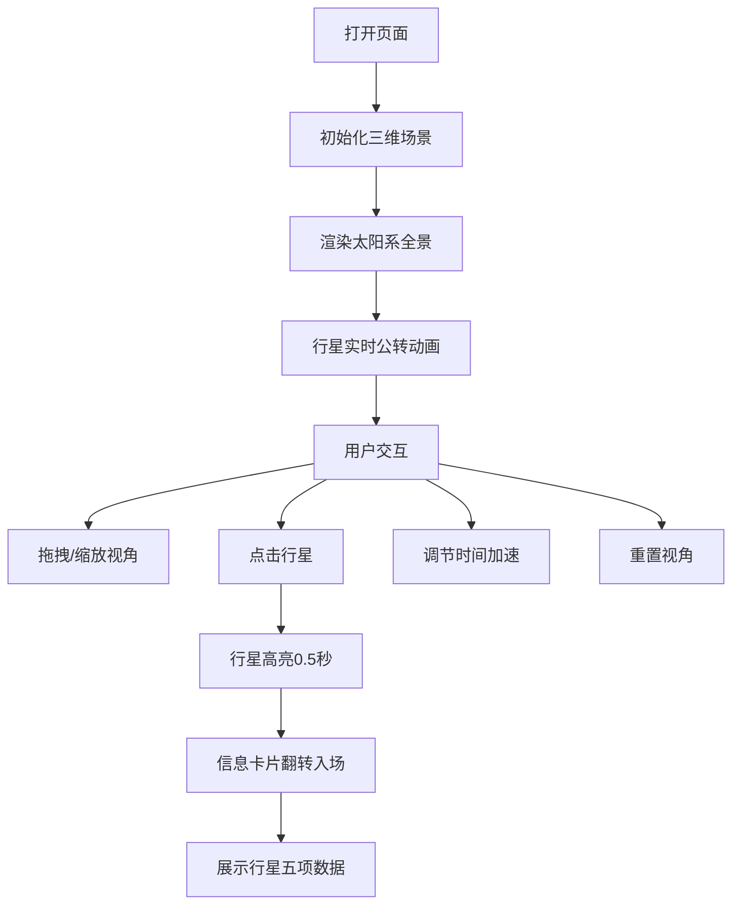

## 1. 产品概述

基于Web的三维太阳系行星轨道动态可视化与数据探索工具，面向天文爱好者和学生群体，提供沉浸式的虚拟天文馆体验。用户可以直观观察八大行星围绕太阳的实时公转轨迹，并交互式查看每颗行星的详细物理数据。

- 核心目标：让天文学学习变得生动有趣，通过三维可视化和交互操作降低天文知识的理解门槛
- 市场价值：填补Web端轻量级太阳系教学工具的空白，无需安装软件即可在浏览器中体验

## 2. 核心功能

### 2.1 用户角色
| 角色 | 注册方式 | 核心权限 |
|------|----------|----------|
| 访客用户 | 无需注册 | 浏览3D场景、查看行星数据、调整视角和时间加速 |

### 2.2 功能模块
1. **主场景页面**：三维太阳系渲染、轨道控制、行星运动动画
2. **行星信息卡片**：点击行星展示详细物理数据，含翻转动画
3. **时间控制面板**：底部时间加速滑块、重置视角按钮

### 2.3 页面详情
| 页面名称 | 模块名称 | 功能描述 |
|----------|----------|----------|
| 主场景页面 | 三维太阳系渲染 | Three.js渲染太阳、八大行星、轨道线，支持实时公转运动 |
| 主场景页面 | 视角控制 | 鼠标拖拽旋转视角（带阻尼），滚轮缩放从俯瞰到近观 |
| 主场景页面 | 点击拾取 | 点击行星触发高亮效果和信息卡片弹出 |
| 行星信息卡片 | 数据展示 | 显示名称、质量、直径、公转周期、日地距离五项数据 |
| 行星信息卡片 | 动画效果 | 翻转入场动画、向下滑出关闭动画、0.5秒高亮渐隐 |
| 时间控制面板 | 时间加速 | 1x-100x滑块控制，平滑变速动画，显示当前倍率 |
| 时间控制面板 | 重置视角 | 贝塞尔曲线路径1.5秒内飞回默认俯瞰位置 |

## 3. 核心流程

用户打开页面后，默认展示整个太阳系的俯瞰视角，行星正在缓慢公转。用户可以通过鼠标拖拽旋转视角、滚轮缩放观察细节。点击任意行星后，行星短暂高亮，右侧弹出信息卡片展示该行星的物理数据。用户可通过底部滑块调节公转速度，或点击"重置视角"按钮恢复初始视角。

## 4. 用户界面设计

### 4.1 设计风格
- **色彩体系**：深空黑渐变背景（#000011 → #0a0a2a），UI半透明毛玻璃效果（rgba(20,20,60,0.6)），主色调用浅白色（#e8e8ff），高亮色为浅蓝色（#66ccff），卡片渐变从深蓝（#0d1b4d）到紫黑（#1a0a33）
- **按钮风格**：圆角矩形（border-radius: 8px），半透明背景，hover时边框发光，0.2秒缓动过渡
- **字体**：主字体使用 'Orbitron'（科技感无衬线字体）搭配 'Segoe UI' 备选
- **布局风格**：全屏3D场景为主体，右侧悬浮信息卡片，底部固定控制条
- **图标风格**：简洁线性图标，与数据项对应（质量用天平、直径用圆圈、周期用时钟、距离用标尺）

### 4.2 页面设计概览
| 页面名称 | 模块名称 | UI元素 |
|----------|----------|--------|
| 主场景页面 | 3D渲染区 | 全屏画布、黑色渐变背景、星点粒子背景 |
| 主场景页面 | 太阳 | 自发光黄色材质、光晕粒子效果 |
| 主场景页面 | 行星 | 按真实比例颜色、木星条纹纹理、土星半透明环、轻微自转 |
| 主场景页面 | 轨道线 | 半透明环形椭圆、略微倾斜、带发光描边 |
| 行星信息卡片 | 卡片容器 | 350px宽、右侧悬浮、毛玻璃背景、深紫渐变 |
| 行星信息卡片 | 数据行 | 图标 + 标签 + 数值，每项独立一行，均匀间距 |
| 时间控制面板 | 控制条 | 底部固定、毛玻璃背景、圆角、滑块 + 数值 + 按钮 |
| 时间控制面板 | 滑块 | 自定义进度条样式、悬停变亮、拖动实时响应 |

### 4.3 响应式
- Desktop-first设计，全屏3D场景自适应窗口尺寸
- 信息卡片在小屏幕上改为底部弹出
- 触摸设备支持手势旋转和缩放

### 4.4 3D场景指引
- **环境**：深空黑色渐变背景，辅以远处星点粒子营造宇宙氛围，无HDRI
- **光照**：太阳作为PointLight光源，强度2.0，距离覆盖整个太阳系；辅以微弱AmbientLight(0x222244)确保暗面可见
- **相机设置**：PerspectiveCamera，fov=60，默认位置(0, 120, 200)看向原点，近裁0.1，远裁5000
- **运动控制**：OrbitControls带damping=true，dampingFactor=0.08，minDistance=5，maxDistance=800
- **交互**：Raycaster进行点击拾取，命中后添加OutlinePass高亮；相机动画使用贝塞尔曲线插值
- **后期处理**：轻微Bloom效果增强太阳和行星的发光感
- **性能**：行星使用简单几何体(SphereGeometry)，纹理程序化生成，总面数控制在合理范围，目标60fps
