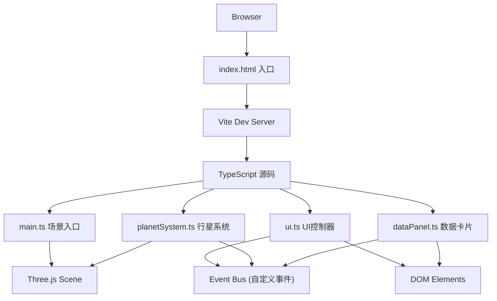
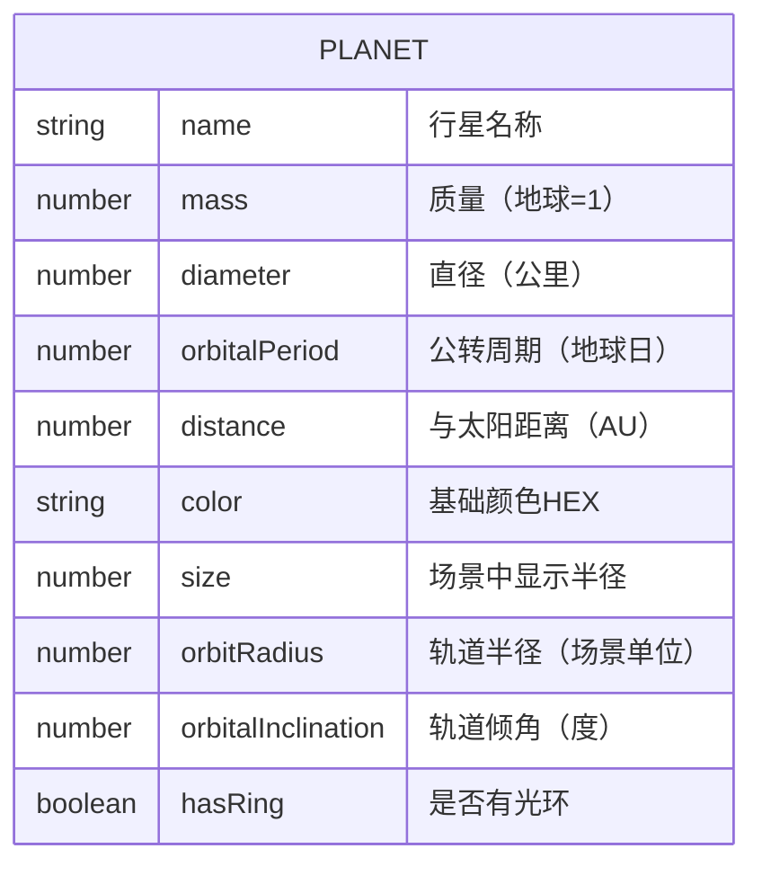

## 1. 架构设计



## 2. 技术描述

- **前端框架**：原生 TypeScript（无React/Vue，用户明确指定Three.js直接操作DOM）
- **3D引擎**：three@0.160.0 + @types/three@0.160.0
- **构建工具**：Vite 5.x（端口3000，原生支持TypeScript）
- **编程语言**：TypeScript 5.x（strict模式，target ES2020）
- **样式方案**：原生CSS + CSS变量，嵌入<style>标签，无需CSS预处理器
- **后端**：无后端，纯前端静态应用
- **数据库**：无，行星数据硬编码在planetSystem.ts中

## 3. 路由定义

| 路由 | 用途 |
|------|------|
| / | 主场景页面（单页应用，无其他路由） |

## 4. API定义（无后端）

无后端API调用。内部模块间通过自定义事件通信：

```typescript
// 事件总线类型定义
interface PlanetEvent {
  type: 'planet:click';
  planetData: PlanetData;
}

interface TimeEvent {
  type: 'time:speedChange';
  speed: number;
}

interface CameraEvent {
  type: 'camera:reset';
}
```

## 5. 服务器架构图（无后端）

纯前端静态项目，部署为静态文件即可。

## 6. 数据模型

### 6.1 数据模型定义



### 6.2 数据定义（行星数据数组）

```typescript
interface PlanetData {
  name: string;              // 行星中文名称
  nameEn: string;            // 英文名称
  mass: number;              // 质量（地球质量=1）
  diameter: number;          // 直径（km）
  orbitalPeriod: number;     // 公转周期（地球日）
  distance: number;          // 日距（AU）
  color: number;             // 基础颜色（十六进制）
  size: number;              // 渲染半径
  orbitRadius: number;       // 轨道半径（场景单位）
  orbitalInclination: number;// 轨道倾角（弧度）
  hasRing?: boolean;         // 是否有行星环
  ringInnerRadius?: number;  // 环内径
  ringOuterRadius?: number;  // 环外径
  ringColor?: number;        // 环颜色
}
```

行星数组包含：水星、金星、地球、火星、木星、土星、天王星、海王星，共8颗。

## 7. 项目文件结构

```
auto70/
├── index.html              # 入口HTML，全屏Canvas容器
├── package.json            # 依赖配置：three, typescript, vite
├── vite.config.js          # Vite配置，端口3000
├── tsconfig.json           # TypeScript严格模式配置
└── src/
    ├── main.ts             # Three.js场景初始化、渲染循环、相机控制、Resize
    ├── planetSystem.ts     # 行星数据、Mesh创建、轨道线、公转更新、点击检测
    ├── ui.ts               # 信息卡片DOM、时间控制条DOM、事件绑定、拾取逻辑
    └── dataPanel.ts        # 卡片翻转动画、滑出效果、数据内容渲染
```

## 8. 关键实现要点

1. **性能优化**：使用InstancedMesh？不，8颗行星直接用Mesh即可；帧率监控使用requestAnimationFrame的delta时间；轨道线使用BufferGeometry的LineSegments
2. **平滑变速**：记录当前轨道角度和目标角度，使用lerp插值避免速度变化时跳跃
3. **贝塞尔相机动画**：THREE.CubicBezierCurve3，从当前位置到目标位置经过两个控制点，1.5秒内完成
4. **高亮效果**：使用OutlinePass后期处理，或简单添加一个放大的半透明蓝色SphereMesh作为轮廓
5. **卡片翻转动画**：CSS transform: rotateY() + perspective + backface-visibility
6. **毛玻璃效果**：CSS backdrop-filter: blur(12px) + rgba背景
