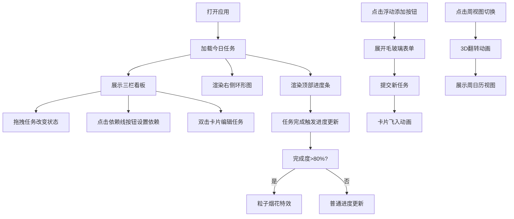

## 1. 产品概述

每日工作流管理应用，专为个人或小团队设计，解决任务依赖混乱、时间分配不透明、进度不可控等痛点。通过可视化看板、依赖关系管理和时间投入度分析，帮助用户高效规划和追踪每日工作。

- 目标用户：自由职业者、产品经理、开发者、小团队负责人
- 核心价值：清晰的任务依赖关系、直观的时间分配可视化、可控的进度追踪

## 2. 核心功能

### 2.1 功能模块
1. **任务看板主界面**：三栏式看板（待办-进行中-已完成）、拖拽状态切换、任务卡片展示
2. **依赖关系管理**：前置依赖设置、可视化虚线箭头、依赖删除
3. **时间投入度环形图**：Canvas绘制的时间占比图表、实时时钟、悬停详情
4. **进度条与提示**：今日完成度进度条、粒子烟花特效、完成动效
5. **任务快速添加与编辑**：浮动按钮添加表单、双击编辑卡片、飞入动画
6. **视图切换**：看板模式/周视图切换、3D翻转动画

### 2.2 页面详情
| 页面名称 | 模块名称 | 功能描述 |
|-----------|-------------|---------------------|
| 主应用 | 顶部进度条 | 显示今日任务完成度，渐变蓝紫，80%触发粒子烟花效果 |
| 主应用 | 三栏看板 | 待办/进行中/已完成三列，支持HTML5拖拽，弹性回弹动画 |
| 主应用 | 任务卡片 | 标题、预估耗时、优先级标签、依赖线按钮、双击编辑 |
| 主应用 | 依赖关系 | 勾选前置依赖、虚线箭头可视化、箭头点击删除确认 |
| 主应用 | 右侧环形图 | Canvas绘制时间占比、优先级配色、悬停Tooltip、实时时钟 |
| 主应用 | 浮动添加按钮 | 圆形按钮点击展开毛玻璃表单、路径飞入动画 |
| 主应用 | 周视图切换 | 3D翻转动画、按日期分列展示任务 |

## 3. 核心流程

用户打开应用后，主界面展示三栏看板和右侧环形图。用户可通过浮动按钮添加新任务，通过拖拽改变任务状态，通过依赖线按钮设置任务前置关系。每完成一个任务，顶部进度条更新并触发动效；当完成度超过80%时，进度条显示粒子烟花效果。用户可随时切换到周视图查看一周任务分布。

## 4. 用户界面设计

### 4.1 设计风格
- **主色调**：深色主题，主背景 `#1a1a2e`，卡片背景 `#16213e`，文字 `#e2e2e2`
- **列标题渐变**：
  - 待办：红色渐变 `#ff6b6b → #ee5a24`
  - 进行中：蓝色渐变 `#48dbfb → #0abde3`
  - 已完成：绿色渐变 `#2ed573 → #1e90ff`
- **优先级配色**：高-红色、中-橙色、低-蓝色
- **按钮风格**：圆形浮动按钮，毛玻璃表单背景（`backdrop-filter: blur(8px)`）
- **字体**：现代无衬线字体，清晰的层级区分
- **布局**：左侧主看板区域（三列等宽）+ 右侧固定环形图面板
- **动效**：所有交互反馈动画 0.2-0.5秒，弹性回弹 0.3秒，飞入动画 0.4秒 ease-out，3D翻转 0.6秒

### 4.2 页面设计概览
| 页面名称 | 模块名称 | UI元素 |
|-----------|-------------|-------------|
| 主应用 | 顶部进度条 | 浅蓝色→深紫色渐变、放大回弹动效、淡金色粒子烟花 |
| 主应用 | 三栏看板 | 等宽排列、渐变标题、拖拽半透明阴影跟随 |
| 主应用 | 任务卡片 | 优先级色标签、依赖线按钮、双击虚线边框呼吸高亮 |
| 主应用 | 依赖箭头 | 虚线箭头、点击变红确认删除、从被依赖卡片左侧延伸 |
| 主应用 | 环形图 | Canvas响应式、扇区优先级配色、悬停Tooltip、0.5秒平滑过渡、外圈实时时钟 |
| 主应用 | 浮动添加按钮 | 圆形按钮展开动画、毛玻璃表单、路径飞入 |
| 主应用 | 周视图 | perspective 1000px 3D翻转、每日纵列 |

### 4.3 响应式
- 桌面优先设计，主看板三列等宽排列
- 右侧环形图面板固定宽度，响应式Canvas自适应
- 考虑中等屏幕的紧凑型布局适配

### 4.4 性能指标
- 每日任务数 ≤ 50 时，环形图更新帧率 ≥ 30fps
- 拖拽操作延迟 < 100ms，无感知卡顿
- 所有动画响应时间 ≤ 100ms
