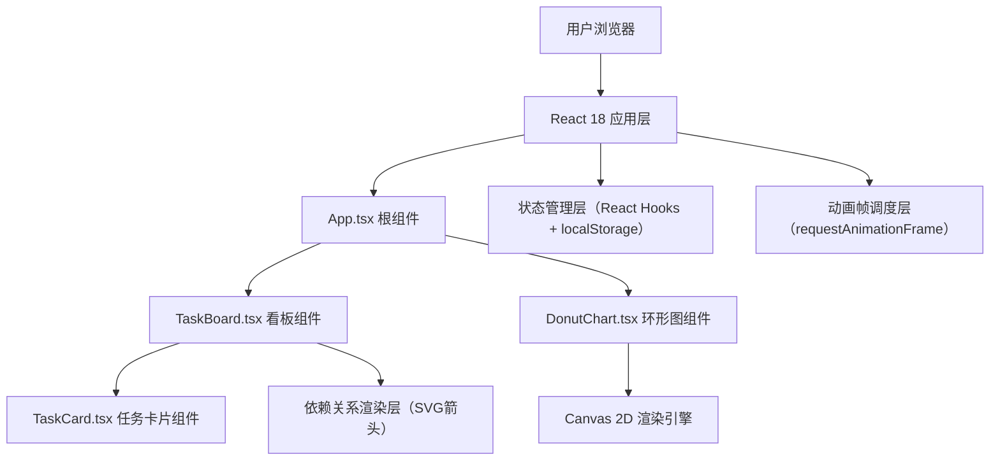
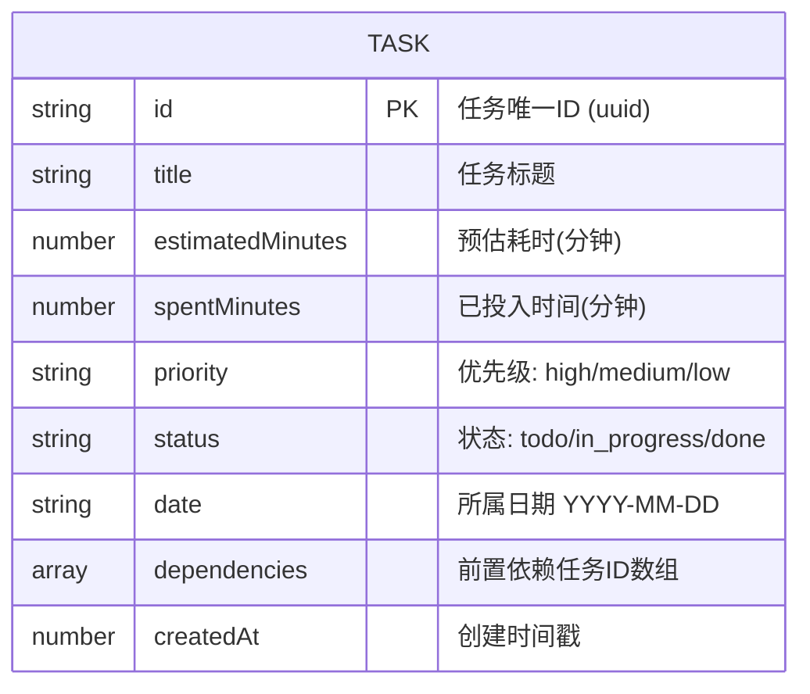

## 1. 架构设计



## 2. 技术描述

- **前端框架**：React 18 + TypeScript 5
- **构建工具**：Vite 5 + @vitejs/plugin-react
- **状态管理**：React useState/useReducer，配合 useEffect 持久化到 localStorage
- **动画方案**：
  - CSS3 动画/过渡用于 DOM 元素动效（回弹、飞入、3D翻转）
  - requestAnimationFrame + Canvas 插值用于环形图扇区平滑过渡
  - requestAnimationFrame 用于粒子烟花特效
- **图表渲染**：原生 Canvas 2D API 绘制环形图
- **依赖线渲染**：SVG 绝对定位层绘制虚线箭头
- **拖拽实现**：HTML5 Drag and Drop API
- **唯一标识**：uuid 库生成任务ID
- **后端**：无（纯前端应用，数据持久化到 localStorage）
- **数据库**：无（localStorage 作为本地数据存储）

## 3. 路由定义

| 路由 | 用途 |
|-------|---------|
| / | 单页应用主入口，包含看板和环形图 |

> 本项目为单页应用（SPA），无多页面路由需求。

## 4. 数据模型

### 4.1 数据模型定义



### 4.2 TypeScript 类型定义

```typescript
type Priority = 'high' | 'medium' | 'low';
type TaskStatus = 'todo' | 'in_progress' | 'done';
type ViewMode = 'board' | 'week';

interface Task {
  id: string;
  title: string;
  estimatedMinutes: number;
  spentMinutes: number;
  priority: Priority;
  status: TaskStatus;
  date: string;
  dependencies: string[];
  createdAt: number;
}
```

### 4.3 文件结构

```
project-root/
├── package.json
├── index.html
├── vite.config.js
├── tsconfig.json
└── src/
    ├── App.tsx          # 根组件，管理全局状态与布局
    ├── TaskBoard.tsx    # 看板组件，三列布局/周视图，拖拽，依赖线
    ├── DonutChart.tsx   # Canvas环形图组件，时间占比，实时时钟
    └── TaskCard.tsx     # 单个任务卡片，编辑，依赖按钮，动画
```

## 5. 关键技术实现要点

### 5.1 拖拽实现
- 使用原生 HTML5 Drag Event（dragstart/dragover/drop/dragend）
- 拖拽时设置半透明（opacity: 0.5）和阴影跟随
- 放置后触发 CSS `transform: scale()` 弹性回弹动画（0.3s cubic-bezier）

### 5.2 依赖线箭头渲染
- 在看板容器内设置绝对定位的 SVG 层（z-index 低于卡片）
- 通过 `getBoundingClientRect()` 获取源卡片和目标卡片位置
- 绘制 `<line stroke-dasharray="5,3">` + `<marker>` 箭头
- 箭头点击变色确认删除逻辑

### 5.3 环形图动画
- 使用 requestAnimationFrame 逐帧渲染
- 每个扇区维护目标角度和当前角度，每帧插值更新（线性插值，0.5秒完成过渡）
- 鼠标位置与扇区角度范围比较实现悬停检测
- 外圈时钟使用 setInterval（1秒）更新文本显示

### 5.4 进度条粒子烟花
- 完成度超过80%时创建粒子数组，每个粒子含位置、速度、透明度、生命周期
- requestAnimationFrame 逐帧更新粒子位置并渲染（Canvas或DOM元素）
- 2秒后自动停止并清理粒子

### 5.5 性能优化策略
- 任务卡片使用 React.memo 避免不必要的重渲染
- 环形图 Canvas 渲染仅在数据变化时触发插值动画，空闲时停止 RAF
- 拖拽状态变更批量更新，减少 setState 调用频率
- 依赖线 SVG 在拖拽结束后重算，拖拽过程中不更新
