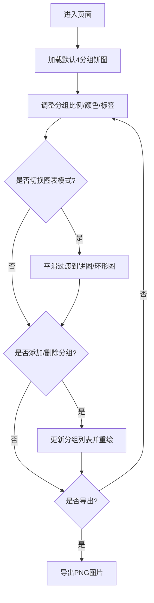

## 1. 产品概述
在线交互式CSS百分比饼图与环形图配置生成器，允许用户通过拖拽滑块和输入数值调整数据分组占比，实时预览图表外观。
- 主要用途：为设计师和开发者提供快速创建、预览和导出饼图/环形图的工具
- 目标用户：UI设计师、前端开发者、数据可视化从业者

## 2. 核心功能

### 2.1 功能模块
1. **图表渲染模块**：Canvas绘制饼图与环形图，支持平滑过渡动画
2. **数据分组控制模块**：滑块调整比例、标签编辑、颜色选择、添加/删除分组
3. **图表模式切换**：饼图/环形图切换，环形图中心文本可编辑
4. **导出功能**：PNG格式导出，支持高分辨率

### 2.2 页面详情
| 页面名称 | 模块名称 | 功能描述 |
|-----------|-------------|---------------------|
| 主页面 | 左侧控制面板 | 分组列表、滑块控制、颜色选择、标签编辑、添加分组按钮 |
| 主页面 | 右侧图表区域 | Canvas画布、模式切换按钮、导出按钮、警告提示 |

## 3. 核心流程
用户进入页面 → 查看默认4分组饼图 → 调整滑块/颜色/标签 → 切换饼图/环形图模式 → 添加/删除分组 → 导出PNG图片

## 4. 用户界面设计

### 4.1 设计风格
- 主背景色：#1a1a2e（深色主题）
- 次要背景：#16213e
- 控件圆角、柔和阴影
- 字体：等宽字体显示数值，无衬线字体显示标签
- 所有过渡动画：0.2秒ease缓动

### 4.2 页面设计概述
| 页面名称 | 模块名称 | UI元素 |
|-----------|-------------|-------------|
| 主页面 | 控制面板 | 320px固定宽度、垂直滚动、分组条目水平排列 |
| 主页面 | 图表区域 | 自适应宽度、最小高度500px、右上角导出按钮 |

### 4.3 响应式
- Desktop-first设计
- 窗口宽度 < 768px时，控制面板折叠到图表下方
