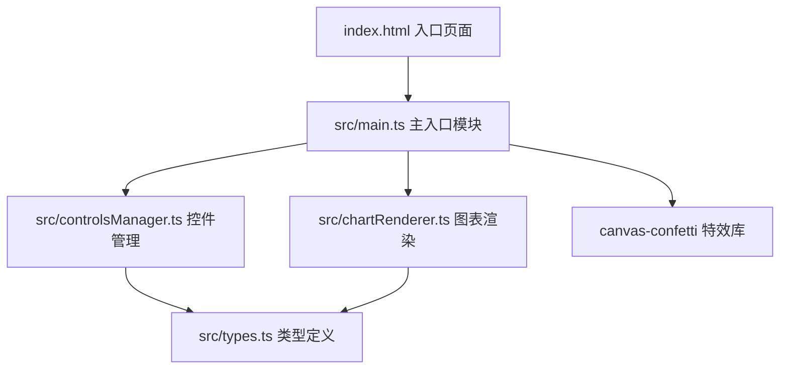
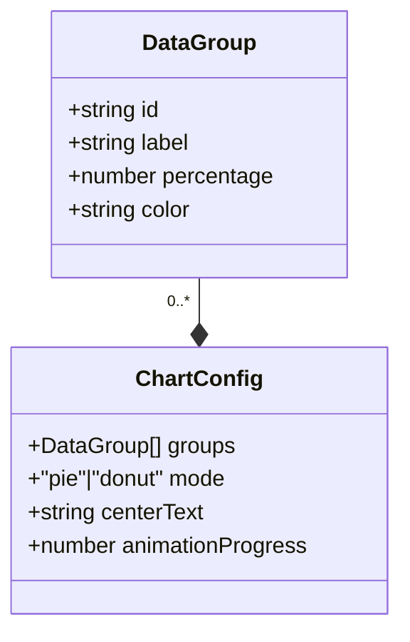

## 1. 架构设计

## 2. 技术说明
- 前端框架：纯TypeScript + Vite（无框架依赖，用户明确要求）
- 构建工具：Vite 5.x
- 语言：TypeScript（严格模式，target ES2020）
- 图表渲染：HTML5 Canvas API
- 特效：canvas-confetti
- 样式：原生CSS（深色主题）

## 3. 模块说明

| 模块 | 职责 |
|-------|------|
| src/types.ts | 定义 DataGroup、ChartConfig 等核心接口 |
| src/chartRenderer.ts | Canvas绘制逻辑：饼图、环形图、图例、动画、导出 |
| src/controlsManager.ts | UI控件创建与事件绑定：滑块、颜色选择器、标签编辑 |
| src/main.ts | 页面初始化、模块协调、全局事件绑定 |

## 4. 数据模型

### 4.1 数据模型定义

### 4.2 初始数据
- 分组A：30%，#FF6B6B
- 分组B：25%，#4ECDC4
- 分组C：20%，#45B7D1
- 分组D：25%，#96CEB4
