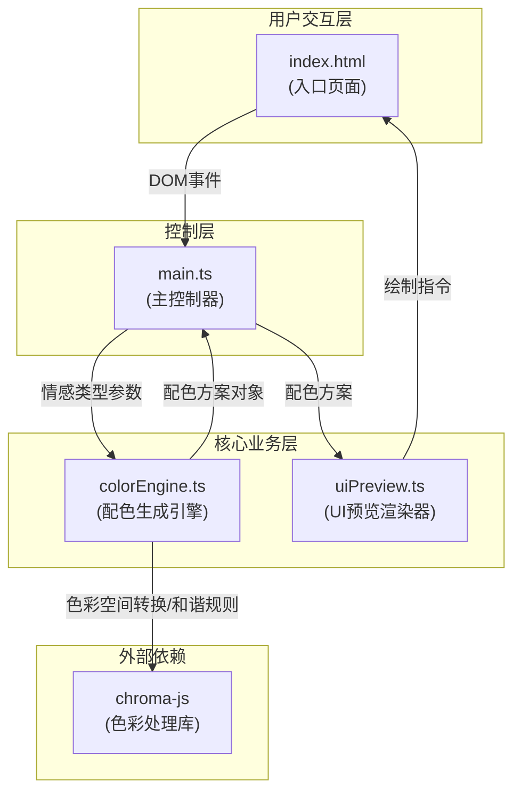

## 1. 架构设计



**文件调用关系与数据流向：**
- `index.html` → 提供DOM容器与Canvas画布，接收用户点击事件
- `main.ts` → 监听HTML事件，调用colorEngine生成配色，将配色传递给uiPreview渲染，更新HTML信息面板
- `colorEngine.ts` → 接收情感类型参数 → 使用chroma-js进行色彩空间转换与和谐规则计算 → 输出包含色值、情感标签、对比度等级的配色对象
- `uiPreview.ts` → 接收配色对象 → 在Canvas上绘制按钮、卡片、输入框、导航栏等UI组件

## 2. 技术描述
- 前端框架：原生 TypeScript (无React/Vue框架)
- 构建工具：Vite@5.x
- 色彩处理：chroma-js@2.x
- 渲染方式：HTML5 Canvas 2D API
- 初始化方式：Vite vanilla-ts 模板

## 3. 文件结构
```
项目根目录/
├── package.json              # 项目依赖与脚本配置
├── vite.config.js            # Vite构建配置(devServer端口3000)
├── tsconfig.json             # TypeScript严格模式配置
├── index.html                # 入口页面(配色面板+UI预览画布)
└── src/
    ├── colorEngine.ts        # 配色生成引擎模块
    ├── uiPreview.ts          # UI组件预览渲染器模块
    └── main.ts               # 主控制器模块
```

## 4. 核心数据模型

### 4.1 情感类型枚举
```typescript
type MoodType = 'calm' | 'vibrant' | 'elegant' | 'vintage' | 'cyberpunk';
```

### 4.2 单个颜色对象
```typescript
interface ColorItem {
  hex: string;           // 十六进制色值
  label: string;         // 情感标签/用途描述（主色、辅色、背景色等）
  lightnessLevel: 'high' | 'medium' | 'low';  // 明度等级
  lightnessLabel: string;  // 中文明度标签：高明度/中明度/低明度
}
```

### 4.3 完整配色方案
```typescript
interface ColorPalette {
  mood: MoodType;             // 情感类型
  moodLabel: string;          // 情感中文名称
  primary: ColorItem;         // 主色
  secondary: ColorItem;       // 辅色
  accent: ColorItem;          // 强调色
  background: ColorItem;      // 背景色
  text: ColorItem;            // 文字色
  contrastRatio: number;      // 主色与背景色对比度
  contrastLevel: 'AAA' | 'AA' | 'Fail';  // WCAG等级
}
```

## 5. 性能约束实现
- **配色生成 < 50ms**：纯同步计算，使用chroma-js内置优化算法，避免DOM操作
- **UI重绘 < 300ms**：Canvas单次重绘，使用requestAnimationFrame，避免布局抖动
- **帧率 ≥ 40fps**：粒子动画使用requestAnimationFrame，控制粒子数量≤30个
- **颜色过渡动画**：使用Canvas线性插值，0.4秒内完成颜色平滑过渡
