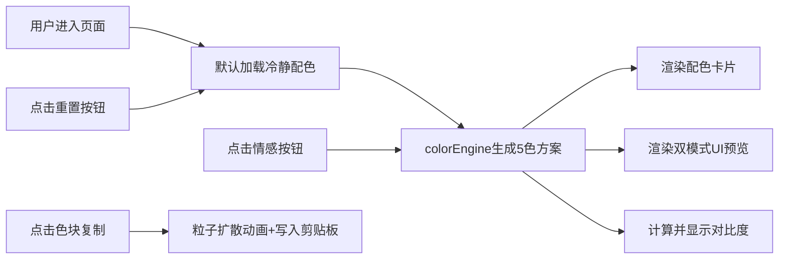

## 1. 产品概述
情感配色方案生成与UI效果预览应用，为前端设计师快速生成具有不同情感倾向的完整配色方案，并一键预览在典型UI组件上的视觉效果。
- 目标用户：前端设计师、UI设计师、产品经理
- 核心价值：避免在多个工具间切换的低效，快速验证配色方案在实际UI组件上的表现

## 2. 核心功能

### 2.1 功能模块
1. **情感配色生成面板**：五种情感主题选择，生成5色和谐配色方案
2. **配色卡片展示**：色块+十六进制码+明度等级标签，支持点击复制
3. **实时UI预览画布**：深色/浅色双模式Canvas预览典型UI组件
4. **对比度检测提示**：WCAG对比度等级显示与警告

### 2.2 页面详情
| 页面名称 | 模块名称 | 功能描述 |
|-----------|-------------|---------------------|
| 主页 | 情感选择区域 | 五个圆形情感按钮（冷静、活力、优雅、复古、赛博朋克），点击触发配色生成 |
| 主页 | 配色卡片区域 | Flex-wrap布局展示5个配色卡片，含色块、HEX码、明度标签，悬停放大旋转动画，点击复制粒子效果 |
| 主页 | 对比度提示栏 | 显示主色与背景色WCAG对比度等级，低于3:1时红色警告 |
| 主页 | UI预览画布 | 左右双Canvas（400x400），左侧深色模式(#1a1a2e)，右侧浅色模式(白色)，含按钮、卡片、输入框、导航栏 |
| 主页 | 重置按钮 | 底部重置按钮，涟漪动画反馈，恢复初始冷静配色 |

## 3. 核心流程

用户进入页面 → 默认展示"冷静"配色方案 → 点击情感按钮触发配色生成 → colorEngine生成带随机偏移的5色方案 → 配色卡片渲染+UI画布重绘+对比度检测 → 用户点击色块复制色值（粒子动画）→ 用户点击重置按钮恢复初始配色

## 4. 用户界面设计

### 4.1 设计风格
- 主背景色：浅灰色 #f5f5f7
- 布局风格：简洁卡片式布局，居中对齐
- 按钮风格：圆角，悬停时translateY(-2px) + 阴影加深（0 2px 4px → 0 4px 8px），0.2秒过渡
- 配色卡片：悬停scale(1.05) + rotate(2deg)，0.3秒缓动
- 重置按钮：中心扩散涟漪反馈动画
- 动画：配色切换0.4秒线性渐变过渡，输入框聚焦0.2秒颜色过渡

### 4.2 页面设计概述
| 页面名称 | 模块名称 | UI元素 |
|-----------|-------------|-------------|
| 主页 | 情感选择区域 | 5个圆形按钮，每个按钮背景色与情感主题挂钩，水平居中排列 |
| 主页 | 配色卡片区域 | flex-wrap布局，<600px每行3个，>=600px每行5个 |
| 主页 | 对比度提示栏 | 单行文本，正常灰色，警告时红色+警告图标 |
| 主页 | UI预览区域 | 两个400x400 Canvas并排，间距20px |
| 主页 | 底部操作区 | 居中的重置按钮 |

### 4.3 响应式
- 桌面端优先设计
- 断点600px：配色卡片从每行5个变为每行3个
- Canvas保持固定400x400尺寸，小屏下自动换行堆叠
