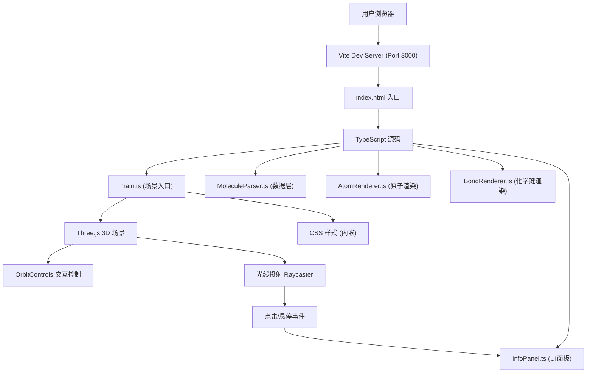

## 1. 架构设计



## 2. 技术描述

- **前端框架**: TypeScript + Three.js @0.160
- **构建工具**: Vite @5
- **UI组件库**: 原生CSS (无UI框架依赖)，dat.gui (调试可选)
- **3D渲染**: Three.js + OrbitControls
- **无后端**: 纯前端应用，分子数据硬编码在MoleculeParser中

### 2.1 核心依赖版本

| 依赖包 | 版本 | 用途 |
|-------|------|------|
| three | 0.160.x | 3D渲染引擎 |
| @types/three | 最新 | TypeScript类型定义 |
| typescript | 最新 | 类型安全编译 |
| vite | 5.x | 构建与开发服务器 |
| dat.gui | 最新 | 调试控制面板（可选） |

## 3. 文件结构

```
auto83/
├── package.json              # 项目依赖与脚本
├── vite.config.js            # Vite 构建配置 (port 3000)
├── tsconfig.json             # TypeScript 配置 (ES2020, strict)
├── index.html                # 入口HTML (3D容器 + 信息面板 + 控制条)
└── src/
    ├── main.ts               # 应用入口，场景组装与渲染循环
    ├── MoleculeParser.ts     # 分子结构数据解析器
    ├── AtomRenderer.ts       # 原子球体渲染与交互
    ├── BondRenderer.ts       # 化学键圆柱渲染
    └── InfoPanel.ts          # 侧边信息面板UI管理
```

## 4. 数据模型

### 4.1 原子数据结构 (AtomData)

```typescript
interface AtomData {
  id: number;           // 原子唯一编号
  element: string;      // 元素符号 (C, H, O, N)
  x: number;            // X坐标 (Å)
  y: number;            // Y坐标 (Å)
  z: number;            // Z坐标 (Å)
  radius: number;       // 渲染半径 (单位)
  color: number;        // 颜色 (十六进制)
}
```

### 4.2 化学键数据结构 (BondData)

```typescript
interface BondData {
  atom1: number;        // 连接原子1的id
  atom2: number;        // 连接原子2的id
  order: 1 | 2;         // 键级：1=单键，2=双键
}
```

### 4.3 分子数据结构 (MoleculeData)

```typescript
interface MoleculeData {
  name: string;         // 分子名称
  formula: string;      // 分子式
  atoms: AtomData[];    // 原子数组
  bonds: BondData[];    // 化学键数组
}
```

### 4.4 元素配置常量

| 元素 | 颜色 | 半径 | 说明 |
|-----|------|------|------|
| C | 0x404040 (深灰) | 0.70 | 碳原子 |
| H | 0xffffff (白色) | 0.40 | 氢原子 |
| O | 0xff0000 (红色) | 0.60 | 氧原子 |
| N | 0x0000ff (蓝色) | 0.65 | 氮原子 |

## 5. 核心类与模块职责

### 5.1 MoleculeParser (数据层)
- **职责**：提供预定义分子（乙醇、咖啡因）的原子坐标和键连接数据
- **方法**：
  - `getEthanol(): MoleculeData` - 返回乙醇分子数据
  - `getCaffeine(): MoleculeData` - 返回咖啡因分子数据
  - `getMoleculeByName(name: string): MoleculeData | null` - 按名称获取分子

### 5.2 AtomRenderer (渲染层)
- **职责**：创建和管理原子的3D球体网格，处理高亮、选中、悬停效果
- **关键属性**：
  - `atomMeshes: Map<number, Mesh>` - 原子id到Mesh的映射
  - `pulseRings: Map<number, Mesh>` - 选中脉冲光圈
  - `hoveredAtomId: number | null` - 当前悬停原子
  - `selectedAtomId: number | null` - 当前选中原子
- **方法**：
  - `createAtom(atom: AtomData): Mesh` - 创建单个原子球体
  - `createAtoms(atoms: AtomData[]): Group` - 批量创建原子组
  - `highlightAtom(id: number)` - 悬停放大效果
  - `unhighlightAtom(id: number)` - 取消悬停
  - `selectAtom(id: number)` - 选中并添加脉冲光圈
  - `deselectAtom()` - 取消选中
  - `updatePulseAnimation(time: number)` - 更新脉冲动画

### 5.3 BondRenderer (渲染层)
- **职责**：创建和管理化学键的3D圆柱网格
- **方法**：
  - `createBond(atom1: AtomData, atom2: AtomData, order: number): Group` - 创建单个化学键（支持单键/双键）
  - `createBonds(atoms: AtomData[], bonds: BondData[]): Group` - 批量创建化学键组

### 5.4 InfoPanel (UI层)
- **职责**：管理右侧信息面板的DOM更新
- **方法**：
  - `updateAtomInfo(atom: AtomData | null)` - 更新面板显示原子信息
  - `clear()` - 清空面板内容
  - `toggle(visible: boolean)` - 显示/隐藏面板

### 5.5 main.ts (应用入口)
- **职责**：组装所有模块，初始化Three.js场景，管理渲染循环和事件
- **核心流程**：
  1. 初始化场景、相机、渲染器、灯光
  2. 初始化OrbitControls（带阻尼）
  3. 加载默认分子（乙醇）
  4. 设置Raycaster处理点击和悬停
  5. 启动渲染循环（处理动画、自动旋转、脉冲效果）
  6. 绑定UI事件（分子切换下拉、自动旋转开关）

## 6. 渲染与性能优化

- **帧率目标**：稳定30fps以上（原子≤30，键≤35）
- **优化策略**：
  - 使用BufferGeometry而非Geometry
  - 共享Material实例减少内存占用
  - 禁用不必要的阴影投射
  - 使用devicePixelRatio限制（Math.min(window.devicePixelRatio, 2)）
  - 悬停检测使用Raycaster，每帧最多一次检测
