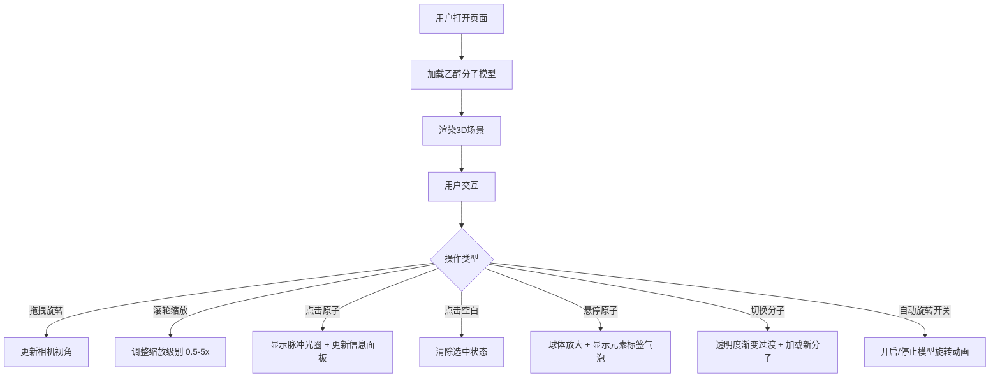

## 1. 产品概述

基于Web的3D分子结构旋转与交互式查看应用，让用户能够像操作虚拟分子模型一样，从任意角度观察分子中原子的空间排列、化学键的连接方式，并查看每个原子的详细元素信息。

- 主要目的：提供直观的3D分子可视化工具，帮助学生、科研人员和化学爱好者理解分子结构
- 目标用户：化学学生、教师、科研人员、化学爱好者
- 产品价值：将抽象的分子结构转化为可交互的3D可视化模型，降低学习门槛

## 2. 核心特性

### 2.1 功能模块

1. **3D分子视图**：Three.js渲染的分子模型，包含原子球体和化学键圆柱
2. **分子切换**：支持乙醇（C2H5OH）和咖啡因（C8H10N4O2）两种分子切换，带过渡动画
3. **交互控制**：鼠标拖拽旋转、滚轮缩放、点击选中、悬停高亮
4. **原子信息面板**：显示选中原子的元素符号、编号、空间坐标
5. **自动旋转控制**：开关控制分子绕Y轴旋转及原子自转
6. **响应式布局**：桌面端左右分栏，移动端悬浮面板

### 2.2 页面详情

| 页面名称 | 模块名称 | 功能描述 |
|---------|---------|----------|
| 主页面 | 3D视图容器 | 占左侧70%，渲染分子模型，支持鼠标交互 |
| 主页面 | 信息面板 | 右侧30%，磨砂玻璃效果，显示原子详细信息表格 |
| 主页面 | 底部控制条 | 高度50px，半透明黑色，包含分子下拉菜单和自动旋转开关 |

## 3. 核心流程

## 4. 用户界面设计

### 4.1 设计风格

- **主色调**：深蓝黑渐变背景（#0a0a1a → #1a1a3a），营造科学探索氛围
- **原子配色**：C深灰色、O红色、H白色、N蓝色，遵循标准CPK配色
- **面板效果**：半透明磨砂玻璃（backdrop-filter: blur(10px), rgba(255,255,255,0.08)）
- **文字颜色**：浅灰色（#d0d0e0），在深色背景下保持高对比度
- **按钮样式**：切换式开关，开启绿色/关闭灰色，0.3秒动画过渡
- **动效风格**：所有交互带0.2-0.4秒缓动，避免突兀变化

### 4.2 页面设计概览

| 模块名称 | UI元素 | 描述 |
|---------|-------|------|
| 3D视图容器 | 分子模型、相机控制 | 原子球体+化学键圆柱，轨道控制带阻尼 |
| 信息面板 | 标题、信息表格 | 两列表格（名称/值），交替行底色，文字右对齐，行间距12px |
| 底部控制条 | 下拉菜单、切换开关 | 半透明黑色条，居中摆放，高度50px |
| 悬停标签 | 圆角气泡标签 | 显示元素符号，向上偏移15像素弹出，0.15秒缓动 |
| 选中光圈 | 脉冲光环 | 亮黄色，半径1.2倍，脉动周期0.8秒 |

### 4.3 响应式设计

- **桌面端（≥768px）**：3D容器70%左侧，信息面板30%右侧，底部控制条固定底部
- **移动端（<768px）**：3D容器全宽，信息面板悬浮于右下角（250px宽，高度自适应），底部控制条仍固定底部
- **触摸优化**：支持触摸拖拽旋转、双指缩放

### 4.4 3D场景设计

- **环境**：深蓝黑渐变背景，多光源照明（环境光+方向光+点光源）
- **光照设置**：环境光强度0.4，方向光强度0.8，多点光源增强立体感
- **相机设置**：PerspectiveCamera，初始距离适配分子大小，OrbitControls带阻尼惯性
- **材质**：原子使用MeshStandardMaterial带金属度和粗糙度，化学键使用半透明MeshStandardMaterial
- **后处理**：确保30fps以上稳定帧率，优化渲染性能
