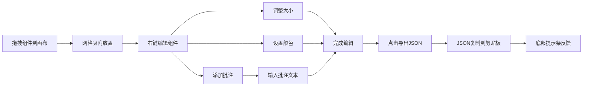

## 1. 产品概述

面向远程设计与开发团队的可交互组件协作白板应用，设计师和开发者可在同一网页内实时拖拽摆放UI组件（按钮、输入框、卡片），为每个组件添加批注标签，最终一键导出当前白板布局的JSON描述，解决设计稿与代码之间反复沟通、格式转换的痛点。

- 主要用途：快速搭建UI原型、组件协作评审、设计规格交付
- 目标用户：UI设计师、前端开发者、产品经理
- 产品价值：消除设计与开发之间的信息断层，减少反复沟通成本

## 2. 核心功能

### 2.1 用户角色
| 角色 | 注册方式 | 核心权限 |
|------|----------|----------|
| 普通用户 | 无需注册，本地使用 | 拖拽组件、添加批注、调整属性、导出JSON |

### 2.2 功能模块
1. **白板画布**：无限滚动网格背景、平移、缩放、吸附对齐
2. **组件工具栏**：按钮、输入框、卡片三种可拖拽组件
3. **组件交互**：右键菜单（调整大小、添加批注、设置颜色）
4. **批注系统**：黄色便签气泡、多行文本输入、尾线指向组件
5. **导出功能**：一键导出JSON、自动复制剪贴板、操作提示

### 2.3 页面详情
| 页面名称 | 模块名称 | 功能描述 |
|---------|---------|---------|
| 主界面 | 左侧工具栏 | 展示三种组件类型（按钮、输入框、卡片），支持拖拽到画布 |
| 主界面 | 中央画布 | Canvas绘制无限网格，支持平移、缩放、组件放置与编辑 |
| 主界面 | 导出按钮 | 右上角悬浮按钮，点击导出所有组件JSON到剪贴板 |
| 主界面 | 右键菜单 | 组件右键弹出菜单：调整大小、添加批注、设置颜色（二级色板） |
| 主界面 | 批注气泡 | 组件上方黄色便签，可拖拽、可输入多行文本（最多200字） |
| 主界面 | 提示条 | 底部滑入绿色提示条，显示导出成功信息 |

## 3. 核心流程

用户从左侧工具栏拖拽组件类型到画布网格区域 → 组件吸附对齐网格后放置 → 右键组件进行大小调整/颜色设置/添加批注 → 点击右上角"导出JSON"按钮 → JSON数据复制到剪贴板 → 底部提示条确认操作完成。

## 4. 用户界面设计

### 4.1 设计风格
- 主色调：极简亮色，背景 #F8F9FA，工具栏 #E9ECEF，画布白色
- 强调色：深蓝 #2563EB（导出按钮）、蓝紫 #8B5CF6（放置辅助线）
- 组件色板：红/橙/黄/绿/青/蓝/紫/灰 8色预设
- 按钮样式：圆角药丸形（导出按钮），所有交互带0.2秒过渡动画
- 字体：系统默认无衬线字体，保持简洁高效
- 布局风格：左侧固定工具栏200px + 右侧弹性画布区域
- 阴影：组件阴影 rgba(0,0,0,0.08)，柔和不突兀

### 4.2 页面设计概览
| 页面名称 | 模块名称 | UI元素 |
|---------|---------|--------|
| 主界面 | 左侧工具栏 | 200px宽灰色面板，三个组件图标（圆角色块/圆角矩形带光标/阴影方框），hover高亮，拖拽时跟随指针的半透明预览 |
| 主界面 | 画布网格 | 淡灰色细线40px间距，按住空格+拖拽平移，滚轮缩放0.5x~3x带弹性阻尼，缩放动画丝滑 |
| 主界面 | 放置辅助线 | 半透明蓝紫色十字线，吸附网格时闪烁0.15秒提示 |
| 主界面 | 组件右键菜单 | 0.1秒淡入动画，三个菜单项带图标，hover高亮，颜色项展开二级色板 |
| 主界面 | 批注气泡 | 柔和黄底 #FEF3C7 黑字，带尾线指向组件中心，圆角，拖拽可移动，多行文本输入 |
| 主界面 | 缩放控制点 | 蓝色小方块位于组件右下角，拖拽显示实时尺寸标签，最小限制40x20px |
| 主界面 | 导出按钮 | 右上角悬浮，圆角药丸，深蓝背景白字，hover变浅蓝，点击有按压反馈 |
| 主界面 | 提示条 | 底部居中绿色背景 #10B981 白字，0.4秒滑入，停留3秒后滑出 |

### 4.3 响应式
- 桌面端优先（默认）：左侧200px工具栏 + 右侧画布
- 移动端（768px以下）：工具栏收起到顶部变为横向可滚动图标条，每个图标64x64px带文字标签
- 触控优化：移动端支持双指缩放画布

### 4.4 性能目标
- 画布拖拽和缩放帧率稳定在45fps以上
- 同时渲染50个组件 + 每个组件附带一个批注气泡时无卡顿
- 使用 requestAnimationFrame 保证渲染效率
