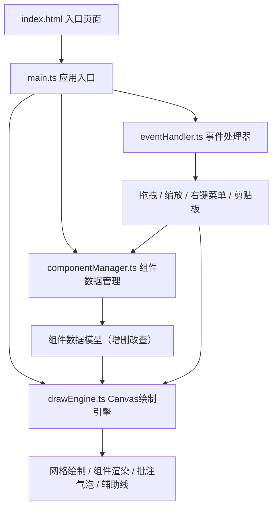

## 1. 架构设计



## 2. 技术描述

- 前端框架：纯 TypeScript（无UI框架）+ HTML5 Canvas API
- 构建工具：Vite 5.x
- 工具库：uuid（生成唯一组件ID）
- 样式方案：原生 CSS（内联在 index.html 的 `<style>` 标签中）
- 渲染架构：单 Canvas 2D 上下文，统一绘制循环
- 状态管理：组件集中存储在 ComponentManager 的数组中

## 3. 文件结构

```
project/
├── package.json            # 依赖配置：typescript, vite, uuid
├── vite.config.js          # Vite 基础配置，端口 3000
├── tsconfig.json           # TypeScript 严格模式，target ES2020
├── index.html              # 入口页面 + 移动端 viewport + 全局样式
└── src/
    ├── main.ts             # 应用入口，初始化 Canvas，串联各模块
    ├── componentManager.ts # 组件数据模型与 CRUD，saveToJSON 方法
    ├── drawEngine.ts       # Canvas 绘制引擎（网格、组件、批注、辅助线）
    └── eventHandler.ts     # 事件处理（拖拽、缩放、右键菜单、剪贴板）
```

## 4. 数据模型

### 4.1 类型定义

```typescript
type ComponentType = 'button' | 'input' | 'card';

interface Comment {
  id: string;
  text: string;
  offsetX: number; // 相对组件中心的偏移
  offsetY: number;
}

interface CanvasComponent {
  id: string;
  type: ComponentType;
  x: number;        // 画布坐标（浮点，保留两位）
  y: number;
  width: number;
  height: number;
  color: string;    // 填充色
  comment?: Comment;
}

interface ViewTransform {
  scale: number;   // 0.5 ~ 3
  offsetX: number; // 画布平移偏移
  offsetY: number;
}
```

### 4.2 导出 JSON 格式

```json
{
  "version": "1.0",
  "exportedAt": "2026-06-10T...",
  "components": [
    {
      "id": "uuid",
      "type": "button",
      "x": 120.50,
      "y": 80.00,
      "width": 120,
      "height": 40,
      "color": "#2563EB",
      "comment": {
        "text": "主按钮文案确认",
        "offsetX": 0,
        "offsetY": -80
      }
    }
  ]
}
```

## 5. 核心模块职责

### 5.1 componentManager.ts
- `addComponent(type, x, y)`: 创建新组件（默认尺寸和颜色）
- `removeComponent(id)`: 删除组件
- `updateComponent(id, patch)`: 更新组件属性（位置、尺寸、颜色等）
- `getComponentById(id)`: 查询组件
- `getAllComponents()`: 获取全部组件
- `saveToJSON()`: 序列化为格式化 JSON 字符串

### 5.2 drawEngine.ts
- `setTransform(scale, offsetX, offsetY)`: 设置视口变换
- `drawGrid()`: 绘制无限网格（40px 间距淡灰线）
- `drawComponent(comp)`: 绘制单个组件（按钮/输入框/卡片）
- `drawComment(comp)`: 绘制批注气泡 + 尾线
- `drawPlacementGuide(x, y)`: 绘制蓝紫色放置辅助线（含吸附闪烁）
- `drawResizeHandle(comp)`: 绘制蓝色缩放控制点 + 实时尺寸标签
- `renderAll()`: requestAnimationFrame 循环，清空画布后统一绘制

### 5.3 eventHandler.ts
- `handleToolbarDragStart(type)`: 从工具栏开始拖拽创建新组件
- `handleCanvasMouseDown/Up/Move`: 画布平移、组件拖拽、缩放控制点
- `handleWheel(e)`: 滚轮缩放（0.5x~3x，弹性阻尼）
- `handleKeyDown/Up(e)`: 空格键按住检测（平移模式切换）
- `handleContextMenu(e)`: 右键菜单弹出（0.1s 淡入）
- `handleExportClick()`: 调用 saveToJSON → 复制剪贴板 → 触发提示条

## 6. 性能优化策略

- 使用 requestAnimationFrame 统一渲染循环，避免重复重绘
- 所有坐标计算缓存化，减少每帧重复运算
- 批注气泡文本只在文本变化时重新测量（measureText 缓存）
- 网格线按视口范围裁剪，只绘制可见区域
- 鼠标移动事件节流（已由 rAF 自然节流）
