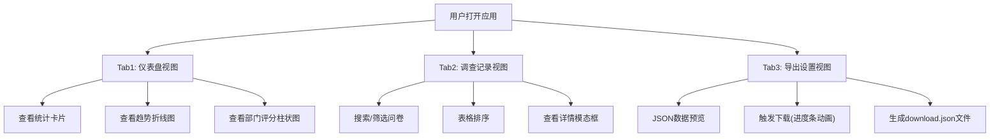

## 1. 产品概述

客户满意度调查数据看板，为小微企业主提供可视化的问卷反馈汇总与多维度分析工具，替代传统人工统计表格的繁琐流程。
- 主要目的：实时汇总客户满意度问卷反馈，提供多维度数据可视化分析
- 目标用户：小微企业内部管理团队
- 产品价值：提升数据统计效率，直观呈现客户满意度趋势与部门差异

## 2. 核心功能

### 2.1 功能模块

1. **仪表盘视图**：统计卡片展示核心指标、趋势折线图展示近60天满意度变化、堆叠柱状图展示各部门评分分布
2. **调查记录视图**：完整问卷记录表格、支持多条件筛选与排序、详情模态框查看反馈文本
3. **导出设置视图**：JSON数据格式化预览、一键导出下载功能

### 2.2 页面详情

| 页面名称 | 模块名称 | 功能描述 |
|-----------|-------------|---------------------|
| 仪表盘 | 统计卡片 | 展示总问卷数、平均满意度、推荐率，带动态数字滚动效果 |
| 仪表盘 | 满意度趋势图 | 近60天按周统计平均分折线图，支持颜色阈值和hover提示 |
| 仪表盘 | 部门评分分布图 | 各部门1-5分占比堆叠柱状图，渐变色区分评分档次 |
| 调查记录 | 数据表格 | 分页展示问卷记录，支持按列排序、星级显示、彩色部门标签 |
| 调查记录 | 筛选搜索 | 模糊搜索反馈文本和部门名、按评分档次筛选、300ms防抖 |
| 调查记录 | 详情模态框 | 点击查看详情弹出完整反馈文本，带缩放动画和遮罩 |
| 导出设置 | JSON预览 | 格式化显示当前数据，等宽字体带行号 |
| 导出设置 | 下载功能 | 进度条动画模拟下载过程，完成后自动下载JSON文件 |

## 3. 核心流程

用户打开应用后，默认展示仪表盘视图，可通过顶部Tab切换不同页面：
1. 在仪表盘查看整体数据概览和趋势分析
2. 切换到调查记录视图，通过搜索和筛选定位特定问卷
3. 点击查看详情了解具体反馈内容
4. 切换到导出设置，预览并下载完整数据

## 4. 用户界面设计

### 4.1 设计风格

- **主色**：科技蓝 #3b82f6
- **辅色**：琥珀黄 #f59e0b（用于强调和重要数据）
- **背景色**：浅灰 #f4f6f8
- **卡片背景**：纯白 #ffffff，阴影 box-shadow: 0 2px 8px rgba(0,0,0,0.06)
- **文本主色**：#1e293b，次级文本：#64748b
- **按钮**：主色填充，hover亮度提升10%，点击缩小至0.97倍
- **字体**：系统sans-serif字体，响应式基准16px
- **布局**：卡片式布局，顶部Tab导航，响应式三档断点

### 4.2 页面设计概述

| 页面名称 | 模块名称 | UI元素 |
|-----------|-------------|-------------|
| 全局 | 顶部导航Tab | 三按钮Tab切换，下划线平滑滑动指示(0.3s ease-out)，内容渐入(0.4s) |
| 仪表盘 | 统计卡片 | 三卡片并排，左上角小图标，数字滚动动画(1s完成) |
| 仪表盘 | 趋势折线图 | 入场动画从左向右逐段绘制(1.5s)，数据点hover提示，颜色阈值变色 |
| 仪表盘 | 评分分布柱状图 | 入场动画从下向上逐柱弹出(0.8s一组)，堆叠渐变色 |
| 调查记录 | 数据表格 | 行hover淡蓝色(#eff6ff)，选中行深蓝色(#dbeafe)，行淡入淡出动画(0.2s) |
| 调查记录 | 部门标签 | 销售橙色、技术蓝色、客服绿色、行政紫色 |
| 调查记录 | 星级评分 | 1-5颗实心/空心星显示 |
| 调查记录 | 详情模态框 | 居中显示，半透明遮罩，0.3s缩放弹出，打开时禁止背景滚动 |
| 导出设置 | 进度条 | 0→100%模拟(2s)，完成后变绿消失 |
| 导出设置 | 代码预览 | pre标签格式化，等宽字体，左侧浅灰色行号 |

### 4.3 响应式设计

- **桌面端(>1024px)**：统计卡片一行三张，图表左右并排
- **平板端(768-1024px)**：图表上下堆叠(折线图在上，柱状图在下)
- **手机端(<768px)**：所有卡片和图表各占一整行，表格隐藏操作列，查看详情改为行尾文字链接
- **过渡效果**：断点切换时所有元素0.3s ease-in-out平滑过渡
