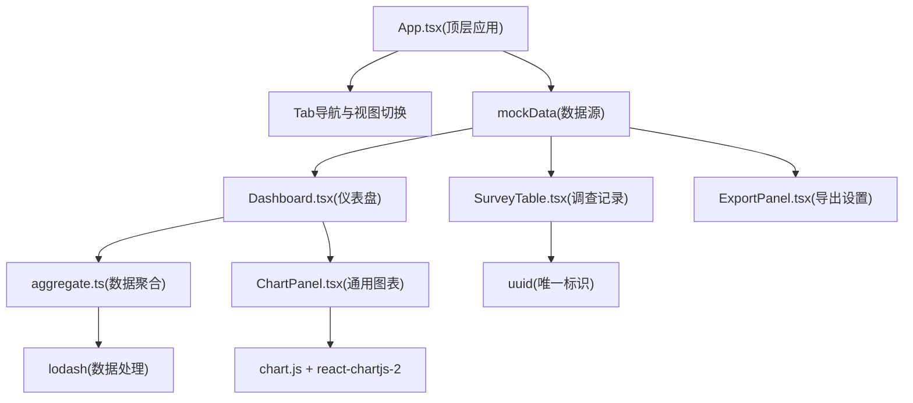
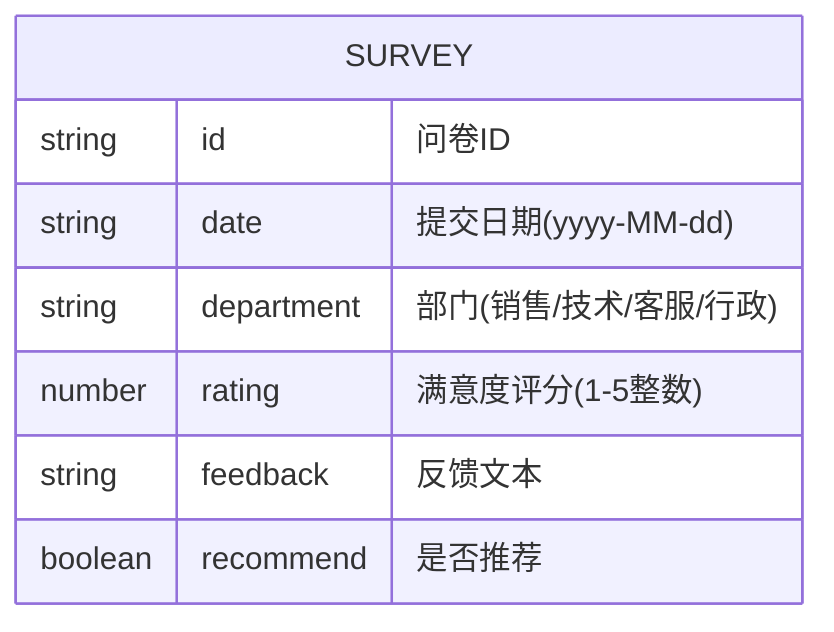

## 1. 架构设计



## 2. 技术描述

- **前端框架**：React@18 + TypeScript
- **构建工具**：Vite + @vitejs/plugin-react，devServer端口3000
- **图表库**：chart.js + react-chartjs-2
- **工具库**：uuid(生成唯一ID)、lodash(数据处理)
- **数据存储**：前端内存模拟，50条随机问卷记录
- **样式方案**：原生CSS (global.css)，不使用Tailwind

## 3. 文件结构与调用关系

| 文件路径 | 职责 | 输入/输出 |
|-----------|------|-----------|
| package.json | 项目依赖配置 | 依赖: react@18, react-dom, typescript, vite, @vitejs/plugin-react, chart.js, react-chartjs-2, uuid, lodash |
| vite.config.js | Vite构建配置 | 支持React+TS，端口3000 |
| tsconfig.json | TypeScript配置 | 严格模式, ES2020, react-jsx, DOM类型 |
| index.html | 入口HTML | 挂载根容器，引入字体样式 |
| src/main.tsx | React入口 | 渲染App组件，挂载到root节点 |
| src/App.tsx | 顶层应用 | 输入: mockData → 输出: 分发给子组件 |
| src/components/Dashboard.tsx | 仪表盘组件 | 输入: 原始数据 → 聚合处理 → 传给ChartPanel |
| src/components/SurveyTable.tsx | 表格视图 | 输入: 原始数据 → 排序过滤 → 渲染表格 |
| src/components/ChartPanel.tsx | 通用图表 | 输入: 统计数据 → 渲染折线图/柱状图，入场动画 |
| src/data/mockData.ts | 模拟数据 | 输出: 50条问卷记录数组 |
| src/utils/aggregate.ts | 数据聚合工具 | 输入: 原始数组 → 输出: 结构化聚合对象 |
| src/styles/global.css | 全局样式 | 背景、字体、响应式、动画效果 |

## 4. 数据模型

### 4.1 数据模型定义



### 4.2 聚合数据结构

```typescript
interface AggregatedData {
  totalSurveys: number;
  averageRating: number;
  recommendRate: number;
  weeklyTrend: { week: string; avg: number }[];
  departmentDistribution: {
    department: string;
    distribution: { rating: number; percentage: number }[];
  }[];
}
```

## 5. 性能约束

- 首次完全渲染时间 ≤ 1500ms（模拟数据加载不计）
- 图表动画帧率 ≥ 30fps
- 表格分页：每页10条，底部页码导航
- 搜索防抖：300ms内不触发额外渲染
