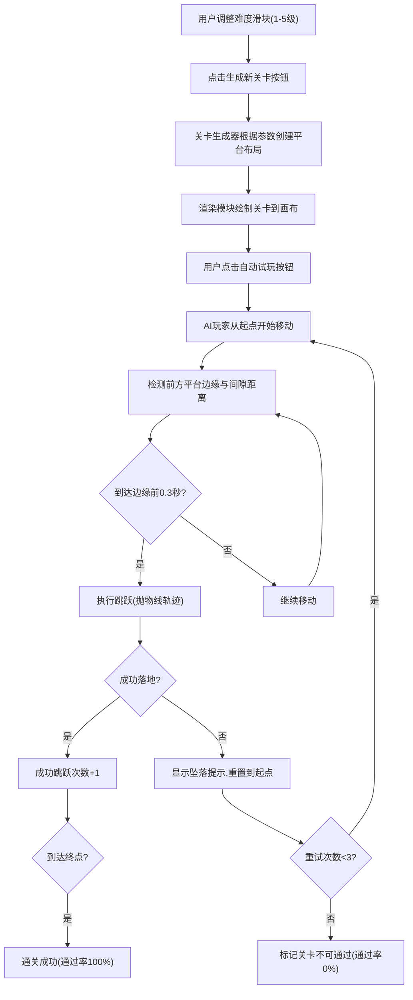

## 1. 产品概述

这是一个面向游戏设计师的2D平台跳跃游戏关卡自动生成与难度预览Web应用。用户可通过调整难度参数快速生成随机关卡布局，并借助AI自动试玩功能验证关卡可通过性。

- 核心目标：提供高效的关卡设计与难度评估工具
- 目标用户：游戏设计师、关卡策划人员
- 市场价值：大幅缩短平台跳跃游戏关卡的设计迭代周期

## 2. 核心功能

### 2.1 功能模块
1. **主游戏画布**：横向滚动的2D平台关卡场景展示，包含玩家角色、平台地形
2. **难度控制面板**：难度滑块（1-5级）、生成新关卡按钮、自动试玩按钮
3. **统计数据面板**：总平台数、平均间隙宽度、预计通关率、最大跳跃距离、成功跳跃次数
4. **AI自动试玩系统**：AI驱动玩家角色自动跳跃通过关卡，支持失败重试机制

### 2.2 页面详情
| 页面名称 | 模块名称 | 功能描述 |
|---------|---------|---------|
| 主页面 | 游戏画布区域 | 渲染2D平台关卡、玩家角色、粒子特效，支持横向滚动显示 |
| 主页面 | 控制面板 | 难度滑块调节、关卡生成、AI自动试玩触发 |
| 主页面 | 统计面板 | 实时显示关卡数据、AI试玩结果、通过率等统计信息 |

## 3. 核心流程

用户调整难度滑块 → 点击生成新关卡 → 系统根据难度参数随机生成15-25个平台 → 画布渲染关卡 → 点击自动试玩 → AI从起点开始自动跳跃 → 实时统计跳跃次数与通关状态 → 展示通过率和失败提示

## 4. 用户界面设计

### 4.1 设计风格
- 主色调：深蓝(#2c3e50)、浅灰(#f0f0f0)、蓝灰(#bdc3c7)、橙色(#e67e22)
- 按钮风格：圆角矩形(圆角6px)，扁平化设计，悬停过渡0.2秒，按下缩放0.95
- 字体：统计数字使用等宽字体，字号14px
- 布局：桌面端采用左侧画布+右侧250px固定宽度垂直控制面板；移动端(小于800px)顶部横向栏+下方画布
- 动效：难度滑块改变时背景颜色平滑过渡0.5秒，粒子特效，失败X闪烁动画

### 4.2 页面设计概述
| 页面名称 | 模块名称 | UI元素 |
|---------|---------|-------|
| 主页面 | 游戏画布 | 浅灰背景(#f0f0f0)、淡灰虚线网格(间距50px)、深蓝圆角平台(#2c3e50,radius 8px)、蓝色方块玩家(带阴影) |
| 主页面 | 控制面板 | 白色背景(#ffffff)、box-shadow: 2px 0 8px rgba(0,0,0,0.1)、垂直排列UI控件 |
| 主页面 | 按钮控件 | 默认背景#3498db、悬停#2980b9、圆角6px、过渡0.2秒 |
| 主页面 | 难度滑块 | 轨道#bdc3c7、滑块手柄#e67e22、背景色从淡绿#e0f7e0到橙红#ffcccc渐变 |
| 主页面 | 统计面板 | 等宽字体、14px字号、通过率绿色高亮 |

### 4.3 响应式
- 桌面优先设计
- 屏幕宽度<800px时：右侧面板收缩为顶部横向栏，游戏画布自动调整高度适应剩余空间
- 触摸设备适配滑块和按钮交互
