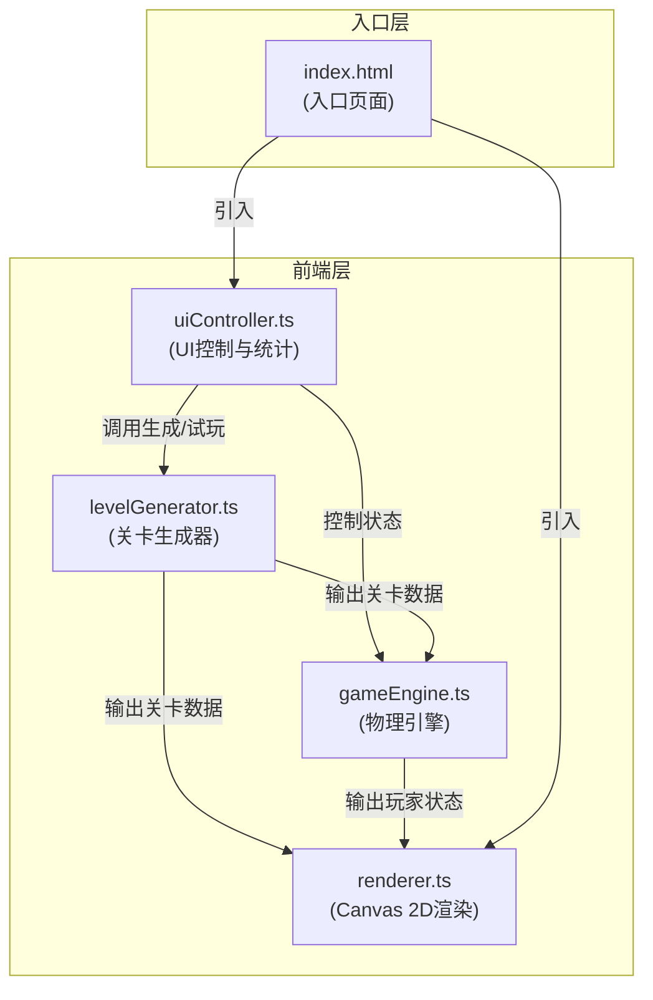

## 1. 架构设计



## 2. 技术说明
- 前端：原生 TypeScript + Vite@5 + Canvas 2D API
- 构建工具：Vite@5（devServer端口3000）
- 语言规范：TypeScript严格模式，target ES2020，包含DOM类型
- 后端：无（纯前端应用）
- 数据库：无

## 3. 文件结构
```
e:\solo\VersionFast\tasks\auto86/
├── package.json          # 依赖配置(typescript, vite@5)，启动脚本npm run dev
├── vite.config.js        # Vite基础构建配置，支持TS，devServer端口3000
├── tsconfig.json         # 严格模式，target ES2020，包含DOM类型
├── index.html            # 入口页面，画布容器+控制面板+统计区
├── src/
│   ├── gameEngine.ts     # 物理引擎：重力、碰撞、跳跃判定
│   ├── levelGenerator.ts # 关卡生成器：平台/间隙/敌人分布
│   ├── renderer.ts       # 渲染模块：Canvas 2D绘制、粒子特效
│   └── uiController.ts   # UI控制：滑块、按钮、统计数据
```

## 4. 核心数据结构

### 4.1 关卡数据
```typescript
interface Platform {
  x: number;        // 平台左上角x坐标
  y: number;        // 平台左上角y坐标
  width: number;    // 平台宽度(40-100px)
  height: number;   // 平台高度(固定值，如16px)
}

interface LevelData {
  platforms: Platform[];      // 平台数组
  totalPlatforms: number;     // 总平台数
  avgGapWidth: number;        // 平均间隙宽度
  maxJumpDistance: number;    // 最大跳跃距离
  difficulty: number;         // 难度等级(1-5)
  startX: number;             // 起点x坐标
  startY: number;             // 起点y坐标
  endX: number;               // 终点x坐标
}
```

### 4.2 玩家状态
```typescript
interface PlayerState {
  x: number;
  y: number;
  vx: number;
  velocityY: number;
  isJumping: boolean;
  isOnGround: boolean;
  width: number;   // 32px
  height: number;  // 32px
}
```

### 4.3 游戏状态
```typescript
interface GameStats {
  successfulJumps: number;   // 成功跳跃次数
  passRate: number;          // 预计通关率(0-100)
  retryCount: number;        // 重试次数
  isPlaying: boolean;        // 是否正在试玩
  isFailed: boolean;         // 是否失败
  showFailAnimation: boolean;// 显示失败动画
}
```

### 4.4 粒子系统
```typescript
interface Particle {
  x: number;
  y: number;
  vx: number;
  vy: number;
  alpha: number;
  life: number;
  maxLife: number;
  radius: number;
  color: string;
}
```

## 5. 物理参数
- 重力加速度：约1500 px/s²
- 跳跃初速度：使最大跳跃高度达到80px
- 玩家水平移动速度：根据AI逻辑设定
- AI跳跃时机：到达平台边缘前0.3秒
- 最大重试次数：3次
