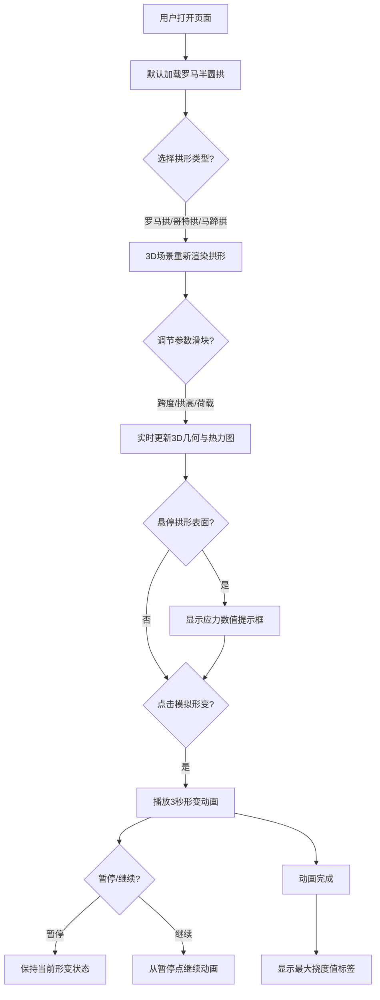

## 1. 产品概述

拱形结构受力分析与形变模拟交互式Web应用，帮助建筑爱好者或学生在浏览器中直观展示经典拱形结构（罗马拱、哥特尖拱、伊斯兰马蹄拱）在垂直荷载下的应力分布与形变路径。

- **解决问题**：静态图片或模型难以直观展示不同拱形在施加垂直荷载时应力分布与形变路径
- **目标用户**：建筑爱好者、学生、教师
- **产品价值**：通过交互式3D可视化，让抽象的结构力学概念变得直观可感知

## 2. 核心功能

### 2.1 用户角色

| 角色 | 注册方式 | 核心权限 |
|------|---------|---------|
| 普通用户 | 无需注册 | 浏览所有拱形、调节参数、查看应力分布、播放形变动画 |

### 2.2 功能模块

1. **拱形选择与参数调节模块**：三种经典拱形卡片展示、跨度/拱高/荷载参数滑块调节
2. **3D拱形渲染模块**：基于Three.js的3D拱形模型渲染与实时几何更新
3. **应力分布热力图模块**：半透明彩色网格覆盖、HSL颜色映射、悬停数值提示
4. **形变路径动画模块**：基于挠度曲线的形变动画、暂停/继续控制、最大挠度值显示
5. **UI交互控制模块**：侧边栏卡片状态、滑块实时反馈、响应式布局

### 2.3 页面详情

| 页面名称 | 模块名称 | 功能描述 |
|---------|---------|---------|
| 主页面 | 左侧侧边栏 | 三种拱形卡片（名称+Canvas缩略图+加载按钮）、参数调节滑块区、形变控制按钮 |
| 主页面 | 右侧3D场景区 | Three.js 3D拱形模型渲染、应力热力图叠加、形变动画播放、最大挠度标签 |
| 主页面 | 悬停提示框 | 鼠标悬停热点时显示应力数值，跟随鼠标位置 |

## 3. 核心流程

用户打开页面 → 默认显示罗马半圆拱 → 可切换拱形类型 → 调节跨度/拱高/荷载参数（3D实时更新）→ 查看应力热力图分布 → 悬停查看具体数值 → 点击"模拟形变"播放动画 → 可暂停/继续 → 动画完成显示最大挠度值。

## 4. 用户界面设计

### 4.1 设计风格

- **主色调**：深灰底色 #2C3E50，米白字体 #F5F0E8，金色强调色 #D4AA70
- **辅助色**：拱形线条暖灰 #8B7D6B，形变橙红 #E67E22
- **热力图渐变色**：HSL蓝色 (240,100%,50%) → HSL红色 (0,100%,50%)
- **按钮风格**：卡片式，圆角柔和边框，悬停上浮效果
- **字体**：Noto Sans SC（Google Fonts），微软雅黑用于提示框
- **布局风格**：左侧固定侧边栏 + 右侧自适应3D场景区
- **阴影**：柔和模糊阴影 8px-12px 范围

### 4.2 页面设计概览

| 页面名称 | 模块名称 | UI元素 |
|---------|---------|-------|
| 主页面 | 侧边栏卡片 | 拱形名称、Canvas缩略图、加载按钮；悬停translateY(-4px)+阴影增强；选中时金色边框 #D4AA70 |
| 主页面 | 参数滑块 | 轨道高度6px颜色#3D566E，滑块直径16px颜色#D4AA70，拖拽时缩放脉冲0.1秒，数字实时更新 |
| 主页面 | 3D场景区 | Three.js场景，拱形由分段圆柱体拼接，带热力图半透明网格 |
| 主页面 | 悬停提示框 | 半透明白#FFFFFF背景，12px圆角，8px阴影，10px微软雅黑文字，0.2秒淡出 |
| 主页面 | 挠度标签 | 半透明黑#000000背景，8px圆角，显示最大挠度值（毫米，精确到0.1） |

### 4.3 响应式

- **桌面端（≥768px）**：左侧固定侧边栏280px，右侧3D场景自适应填充
- **移动端（<768px）**：侧边栏折叠为顶部横向导航，每个拱形按钮宽80px，3D场景占满剩余高度
- **触摸优化**：滑块支持触摸拖拽，按钮点击区域增大

### 4.4 3D场景指引

- **环境**：深灰背景与页面统一，无HDRI保持简洁学术风
- **灯光设置**：环境光(AmbientLight) + 两个方向光(DirectionalLight)，柔和均匀照明
- **相机设置**：PerspectiveCamera，初始位置正前方略微俯视，支持OrbitControls轨道控制
- **构图**：拱形居中，足够空间展示形变效果
- **交互与动画**：
  - 参数变化时0.5秒缓动过渡更新几何
  - 热力图切换时透明度0→1渐变0.3秒
  - 形变动画3秒，60fps，线条颜色从暖灰渐变到橙红
- **性能**：帧率保持40fps以上，热力图更新响应<0.2秒
