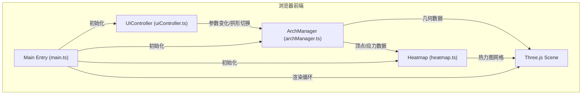

## 1. 架构设计



## 2. 技术选型说明

- **前端框架**：TypeScript + Three.js + Vite@5（用户明确指定，无需React/Vue）
- **3D渲染**：three@0.160.0，@types/three类型支持
- **构建工具**：Vite@5，devServer端口3000
- **调试工具**：dat.gui（可选辅助调试）
- **字体**：Google Fonts - Noto Sans SC

## 3. 文件结构与模块职责

| 文件路径 | 模块职责 |
|---------|---------|
| `/package.json` | 项目依赖与启动脚本 |
| `/vite.config.js` | Vite构建配置，支持TypeScript，devServer端口3000 |
| `/tsconfig.json` | TypeScript严格模式配置，target ES2020，DOM类型 |
| `/index.html` | 入口页面，侧边栏+3D场景容器，引入Google Fonts |
| `/src/main.ts` | 主程序入口：Three场景/相机/灯光初始化、窗口尺寸监听、模块整合、渲染循环 |
| `/src/archManager.ts` | 拱形模型管理：三种拱形顶点生成算法、参数更新、形变计算、应力计算（简化梁理论） |
| `/src/heatmap.ts` | 热力图渲染：应力数据→彩色网格、HSL颜色映射、悬停提示框逻辑 |
| `/src/uiController.ts` | UI控制器：侧边栏卡片状态、参数滑块事件、按钮事件、输出到ArchManager |

## 4. 核心数据结构与接口

```typescript
// 拱形类型枚举
enum ArchType {
  ROMAN = 'roman',       // 罗马半圆拱
  GOTHIC = 'gothic',     // 哥特尖拱
  HORSESHOE = 'horseshoe' // 伊斯兰马蹄拱
}

// 拱形参数
interface ArchParams {
  span: number;      // 跨度 2-8米
  height: number;    // 拱高 1-4米
  load: number;      // 垂直荷载 100-1000牛顿
}

// 分段顶点数据
interface ArchSegment {
  startPoint: THREE.Vector3;
  endPoint: THREE.Vector3;
  stress: number;          // 当前段应力值
  originalPoint: THREE.Vector3; // 形变前原始顶点
  deformedPoint: THREE.Vector3; // 形变后顶点
}

// 热力图格子数据
interface HeatmapCell {
  position: THREE.Vector3;
  stressValue: number;
  color: THREE.Color;
}
```

## 5. 关键算法说明

### 5.1 拱形顶点生成

- **罗马半圆拱**：基于圆形参数方程 `(x, y) = (R*cosθ, R*sinθ)`，θ从π到0
- **哥特尖拱**：两个相交圆弧，尖顶在中心，控制点基于跨度和拱高计算
- **伊斯兰马蹄拱**：半圆基础上，底部向内收缩，矢高大于半径

### 5.2 应力计算（简化梁理论）

```
应力 σ(x) = (M(x) * y) / I
其中：
- M(x): 位置x处的弯矩，均布荷载下 M(x) = (q*L*x/2) - (q*x²/2)
- y: 该点到中性轴距离
- I: 截面惯性矩
- q: 均布荷载（总荷载/跨度）
- L: 跨度
```

### 5.3 形变计算（挠度曲线）

```
均布荷载下挠度曲线：
δ(x) = (q*x / (24*E*I)) * (L³ - 2*L*x² + x³)
其中：
- E: 弹性模量（简化为常数）
- I: 截面惯性矩
- 最大挠度在跨中：δ_max = (5*q*L⁴) / (384*E*I)
```

### 5.4 HSL颜色映射

```
应力值归一化 t ∈ [0, 1]
H = 240 * (1 - t)   // 从240°(蓝)线性插值到0°(红)
S = 100%, L = 50%
转换为RGB后应用到热力图格子
```

## 6. 性能优化策略

1. **几何体复用**：参数变化时更新顶点位置而非重建Mesh
2. **节流更新**：热力图每0.5秒重新计算一次
3. **requestAnimationFrame**：形变动画使用RAF，60fps流畅更新
4. **合理分段数**：拱形分段数随跨度自动调整，避免过多圆柱体
5. **透明度渐变**：热力图切换使用CSS/材质透明度渐变而非重建
