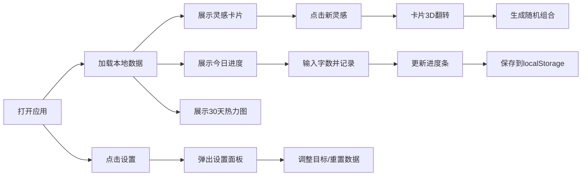

## 1. 产品概述

创意工坊是一款面向写作者的在线创意写作辅助工具，通过随机生成灵感卡片（角色、场景、冲突三元素组合）激发创作灵感，并提供每日写作字数记录与可视化进度追踪功能，帮助写作者建立持续创作习惯。

- 目标用户：小说作者、编剧、内容创作者、写作爱好者
- 核心价值：降低创作启动门槛，通过可视化进度激励持续写作

## 2. 核心功能

### 2.1 用户角色

| 角色 | 注册方式 | 核心权限 |
|------|----------|----------|
| 普通用户 | 无需注册（本地存储） | 使用全部功能，数据保存在本地浏览器 |

### 2.2 功能模块

1. **灵感卡片模块**：随机生成写作提示（角色、场景、冲突三元素），支持翻转动画刷新
2. **今日字数记录模块**：输入并记录每日写作字数，带范围限制
3. **环形进度条模块**：可视化展示今日目标完成百分比
4. **月度热力图模块**：展示最近30天写作字数分布
5. **设置面板模块**：调整日目标字数、重置数据

### 2.3 页面详情

| 页面名称 | 模块名称 | 功能描述 |
|----------|----------|----------|
| 主页 | 顶部标题栏 | 显示应用名称"创意工坊"，右侧放置设置齿轮图标 |
| 主页 | 灵感卡片区 | 3D翻转卡片，展示角色、场景、冲突，圆形刷新按钮 |
| 主页 | 今日字数区 | 数字输入框（0-5000）、记录按钮 |
| 主页 | 环形进度条 | 基于日目标计算完成率，渐变色填充，带动画 |
| 主页 | 月度热力图 | 30天网格，颜色深浅对应字数，Tooltip显示详情 |
| 设置弹窗 | 设置面板 | 日目标输入框、重置所有数据按钮（带确认） |

## 3. 核心流程

### 主用户流程
1. 用户打开应用 → 从localStorage加载历史数据 → 展示当前灵感卡片和今日进度
2. 用户点击"新灵感"按钮 → 卡片3D翻转 → 随机生成新的角色/场景/冲突组合
3. 用户输入今日写作字数 → 点击"记录"按钮 → 更新环形进度条和热力图 → 保存到localStorage
4. 用户点击设置图标 → 弹窗滑入 → 调整日目标或重置数据

## 4. 用户界面设计

### 4.1 设计风格
- 主色调：紫色 #7B2CBF，强调色：粉色 #FF6B6B
- 背景色：浅灰 #F9F9F9，文字色：深灰 #2D2D2D
- 所有交互元素统一圆角 12px，过渡时长 0.3 秒
- 按钮悬停效果：上移 2px 并加深阴影，点击时缩放至 0.95
- 卡片风格：灵感卡片渐变背景（紫色到粉色），圆角 16px，柔和阴影

### 4.2 页面设计概览

| 页面名称 | 模块名称 | UI元素 |
|----------|----------|--------|
| 主页 | 顶部标题栏 | 左侧"创意工坊"文字（主色紫色），右侧齿轮图标按钮 |
| 主页 | 中间主区域 | 左右两栏（桌面端）：左侧60%灵感卡片，右侧40%进度区；移动端单列 |
| 主页 | 灵感卡片 | 渐变紫粉背景，白色文字，三行内容（角色/场景/冲突），右下角圆形刷新按钮，3D翻转动画0.6秒 |
| 主页 | 今日字数区 | 数字输入框（聚焦时紫色边框发光），记录按钮 |
| 主页 | 环形进度条 | 红色→绿色渐变，从底部顺时针填充，0.5秒缓出动画 |
| 主页 | 热力图 | 10x10像素方格（移动端8x8），间距2px，5级蓝色色阶，Tooltip淡入0.2秒 |
| 设置弹窗 | 设置面板 | 半透明遮罩 rgba(0,0,0,0.5)，中心缩放弹入动画0.3秒 |

### 4.3 响应式设计
- 桌面端（≥768px）：中间区域左右两栏布局，灵感卡片60%，进度条40%
- 移动端（<768px）：中间区域单列垂直排列，热力图缩小为8x8像素方格并支持水平滚动
- 触摸优化：按钮和可点击区域最小尺寸 44x44px

### 4.4 动画与交互细节
- 灵感卡片翻转：0.6秒 3D Y轴旋转180度，背面显示加载动画
- 进度条填充：0.5秒缓出动画，颜色渐变 #FF4444 → #00C853
- 热力图更新：旧数据0.3秒渐出，新数据0.3秒渐入
- 按钮点击：0.1秒缩小到0.95倍再恢复
- 设置弹窗：中心缩放弹入 0.3秒弹性动画
- 输入框聚焦：紫色边框 + 细微发光效果
