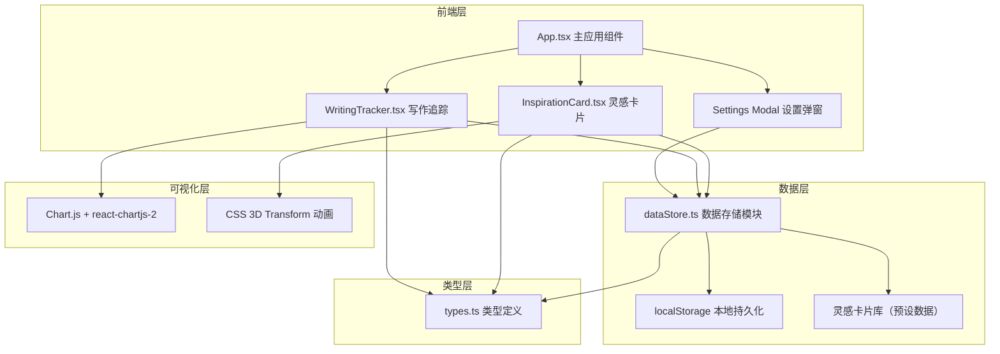

## 1. 架构设计



## 2. 技术描述

- **前端框架**：React@18 + TypeScript
- **构建工具**：Vite@5 + @vitejs/plugin-react
- **可视化库**：Chart.js + react-chartjs-2
- **数据持久化**：localStorage（浏览器本地存储）
- **唯一ID生成**：uuid
- **样式方案**：原生 CSS（CSS变量 + CSS Modules 风格内联样式）
- **动画方案**：CSS 3D Transform + CSS Transitions

## 3. 文件结构

```
├── package.json              # 项目依赖与脚本配置
├── vite.config.js            # Vite 构建配置
├── tsconfig.json             # TypeScript 配置
├── index.html                # 入口 HTML
└── src/
    ├── App.tsx               # 主应用组件
    ├── InspirationCard.tsx   # 灵感卡片组件
    ├── WritingTracker.tsx    # 写作进度追踪组件
    ├── dataStore.ts          # 数据存储模块
    └── types.ts              # TypeScript 类型定义
```

## 4. 数据模型

### 4.1 类型定义

```typescript
// 灵感卡片
interface InspirationCardData {
  character: string;  // 角色
  scene: string;      // 场景
  conflict: string;   // 冲突
}

// 每日字数记录
interface DailyWordCount {
  date: string;       // 日期字符串 YYYY-MM-DD
  words: number;      // 字数
}

// 应用设置
interface AppSettings {
  dailyGoal: number;  // 每日目标字数
}
```

### 4.2 localStorage 键名约定

- `creative_workshop_word_counts`：每日字数记录数组 JSON
- `creative_workshop_settings`：应用设置 JSON
- `creative_workshop_current_card`：当前灵感卡片（可选，避免刷新后变化）

### 4.3 灵感卡片库

预设至少 30 组角色、场景、冲突组合，存储在内存数组中，随机选取时确保连续三次不重复。

## 5. 组件职责划分

### App.tsx
- 管理全局状态：当前灵感卡片、字数记录、设置
- 处理数据持久化逻辑（读取/写入 localStorage）
- 页面整体布局（顶部栏、中间区、底部热力图）
- 设置弹窗的显示/隐藏控制

### InspirationCard.tsx
- 展示角色、场景、冲突三元素
- 处理 3D 翻转动画（CSS transform: rotateY）
- 刷新按钮交互（点击触发翻转 + 随机切换）
- 背面加载动画展示

### WritingTracker.tsx
- 今日字数输入框（0-5000 范围校验）
- 环形进度条（Canvas 或 SVG 绘制，渐变色填充）
- 月度热力图（Chart.js matrix 插件，30天数据）
- 处理字数记录提交

## 6. 性能优化策略

- **动画帧率**：使用 CSS transform/opacity 属性触发 GPU 加速，确保 ≥40fps
- **卡片切换响应**：预设数据内存读取，纯前端计算 <100ms
- **热力图渲染**：30 数据点 Chart.js 渲染，目标 <200ms
- **localStorage 操作**：同步读写不阻塞主线程（数据量小，<10KB）
- **防抖优化**：字数输入可添加轻微防抖避免频繁重渲染
