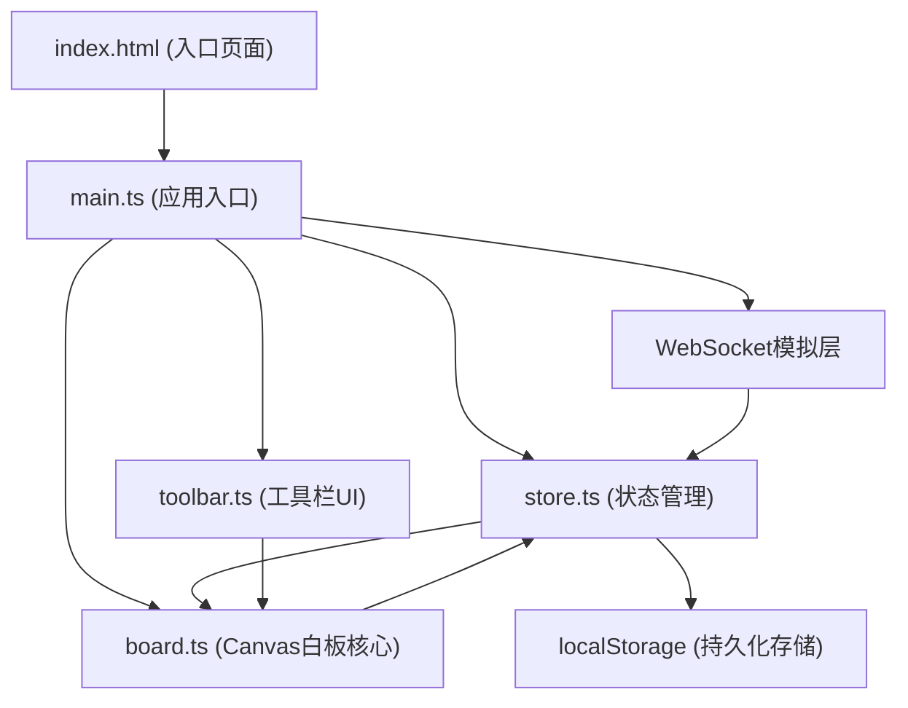

## 1. 架构设计



## 2. 技术说明

- **前端框架**：原生 TypeScript + HTML5 Canvas + Vite
- **初始化工具**：Vite
- **状态管理**：自研轻量级Store（发布订阅模式）
- **数据持久化**：浏览器 localStorage
- **实时通信**：模拟 WebSocket（EventEmitter 模式）
- **图标**：Font Awesome CDN
- **Markdown渲染**：内置轻量Markdown解析器

## 3. 模块职责

| 模块 | 文件 | 职责 |
|------|------|------|
| 应用入口 | src/main.ts | 初始化各模块、WebSocket模拟、全局事件绑定 |
| 白板核心 | src/board.ts | Canvas渲染循环、便签/图形绘制、交互事件处理、缩放平移 |
| 工具栏 | src/toolbar.ts | 工具按钮UI、颜色选择、粗细调节、向board派发动作 |
| 状态管理 | src/store.ts | 便签/图形/分组数据CRUD、订阅通知、localStorage读写 |

## 4. 数据模型

### 4.1 数据结构定义

```typescript
// 便签类型
interface StickyNote {
  id: string;
  x: number;
  y: number;
  width: number;
  height: number;
  content: string;
  color: string;
  sentiment: 'positive' | 'neutral';
  groupId: string | null;
  zIndex: number;
}

// 图形类型
type ShapeType = 'pen' | 'line' | 'eraser';

interface Shape {
  id: string;
  type: ShapeType;
  color: string;
  thickness: number;
  points: { x: number; y: number }[];
}

// 分组类型
interface Group {
  id: string;
  title: string;
  x: number;
  y: number;
  width: number;
  height: number;
  collapsed: boolean;
  noteIds: string[];
}

// 工具类型
type Tool = 'select' | 'pen' | 'eraser' | 'line' | 'sticky' | 'marquee';

// 应用状态
interface AppState {
  notes: StickyNote[];
  shapes: Shape[];
  groups: Group[];
  selectedIds: string[];
  activeTool: Tool;
  penColor: string;
  penThickness: number;
  zoom: number;
  panOffset: { x: number; y: number };
}
```

### 4.2 预设颜色

画笔颜色（6种）：
- #FFD700 柠檬黄、#87CEEB 天蓝、#FF6B6B 珊瑚红
- #4ECDC4 青绿、#95E1D3 薄荷、#A8E6CF 浅绿

便签暖色（积极情感）：
- #FFE4B5 浅橙、#FFDAB9 桃色、#F0E68C 卡其

便签冷色（中性情感）：
- #E0FFFF 浅青、#E6E6FA 淡紫、#D3D3D3 浅灰

## 5. 核心算法

### 5.1 情感分析（简化版）
关键词匹配法：检测内容中是否包含积极词（好、棒、赞、优秀、喜欢、idea、great等），命中则归为积极情感（暖色），否则中性（冷色）。

### 5.2 Canvas渲染循环
requestAnimationFrame驱动，双缓冲策略：
- 脏矩形检测：仅重绘变化区域
- 分层渲染：图形层 → 便签层 → 分组层 → 交互层
- 离屏缓存：静态内容预渲染到离屏Canvas

### 5.3 坐标变换
- 屏幕坐标 → 世界坐标：`worldX = (screenX - panX) / zoom`
- 世界坐标 → 屏幕坐标：`screenX = worldX * zoom + panX`

## 6. 性能优化策略
1. **便签拖拽**：使用CSS Transforms（GPU加速），拖拽时临时提升为合成层
2. **Canvas渲染**：requestAnimationFrame + 脏标记，避免逐帧全量重绘
3. **事件节流**：mousemove/scroll 事件 requestAnimationFrame 节流
4. **对象池**：复用绘制路径对象，减少GC压力
5. **localStorage**：防抖写入（300ms delay），避免频繁IO
