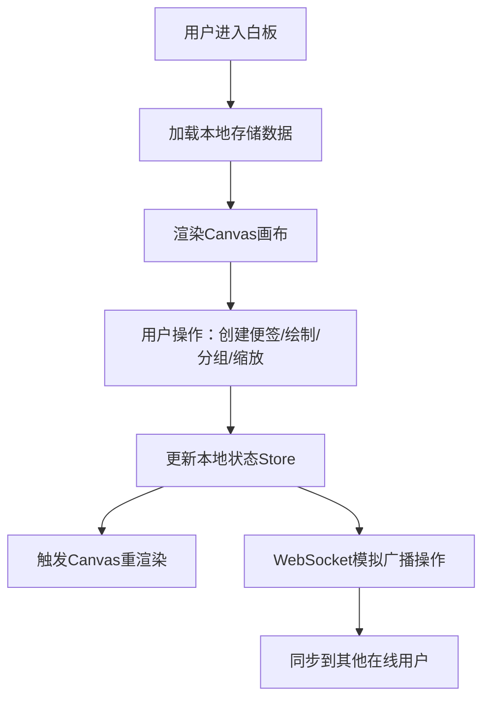

## 1. 产品概述

多人协作在线头脑风暴白板应用，让远程团队能够像在同一间会议室里一样，自由地在虚拟白板上贴便签、画草图、整理思路。
- 主要解决远程协作场景下的创意发散和思路梳理问题
- 目标用户为产品、设计、研发等需要头脑风暴的远程团队
- 产品价值：提供实时、流畅、易用的多人协作白板体验

## 2. 核心特性

### 2.1 功能模块
1. **白板画布**：无限延展的Canvas画布，支持缩放、平移，承载便签和手绘图形
2. **彩色便签**：支持纯文本和Markdown格式，可任意拖拽，颜色按内容情感自动分类
3. **工具栏**：画笔、橡皮擦、直线工具，支持6种预设颜色和画笔粗细调节
4. **分组管理**：框选多个便签后一键分组，支持组整体移动、折叠/展开、标题编辑
5. **实时同步**：通过WebSocket模拟实现多用户操作实时同步
6. **本地存储**：便签和图形数据持久化存储在浏览器localStorage中

### 2.2 页面详情
| 页面名称 | 模块名称 | 功能描述 |
|-----------|-------------|---------------------|
| 白板主页面 | 顶部工具栏 | 工具切换、颜色选择、画笔粗细、便签创建、分组操作 |
| 白板主页面 | 画布区域 | Canvas渲染便签和图形、拖拽交互、缩放平移、框选分组 |
| 白板主页面 | 便签编辑器 | 双击编辑便签内容（纯文本/Markdown）、支持内容情感颜色分类 |
| 白板主页面 | 在线用户区 | 显示当前在线用户（模拟WebSocket连接状态） |

## 3. 核心流程

用户进入白板页面 → 系统加载本地存储数据并渲染画布 → 用户可进行以下操作：
1. 点击工具栏创建便签 → 编辑内容 → 自动按情感分配颜色 → 拖拽定位
2. 选择画笔/直线工具 → 设置颜色和粗细 → 在画布上绘制
3. 使用框选工具 → 选中多个便签 → 一键分组 → 编辑组标题/折叠展开
4. 滚轮缩放画布（10%-200%） → 拖拽画布平移
5. 所有操作通过WebSocket广播给其他在线用户

## 4. 用户界面设计

### 4.1 设计风格
- **主色调**：浅灰#F5F5F5（背景）
- **强调色**：柠檬黄#FFD700、天蓝#87CEEB
- **便签颜色**：
  - 积极内容（暖色）：#FFE4B5 浅橙、#FFDAB9 桃色、#F0E68C 卡其
  - 中性内容（冷色）：#E0FFFF 浅青、#E6E6FA 淡紫、#D3D3D3 浅灰
- **按钮风格**：圆角8px、悬停阴影、点击涟漪效果
- **字体**：系统默认无衬线字体，标题14px、正文13px
- **布局风格**：顶部固定工具栏 + 全屏画布区域，简洁现代
- **图标**：Font Awesome 图标库

### 4.2 页面设计概览
| 页面名称 | 模块名称 | UI元素 |
|-----------|-------------|-------------|
| 白板主页面 | 顶部工具栏 | 白色背景、圆角工具按钮、颜色选择器面板、粗细滑块 |
| 白板主页面 | 画布区域 | #F5F5F5背景、细网格纹理、便签带阴影、图形平滑线条 |
| 白板主页面 | 便签卡片 | 圆角6px、柔和阴影、可拖拽、双击进入编辑态 |
| 白板主页面 | 分组容器 | 虚线边框、标题栏、折叠/展开箭头按钮 |
| 白板主页面 | 过渡动画 | 白板切换淡入淡出500ms、操作反馈涟漪效果 |

### 4.3 响应式设计
- 桌面端（≥1024px）：工具栏水平排列，画布全屏
- 平板端（768px-1023px）：工具栏紧凑布局，画布自适应
- 移动端（<768px）：工具栏可折叠，触控优化

## 5. 性能指标
- 便签数量50个时拖拽保持60fps
- 工具栏按钮响应时间 < 100ms
- Canvas渲染帧率 ≥ 30fps
- 缩放范围：10% - 200%
