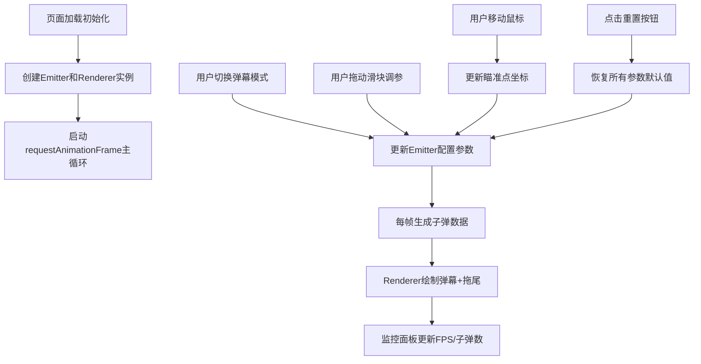

## 1. 产品概述

弹幕射击模式可视化编辑器是一款面向游戏设计师的Web工具，用于快速验证不同弹幕图案（螺旋形、扇形、随机散射）在玩家躲避时的视觉压力与可玩性，帮助优化子弹地狱类游戏的弹幕设计，避免弹幕过于密集或稀疏。

## 2. 核心特性

### 2.1 功能模块
1. **主画布区域**：800x600 Canvas画布，实时渲染弹幕轨迹和玩家瞄准点
2. **控制面板**：模式选择下拉菜单、参数调节滑块、重置按钮
3. **性能监控面板**：FPS、子弹总数、每波子弹数实时显示
4. **弹幕发射器**：三种弹幕模式（螺旋形、扇形、随机散射）的核心发射逻辑
5. **视觉反馈系统**：子弹颜色渐变、拖尾效果、瞄准点发光

### 2.2 页面详情

| 页面名称 | 模块名称 | 功能描述 |
|---------|---------|---------|
| 主编辑器 | 弹幕画布 | 800x600 Canvas，居中显示，深空色背景，实时渲染弹幕 |
| 主编辑器 | 控制面板 | 固定右侧280px宽，半透明黑底高斯模糊，模式选择+参数滑块+重置按钮 |
| 主编辑器 | 性能监控 | 右上角浮层，半透明黑底白字，每秒刷新FPS/子弹数/每波数 |
| 主编辑器 | 瞄准点交互 | 跟随鼠标的白色发光圆形，弹幕方向跟随瞄准点 |

## 3. 核心流程

## 4. 用户界面设计

### 4.1 设计风格
- **主色调**：深空色背景 #1a1a2e，半透明黑色面板 #000000cc
- **强调色**：紫色渐变滑块 #7c3aed → #a78bfa
- **弹幕配色**：
  - 螺旋形：暖色渐变（红→橙→黄）
  - 扇形：蓝紫色系渐变
  - 随机散射：预设明亮色板随机色
- **字体**：白色文字，浅灰色边框 #aaa，滑块轨道深灰色 #333
- **按钮**：圆角矩形，悬停紫色渐变背景

### 4.2 页面设计概览

| 页面名称 | 模块名称 | UI元素 |
|---------|---------|-------|
| 主编辑器 | 弹幕画布 | 800x600 Canvas，居中，深空色背景，子弹圆形4px半径，拖尾5帧残影 |
| 主编辑器 | 控制面板 | 280px固定右侧，半透明黑底+高斯模糊，模式下拉，3个滑块+数值标签，重置按钮 |
| 主编辑器 | 瞄准点 | 白色圆形6px半径，半透明发光，实线轮廓 |
| 主编辑器 | 性能监控 | 右上角浮层，半透明黑底白字，每秒刷新 |
| 主编辑器 | 过渡动画 | 所有交互0.2s平滑过渡 transition: all 0.2s ease |

### 4.3 响应式
- Desktop-first设计，画布固定800x600居中
- 页面边距5%，画布占宽高80%
- 控制面板固定在画布右侧

## 5. 性能要求
- 每波子弹数最大30颗时，子弹总数≤1000颗情况下FPS≥30
- 子弹总数超过2000颗时自动丢弃最早一批（环形缓冲策略）
- 滑块拖动响应延迟＜1帧
- 瞄准点移动平滑无卡顿
