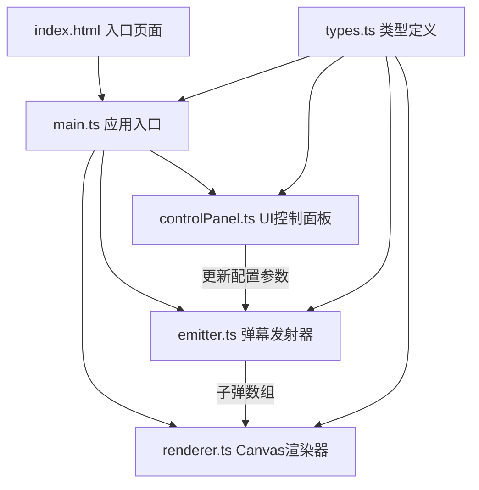

## 1. 架构设计



## 2. 技术说明
- **前端框架**：原生 TypeScript（无框架）+ Canvas 2D API
- **构建工具**：Vite@5
- **编程语言**：TypeScript@5，严格模式，target ES2020
- **样式方案**：原生CSS，内联在index.html中
- **渲染方式**：Canvas 2D，requestAnimationFrame驱动

### 模块调用关系与数据流
1. **types.ts**：定义所有公共类型（弹幕模式枚举、配置接口、子弹状态），被所有模块引用
2. **controlPanel.ts**：监听DOM事件，读取用户输入，更新EmitterConfig对象
3. **emitter.ts**：接收EmitterConfig，每帧update()生成Bullet[]，采用环形缓冲限制子弹数量
4. **renderer.ts**：接收Bullet[]和瞄准点坐标，调用Canvas API绘制弹幕、拖尾、瞄准点、性能监控
5. **main.ts**：初始化DOM、创建各模块实例、驱动主循环、协调数据流

## 3. 文件结构

```
e:\solo\VersionFast\tasks\auto90\
├── package.json
├── vite.config.js
├── tsconfig.json
├── index.html
└── src/
    ├── types.ts
    ├── emitter.ts
    ├── renderer.ts
    ├── controlPanel.ts
    └── main.ts
```

## 4. 数据模型

### 4.1 类型定义

```typescript
// 弹幕模式枚举
enum BulletPattern {
  SPIRAL = 'spiral',
  FAN = 'fan',
  RANDOM = 'random'
}

// 弹幕发射器配置
interface EmitterConfig {
  pattern: BulletPattern;
  bulletsPerWave: number;      // 1-30
  bulletSpeed: number;         // 1-15 像素/帧
  rotationSpeed: number;       // 0-10 度/帧（仅螺旋）
  fanAngleRange: number;       // 扇形角度范围
  centerX: number;             // 发射中心X
  centerY: number;             // 发射中心Y
  aimX: number;                // 瞄准点X
  aimY: number;                // 瞄准点Y
}

// 子弹状态
interface Bullet {
  x: number;
  y: number;
  vx: number;
  vy: number;
  color: string;
  trail: { x: number; y: number }[];  // 最近5帧位置
  age: number;
}

// 性能统计
interface PerformanceStats {
  fps: number;
  totalBullets: number;
  bulletsPerWave: number;
}
```

### 4.2 弹幕模式参数预设

| 模式 | 每波子弹数 | 子弹速度 | 旋转速度 | 角度范围 | 速度范围 |
|-----|----------|---------|---------|---------|---------|
| 螺旋形 | 5 | 5 | 3度/帧 | - | - |
| 扇形 | 10 | 5 | - | 60度 | - |
| 随机散射 | 15 | - | - | - | 2-8像素/帧 |

## 5. 核心算法

### 5.1 螺旋形弹幕
- 每帧旋转角度增加 rotationSpeed 度
- 按 bulletsPerWave 均分圆周方向发射
- 子弹颜色：暖色渐变（红→橙→黄，基于角度插值）

### 5.2 扇形弹幕
- 以瞄准点方向为中线
- ±fanAngleRange/2 范围内均分布 bulletsPerWave 颗子弹
- 子弹颜色：蓝紫色系渐变（基于扇形位置插值）

### 5.3 随机散射弹幕
- 以瞄准点方向为平均方向
- 随机偏移角度（±45度）
- 速度在 minSpeed~maxSpeed 范围内随机
- 子弹颜色：从预设明亮色板中随机选取

### 5.4 环形缓冲策略
- 子弹数组最大容量 MAX_BULLETS = 2000
- 超过容量时，从数组头部移除最早的子弹
- 保证每帧处理的子弹数量可控

### 5.5 拖尾效果
- 每颗子弹维护最近5帧位置的trail数组
- 绘制时从新到旧，透明度从0.5递减到0.1
- 拖尾圆半径与主体相同或略小
