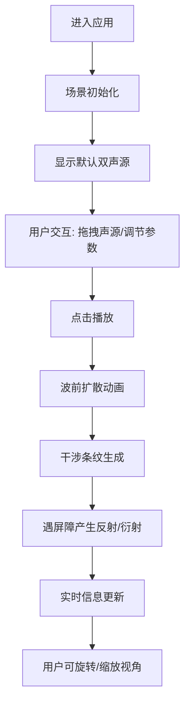

## 1. 产品概述
3D声波传播可视化应用，帮助音乐爱好者和音频学习者直观理解声波在三维空间中的传播、干涉、反射和衍射效应。
- 解决传统二维示波器无法展示多声源立体传播路径、波阵面在不同介质中速度变化等教学痛点
- 目标用户：音乐爱好者、音频工程学习者、物理教育工作者

## 2. 核心功能

### 2.1 功能模块
1. **主场景页面**: 3D声波可视化场景、声源控制、波前动画、干涉条纹、屏障设置、介质切换、实时信息面板

### 2.2 页面详情
| 页面名称 | 模块名称 | 功能描述 |
|---------|---------|---------|
| 主场景页面 | 3D场景 | Three.js渲染的三维空间，含反射地面、网格辅助线、可拖拽声源球体 |
| 主场景页面 | 波前传播动画 | 同心球面波前扩散，颜色渐变，最大半径8单位，每帧步进0.05单位 |
| 主场景页面 | 干涉条纹 | 两波前相遇区域绘制明暗交替条纹，驻波节点蓝色小点标记，干涉级次实时显示 |
| 主场景页面 | 反射与衍射 | 竖直屏障产生反射波前（入射角=反射角）和边缘衍射弧线，虚线区分 |
| 主场景页面 | 介质切换 | 空气/水/玻璃三种介质，传播速度按比例变化，背景色切换，波前重置 |
| 主场景页面 | 侧边控制面板 | 声源坐标输入、频率滑块、声源开关、介质下拉、屏障高度、实时信息 |

## 3. 核心流程
用户打开应用 → 查看默认双声源场景 → 拖拽调整声源位置 → 设置频率和介质参数 → 点击播放观察波前传播 → 调节屏障高度观察反射衍射效果 → 通过OrbitControls旋转缩放视角

## 4. 用户界面设计

### 4.1 设计风格
- **主色调**: 深色主题 #1A1A1A 背景，侧边栏 #2D2D2D，字体 #E0E0E0
- **声源色彩**: 橙红 #FF6B35、青蓝 #00B4D8
- **按钮样式**: 0.2秒过渡动画，悬停变色
- **字体**: 现代无衬线字体，清晰可读
- **布局**: 桌面端右侧固定280px侧边栏，移动端折叠为图标按钮
- **交互反馈**: 滑块拖拽数值跳动、声源拖拽高亮边缘

### 4.2 页面设计概览
| 页面名称 | 模块名称 | UI元素 |
|---------|---------|--------|
| 主场景页面 | 3D场景 | 半透明浅灰地面、网格线、彩色声源球体、球壳波前、条纹粒子 |
| 主场景页面 | 侧边栏 | 深色面板、数值输入框、滑块控件、开关按钮、下拉菜单、信息显示区 |

### 4.3 响应式
- 桌面端(≥1200px): 侧边栏固定280px宽度，3D场景自适应
- 移动端(<1200px): 侧边栏折叠为图标按钮，点击展开覆盖层

### 4.4 3D场景指引
- **环境**: 深色背景，浅灰半透明地面+网格辅助
- **光照**: 环境光+点光源，标准材质球体
- **相机**: PerspectiveCamera，OrbitControls拖拽旋转+滚轮缩放
- **动画**: 60FPS波前扩散动画，帧率保障≥45FPS
- **性能优化**: 波前数量>200时自动合并相邻波前
